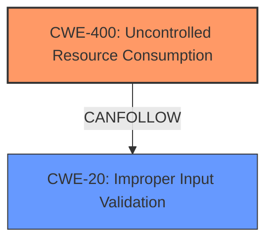

# Analysis Report for CVE-2024-7515

# Vulnerability Analysis Report: CVE-2024-7515

## Description

CVE-2024-7515 IMPACT A denial-of-service vulnerability exists in the affected products. A malformed PTP management packet can cause a major nonrecoverable fault in the controller.

## Vulnerability Description Key Phrases

- **Impact:** denial of service
- **Vector:** malformed PTP management packet

## Analysis (with Relationship Data)

# Summary
| CWE ID | CWE Name | Confidence | CWE Abstraction Level | CWE Vulnerability Mapping Label | CWE-Vulnerability Mapping Notes |
|---|---|---|---|---|---|
| CWE-400 | Uncontrolled Resource Consumption | 0.75 | Class | Primary | Allowed |
| CWE-20 | Improper Input Validation | 0.60 | Class | Secondary | Discouraged |

## Evidence and Confidence

*   **Confidence Score:** 0.70
*   **Evidence Strength:** LOW

## Relationship Analysis
The primary relationship considered was the hierarchical structure, specifically the Class level of CWE-400 and CWE-20. While more specific Base CWEs exist, the provided evidence is insufficient to pinpoint the exact resource being exhausted or the precise input validation failure. The relationship between CWE-20 and CWE-400 is that improper input validation (CWE-20) can lead to uncontrolled resource consumption (CWE-400).



## Vulnerability Chain
The vulnerability chain starts with a **malformed PTP management packet** being received. This leads to a **denial-of-service**, which suggests **uncontrolled resource consumption** (CWE-400). It's implied that the malformed packet isn't properly validated, leading to the resource consumption. Thus, the chain is: Malformed Packet -> **Improper Input Validation** (CWE-20) -> **Uncontrolled Resource Consumption** (CWE-400) -> Denial of Service.

## Summary of Analysis
The initial analysis focused on identifying the root cause of the denial-of-service vulnerability described. Due to the limited information provided, the selection of CWEs was challenging. The primary CWE, CWE-400, was chosen because the vulnerability description explicitly states that the impact is a denial-of-service. The malformed PTP management packet suggests an **improper input validation** issue (CWE-20), which could be a contributing factor.

The graph relationships show that CWE-20 can lead to CWE-400, supporting the choice of both CWEs. However, without more information on the specific resource being consumed or the exact validation error, a more precise mapping is not possible.

The selected CWEs are at the Class level because the provided evidence does not support selecting more specific Base or Variant level CWEs. The assessment is heavily based on the limited evidence provided in the vulnerability description, which mentions a "malformed PTP management packet" causing a "denial-of-service."

CWEs Considered but Not Used:

*   CWE-119 (Improper Restriction of Operations within the Bounds of a Memory Buffer), CWE-125 (Out-of-bounds Read), CWE-476 (NULL Pointer Dereference), CWE-1284 (Improper Validation of Specified Quantity in Input), CWE-770 (Allocation of Resources Without Limits or Throttling), CWE-617 (Reachable Assertion), CWE-1285 (Improper Validation of Specified Index, Position, or Offset in Input), CWE-190 (Integer Overflow or Wraparound): These CWEs were considered but not selected because the provided information did not offer specific evidence to support them. While an out-of-bounds read or write could potentially be involved, there's nothing in the description to confirm this.

Relevant CWE Information:

## CWE-824: Access of Uninitialized Pointer
**Abstraction Level**: Base
**Similarity Score**: 0.75
**Source**: dense

**Description**:
The product accesses or uses a pointer that has not been initialized.

**Mapping Guidance**:
- Usage: Allowed
- Rationale: This CWE entry is at the Base level of abstraction, which is a preferred level of abstraction for mapping to the root causes of vulnerabilities.

## CWE-755: Improper Handling of Exceptional Conditions
**Abstraction Level**: Class
**Similarity Score**: 0.75
**Source**: dense

**Description**:
The product does not handle or incorrectly handles an exceptional condition.

**Mapping Guidance**:
- Usage: Discouraged
- Rationale: This CWE entry is a level-1 Class (i.e., a child of a Pillar). It might have lower-level children that would be more appropriate

## CWE-1285: Improper Validation of Specified Index, Position, or Offset in Input
**Abstraction Level**: Base
**Similarity Score**: 0.74
**Source**: dense

**Description**:
The product receives input that is expected to specify an index, position, or offset into an indexable resource such as a buffer or file, but it does not validate or incorrectly validates that the specified index/position/offset has the required properties.

**Mapping Guidance**:
- Usage: Allowed
- Rationale: This CWE entry is at the Base level of abstraction, which is a preferred level of abstraction for mapping to the root causes of vulnerabilities.

## CWE-696: Incorrect Behavior Order
**Abstraction Level**: Class
**Similarity Score**: 0.74
**Source**: dense

**Description**:
The product performs multiple related behaviors, but the behaviors are performed in the wrong order in ways which may produce resultant weaknesses.

**Mapping Guidance**:
- Usage: Allowed-with-Review
- Rationale: This CWE entry is a Class and might have Base-level children that would be more appropriate

## CWE-400: Uncontrolled Resource Consumption
**Abstraction Level**: Class
**Similarity Score**: 0.74
**Source**: dense

**Description**:
The product does not properly control the allocation and maintenance of a limited resource, thereby enabling an actor to influence the amount of resources consumed, eventually leading to the exhaustion of available resources.

**Mapping Guidance**:
- Usage: Discouraged
- Rationale: CWE-400 is intended for incorrect behaviors in which the product is expected to track and restrict how many resources it consumes, but CWE-400 is often misused because it is conflated with the "technical impact" of vulnerabilities in which resource consumption occurs. It is sometimes used for low-information vulnerability reports. It is a level-1 Class (i.e., a child of a Pillar).

## CWE-119: Improper Restriction of Operations within the Bounds of a Memory Buffer
**Abstraction Level**: Class
**Similarity Score**: 0.74
**Source**: dense

**Description**:
The product performs operations on a memory buffer, but it reads from or writes to a memory location outside the buffer's intended boundary. This may result in read or write operations on unexpected memory locations that could be linked to other variables, data structures, or internal program data.

**Mapping Guidance**:
- Usage: Discouraged
- Rationale: CWE-119 is commonly misused in low-information vulnerability reports when lower-level CWEs could be used instead, or when more details about the vulnerability are available.

## CWE-617: Reachable Assertion
**Abstraction Level**: Base
**Similarity Score**: 0.73
**Source**: dense

**Description**:
The product contains an assert() or similar statement that can be triggered by an attacker, which leads to an application exit or other behavior that is more severe than necessary.

**Mapping Guidance**:
- Usage: Allowed
- Rationale: This CWE entry is at the Base level of abstraction, which is a preferred level of abstraction for mapping to the root causes of vulnerabilities.

## CWE-1284: Improper Validation of Specified Quantity in Input
**Abstraction Level**: Base
**Similarity Score**: 0.73
**Source**: dense

**Description**:
The product receives input that is expected to specify a quantity (such as size or length), but it does not validate or incorrectly validates that the quantity has the required properties.

**Mapping Guidance**:
- Usage: Allowed
- Rationale: This CWE entry is at the Base level of abstraction, which is a preferred level of abstraction for mapping to the root causes of vulnerabilities.

## CWE-131: Incorrect Calculation of Buffer Size
**Abstraction Level**: Base
**Similarity Score**: 0.73
**Source**: dense

**Description**:
The product does not correctly calculate the size to be used when allocating a buffer, which could lead to a buffer overflow.

**Mapping Guidance**:
- Usage: Allowed
- Rationale: This CWE entry is at the Base level of abstraction, which is a preferred level of abstraction for mapping to the root causes of vulnerabilities.

## CWE-294: Authentication Bypass by Capture-replay
**Abstraction Level**: Base
**Similarity Score**: 0.72
**Source**: dense

**Description**:
A capture-replay flaw exists when the design of the product makes it possible for a malicious user to sniff network traffic and bypass authentication by replaying it to the server in question to the same effect as the original message (or with minor changes).

**Mapping Guidance**:
- Usage: Allowed
- Rationale: This CWE entry is at the Base level of abstraction,


## CWE Relationship Analysis

Current CWEs represent these abstraction levels: .


### Vulnerability Chain Analysis

**Chain starting from CWE-1284:**
- 1284 (Improper Validation of Specified Quantity in Input) - ROOT


**Chain starting from CWE-400:**
- 400 (Uncontrolled Resource Consumption) - ROOT


### CWE Relationship Diagram

```mermaid
graph TD
    classDef primary fill:#f96,stroke:#333,stroke-width:2px
    classDef secondary fill:#69f,stroke:#333
    classDef tertiary fill:#9e9,stroke:#333
```


*Report generated on 2025-07-14 02:51:36*
