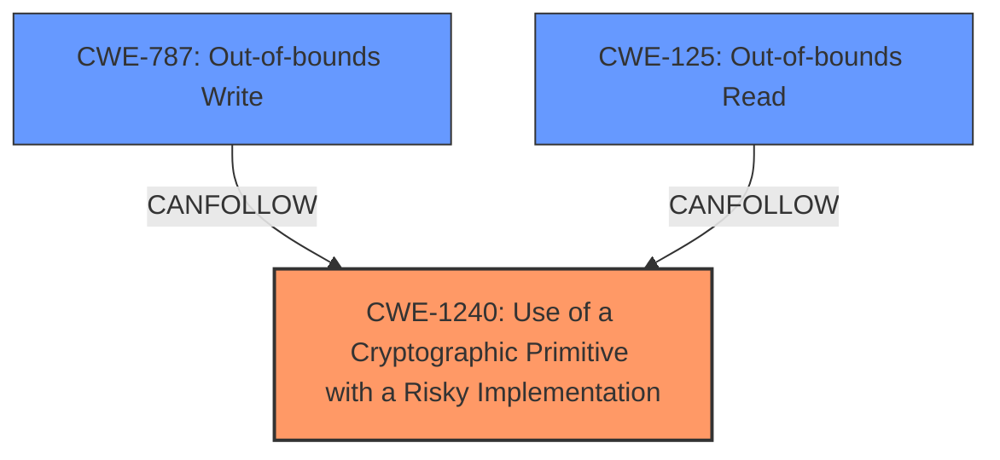

# Analysis for CVE-2024-7531

# Summary
| CWE ID | CWE Name | Confidence | CWE Abstraction Level | CWE Vulnerability Mapping Label | CWE-Vulnerability Mapping Notes |
|---|---|---|---|---|---|
| CWE-1240 | Use of a Cryptographic Primitive with a Risky Implementation | 0.9 | Base | Allowed | Primary CWE: The vulnerability arises from using the `PK11_Encrypt()` function in NSS with CKM_CHACHA20 and the same buffer for input and output, indicating a risky cryptographic implementation. |
| CWE-787 | Out-of-bounds Write | 0.6 | Base | Allowed | Secondary Candidate: While not the primary cause, the use of the same buffer for input and output *could* lead to an out-of-bounds write depending on the implementation details and how the buffer is managed. |
| CWE-125 | Out-of-bounds Read | 0.5 | Base | Allowed | Secondary Candidate: Similar to CWE-787, the vulnerability *could* involve an out-of-bounds read in the context of using the same buffer for both input and output during encryption. |

## Evidence and Confidence

*   **Confidence Score:** 0.9
*   **Evidence Strength:** HIGH

## Relationship Analysis
The primary CWE selected is CWE-1240, which directly addresses the risky cryptographic implementation. CWE-787 and CWE-125 are considered as secondary candidates due to the potential for buffer overflow issues arising from the specific implementation of the cryptographic primitive.

## Vulnerability Chain
The vulnerability chain starts with the **use of a cryptographic primitive with a risky implementation (CWE-1240)**, specifically calling `PK11_Encrypt()` in NSS using CKM_CHACHA20 with the same buffer for input and output. This can then lead to potential out-of-bounds write (CWE-787) or read (CWE-125) depending on the memory management during the encryption process. The final impact is plaintext exposure on Intel Sandy Bridge processors.

## Summary of Analysis
The primary cause is the use of a specific cryptographic implementation that is vulnerable when input and output buffers overlap (CWE-1240). The vulnerability description and CVE details strongly support this. The potential for out-of-bounds read or write operations (CWE-125, CWE-787) is a consequence of the specific implementation, but not the primary cause.

The evidence for CWE-1240 is: "Calling `PK11_Encrypt()` in NSS using CKM_CHACHA20 and the same buffer for input and output" leading to "plaintext on an Intel Sandy Bridge processor".

The retriever results also support this, with CWE-1240 having a high score due to the presence of cryptographic primitives.

CWE-787 and CWE-125 were considered due to the potential for buffer overflows when using the same buffer for both input and output. However, without more information about the exact memory operations within `PK11_Encrypt()`, these remain secondary possibilities.

The selected CWEs are at the optimal level of specificity, with CWE-1240 capturing the core issue of a risky cryptographic implementation.

Relevant CWE Information:

# Enhanced Context (25 CWEs)
The following CWEs were identified as potentially relevant to this vulnerability:

## CWE-346: Origin Validation Error
**Abstraction Level**: Class
**Similarity Score**: 0.73
**Source**: dense

**Description**:
The product does not properly verify that the source of data or communication is valid.

**Mapping Guidance**:
- Usage: Allowed-with-Review
- Rationale: This CWE entry is a Class and might have Base-level children that would be more appropriate

## CWE-319: Cleartext Transmission of Sensitive Information
**Abstraction Level**: Base
**Similarity Score**: 0.72
**Source**: dense

**Description**:
The product transmits sensitive or security-critical data in cleartext in a communication channel that can be sniffed by unauthorized actors.

**Mapping Guidance**:
- Usage: Allowed
- Rationale: This CWE entry is at the Base level of abstraction, which is a preferred level of abstraction for mapping to the root causes of vulnerabilities.

## CWE-843: Access of Resource Using Incompatible Type ('Type Confusion')
**Abstraction Level**: Base
**Similarity Score**: 0.72
**Source**: dense

**Description**:
The product allocates or initializes a resource such as a pointer, object, or variable using one type, but it later accesses that resource using a type that is incompatible with the original type.

**Mapping Guidance**:
- Usage: Allowed
- Rationale: This CWE entry is at the Base level of abstraction, which is a preferred level of abstraction for mapping to the root causes of vulnerabilities.

## CWE-203: Observable Discrepancy
**Abstraction Level**: Base
**Similarity Score**: 0.72
**Source**: dense

**Description**:
The product behaves differently or sends different responses under different circumstances in a way that is observable to an unauthorized actor, which exposes security-relevant information about the state of the product, such as whether a particular operation was successful or not.

**Mapping Guidance**:
- Usage: Allowed
- Rationale: This CWE entry is at the Base level of abstraction, which is a preferred level of abstraction for mapping to the root causes of vulnerabilities.

## CWE-125: Out-of-bounds Read
**Abstraction Level**: Base
**Similarity Score**: 0.72
**Source**: dense

**Description**:
The product reads data past the end, or before the beginning, of the intended buffer.

**Mapping Guidance**:
- Usage: Allowed
- Rationale: This CWE entry is at the Base level of abstraction, which is a preferred level of abstraction for mapping to the root causes of vulnerabilities.

## CWE-451: User Interface (UI) Misrepresentation of Critical Information
**Abstraction Level**: Class
**Similarity Score**: 0.71
**Source**: dense

**Description**:
The user interface (UI) does not properly represent critical information to the user, allowing the information - or its source - to be obscured or spoofed. This is often a component in phishing attacks.

**Mapping Guidance**:
- Usage: Allowed-with-Review
- Rationale: This CWE entry is a Class and might have Base-level children that would be more appropriate

## CWE-755: Improper Handling of Exceptional Conditions
**Abstraction Level**: Class
**Similarity Score**: 0.71
**Source**: dense

**Description**:
The product does not handle or incorrectly handles an exceptional condition.

**Mapping Guidance**:
- Usage: Discouraged
- Rationale: This CWE entry is a level-1 Class (i.e., a child of a Pillar). It might have lower-level children that would be more appropriate

## CWE-617: Reachable Assertion
**Abstraction Level**: Base
**Similarity Score**: 0.71
**Source**: dense

**Description**:
The product contains an assert() or similar statement that can be triggered by an attacker, which leads to an application exit or other behavior that is more severe than necessary.

**Mapping Guidance**:
- Usage: Allowed
- Rationale: This CWE entry is at the Base level of abstraction, which is a preferred level of abstraction for mapping to the root causes of vulnerabilities.

## CWE-703: Improper Check or Handling of Exceptional Conditions
**Abstraction Level**: Pillar
**Similarity Score**: 0.71
**Source**: dense

**Description**:
The product does not properly anticipate or handle exceptional conditions that rarely occur during normal operation of the product.

**Mapping Guidance**:
- Usage: Discouraged
- Rationale: This CWE entry is extremely high-level, a Pillar.

## CWE-787: Out-of-bounds Write
**Abstraction Level**: Base
**Similarity Score**: 0.71
**Source**: dense

**Description**:
The product writes data past the end, or before the beginning, of the intended buffer.

**Mapping Guidance**:
- Usage: Allowed
- Rationale: This CWE entry is at the Base level of abstraction, which is a preferred level of abstraction for mapping to the root causes of vulnerabilities.

## CWE-668: Exposure of Resource to Wrong Sphere
**Abstraction Level**: Class
**Similarity Score**: 645.86
**Source**: sparse

**Description**:
The product exposes a resource to the wrong control sphere, providing unintended actors with inappropriate access to the resource.

**Mapping Guidance**:
- Usage: Disc