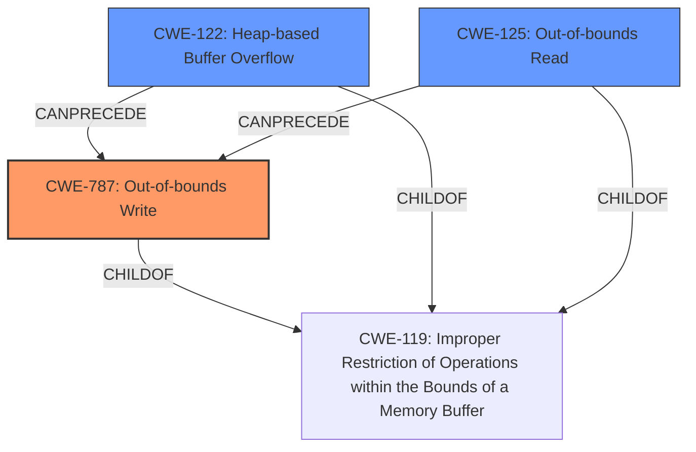

# Raw Analyzer Response for CVE-2024-7532

# Summary
| CWE ID | CWE Name | Confidence | CWE Abstraction Level | CWE Vulnerability Mapping Label | CWE-Vulnerability Mapping Notes |
|---|---|---|---|---|---|
| CWE-787 | Out-of-bounds Write | 1.0 | Base | Allowed | Primary CWE. The vulnerability involves writing data past the end or before the beginning of the intended buffer. |
| CWE-122 | Heap-based Buffer Overflow | 0.7 | Variant | Allowed | Secondary candidate. The vulnerability leads to heap corruption, suggesting a heap-based buffer overflow. |
| CWE-125 | Out-of-bounds Read | 0.6 | Base | Allowed | Secondary candidate. The vulnerability description mentions "Out of bounds memory access" which could involve reading data past the end of the intended buffer. |

## Evidence and Confidence

*   **Confidence Score:** 0.9
*   **Evidence Strength:** HIGH

## Relationship Analysis
The primary CWE is CWE-787 **Out-of-bounds Write**, which is a base-level CWE. The retriever also identified CWE-122 **Heap-based Buffer Overflow**, which is a variant of buffer overflow and related to heap corruption. CWE-125 **Out-of-bounds Read** is also identified as a possible related weakness.

## Vulnerability Chain
The vulnerability chain starts with the **out-of-bounds memory access** (**ROOTCAUSE**) in ANGLE, which leads to potential heap corruption, potentially enabling a remote attacker to exploit the system by crafting a malicious HTML page.

Vulnerability Chain:
1.  **CWE-787 Out-of-bounds Write**: The initial **weakness** is the **out-of-bounds write** in ANGLE.
2.  **Heap Corruption**: The out-of-bounds write leads to heap corruption.
3.  **Exploitation**: The heap corruption could be exploited by a remote attacker.

## Summary of Analysis
The vulnerability description clearly states "**Out of bounds memory access** in ANGLE...allowed a remote attacker to potentially exploit heap corruption." The **Root cause of vulnerability** extracted from the CVE Reference Links Content Summary also states "Out of bounds memory access in ANGLE." The **primary weakness** is therefore identified as CWE-787 **Out-of-bounds Write**, since the description specifically states that the vulnerability is due to writing outside the intended buffer. The "heap corruption" indicates a potential overflow scenario on the heap, making CWE-122 **Heap-based Buffer Overflow** a secondary candidate. The vulnerability description mentions "**Out of bounds memory access**" which could be related to either reading from memory out of bounds (CWE-125 **Out-of-bounds Read**) or writing to memory out of bounds (CWE-787 **Out-of-bounds Write**), but since the vulnerability leads to heap corruption, **out-of-bounds write** is the more likely root cause.

I considered CWE-843 **Access of Resource Using Incompatible Type ('Type Confusion')**, but the vulnerability description doesn't provide enough evidence to support this. The same is true for CWE-416 **Use After Free** and CWE-366 **Race Condition within a Thread**. I also considered CWE-823 **Use of Out-of-range Pointer Offset**, but the core issue is writing beyond the buffer boundary, not just using an out-of-range offset.