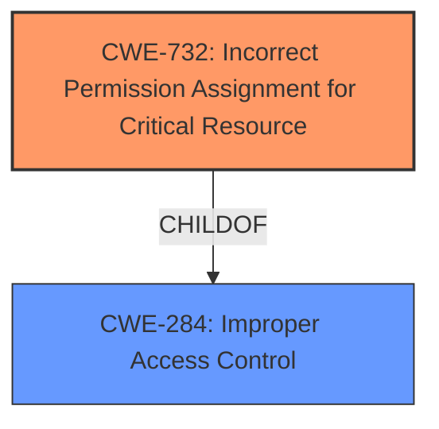

# Raw Analyzer Response for CVE-2024-7553

# Summary

| CWE ID | CWE Name | Confidence | CWE Abstraction Level | CWE Vulnerability Mapping Label | CWE-Vulnerability Mapping Notes |
|---|---|---|---|---|---|
| CWE-732 | Incorrect Permission Assignment for Critical Resource | 0.8 | Class | Primary | Allowed-with-Review |
| CWE-284 | Improper Access Control | 0.6 | Class | Secondary | Discouraged |

## Evidence and Confidence

*   **Confidence Score:** 0.7
*   **Evidence Strength:** MEDIUM

## Relationship Analysis
The primary relationship considered was between CWE-732 (Incorrect Permission Assignment for Critical Resource) and CWE-284 (Improper Access Control). While the description mentions incorrect validation, the core issue lies in how resources are accessed and handled, aligning more closely with permission-related problems. CWE-732 is a class-level CWE, and while a more specific base-level CWE would be ideal, the evidence supports this classification. Other candidates like CWE-22 (Path Traversal) and CWE-427 (Uncontrolled Search Path Element) were considered, but the root cause focuses on the incorrect assignment of permissions for a critical resource rather than path manipulation.

## Vulnerability Chain
The vulnerability chain starts with the **incorrect validation of files loaded from a local untrusted directory**. This leads to **incorrect permission assignment for critical resources** (CWE-732), which in turn allows for local privilege escalation and arbitrary code execution on Windows systems. The chain highlights the progression from a validation flaw to an access control issue and ultimately a privilege escalation impact.

## Summary of Analysis
The analysis hinges on the **root cause** identified as "**Incorrect validation of files loaded from a local untrusted directory**." While input validation is a factor, the more pertinent issue is the **incorrect permission assignment** on the loaded files, which is the root cause. The description clearly states that this leads to local privilege escalation, indicating that the loaded files are treated as critical resources with overly permissive access.

The Retriever Results initially pointed to CWE-755 (Improper Handling of Exceptional Conditions) and CWE-269 (Improper Privilege Management), which are less relevant than CWE-732. CWE-755 is too general, and CWE-269 is discouraged for privilege escalation scenarios. The guidance provided in "Privileges vs Permissions Guidance" also clarifies the distinction between privileges and permissions, further supporting the selection of permission-related CWEs like CWE-732.

Therefore, CWE-732 is selected as the primary CWE because it directly addresses the **incorrect permission assignment** for critical resources, facilitating the privilege escalation. CWE-284 (Improper Access Control) is considered a secondary CWE as it represents a more general form of the access control issue.

The selected CWEs are at a suitable level of specificity, with CWE-732 being a Class-level CWE that captures the core weakness, and CWE-284 providing a broader context for the vulnerability.

Relevant CWE Information:

# Enhanced Context (25 CWEs)
The following CWEs were identified as potentially relevant to this vulnerability:

## CWE-267: Privilege Defined With Unsafe Actions
**Abstraction Level**: Base
**Similarity Score**: 0.79
**Source**: dense

**Description**:
A particular privilege, role, capability, or right can be used to perform unsafe actions that were not intended, even when it is assigned to the correct entity.

**Mapping Guidance**:
- Usage: Allowed
- Rationale: This CWE entry is at the Base level of abstraction, which is a preferred level of abstraction for mapping to the root causes of vulnerabilities.

*Not Selected*: This CWE is related to unsafe actions when a privilege is used, but the description indicates the files loaded from an untrusted directory allows local privilege escalation, suggesting it's related to incorrect permission assignment and access control.

## CWE-266: Incorrect Privilege Assignment
**Abstraction Level**: Base
**Similarity Score**: 0.79
**Source**: dense

**Description**:
A product incorrectly assigns a privilege to a particular actor, creating an unintended sphere of control for that actor.

**Mapping Guidance**:
- Usage: Allowed
- Rationale: This CWE entry is at the Base level of abstraction, which is a preferred level of abstraction for mapping to the root causes of vulnerabilities.

*Not Selected*: The description focuses on incorrect permission assignment for critical resources and not on incorrect privilege assignments to actors (users/roles).

## CWE-274: Improper Handling of Insufficient Privileges
**Abstraction Level**: Base
**Similarity Score**: 0.79
**Source**: dense

**Description**:
The product does not handle or incorrectly handles when it has insufficient privileges to perform an operation, leading to resultant weaknesses.

**Mapping Guidance**:
- Usage: Discouraged
- Rationale: This CWE entry could be deprecated in a future version of CWE.

*Not Selected*: This CWE is about handling of insufficient privileges whereas the vulnerability description indicates incorrect handling of files loaded from a local untrusted directory that allows local privilege escalation.

## CWE-280: Improper Handling of Insufficient Permissions or Privileges
**Abstraction Level**: Base
**Similarity Score**: 0.78
**Source**: dense

**Description**:
The product does not handle or incorrectly handles when it has insufficient privileges to access resources or functionality as specified by their permissions. This may cause it to follow unexpected code paths that may leave the product in an invalid state.

**Mapping Guidance**:
- Usage: Allowed
- Rationale: This CWE entry is at the Base level of abstraction, which is a preferred level of abstraction for mapping to the root causes of vulnerabilities.

*Not Selected*: This CWE is about handling of insufficient permissions or privileges whereas the vulnerability description indicates incorrect handling of files loaded from a local untrusted directory that allows local privilege escalation.

## CWE-41: Improper Resolution of Path Equivalence
**Abstraction Level**: Base
**Similarity Score**: 0.77
**Source**: dense

**Description**:
The product is vulnerable to file system contents disclosure through path equivalence. Path equivalence involves the use of special characters in file and directory names. The associated manipulations are intended to generate multiple names for the same object.

**Mapping Guidance**:
- Usage: Allowed
- Rationale: This CWE entry is at the Base level of abstraction, which is a preferred level of abstraction for mapping to the root causes of vulnerabilities.

*Not Selected*: Path equivalence is not mentioned in the description.

## CWE-668: Exposure of Resource to Wrong Sphere
**Abstraction Level**: Class
**Similarity Score**: 0.77
**Source**: dense

**Description**:
The product exposes a resource to the wrong control sphere, providing unintended actors with inappropriate access to the resource.

**Mapping Guidance**:
- Usage: Discouraged
- Rationale: CWE-668 is high-level and is often misused as a catch-all when lower-level CWE IDs might be applicable. It is sometimes used for low-information vulnerability reports [REF-1287]. It is a level-1 Class (i.e., a child of a Pillar). It is not useful for trend analysis.

*Not Selected*: Though related, the description focuses on incorrect permission assignment for critical resources which allows privilege escalation, making CWE-732 a better fit.

## CWE-59: Improper Link Resolution Before File Access ('Link Following')
**Abstraction Level**: Base
**Similarity Score**: 0.76
**Source**: dense

**Description**:
The product attempts to access a file based on the filename, but it does not properly prevent that filename from identifying a link or shortcut that resolves to an unintended resource.

**Mapping Guidance**:
- Usage: Allowed
- Rationale: This CWE entry is at the Base level of abstraction, which is a preferred level of abstraction for mapping to the root causes of vulnerabilities.

*Not Selected*: The vulnerability description doesn't mention anything about link resolution.

## CWE-212: Improper Removal of Sensitive Information Before Storage or Transfer
**Abstraction Level**: Base
**Similarity Score**: 0.76
**Source**: dense

**Description**:
The product stores, transfers, or shares a resource that contains sensitive information, but it does not properly remove that information before the product makes the resource available to unauthorized actors.

**Mapping Guidance**:
- Usage: Allowed
- Rationale: This CWE entry is at the Base level of abstraction, which is a preferred level of abstraction for mapping to the root causes of vulnerabilities.

*Not Selected*: This CWE is about removal of sensitive information before storage or transfer, which is not indicated by the vulnerability description.

## CWE-703: Improper Check or Handling of Exceptional Conditions
**Abstraction Level**: Pillar
**Similarity Score**: 0.76
**Source**: dense

**Description**:
The product does not properly anticipate or handle exceptional conditions that rarely occur during normal operation of the product.

**Mapping Guidance**:
- Usage: Discour