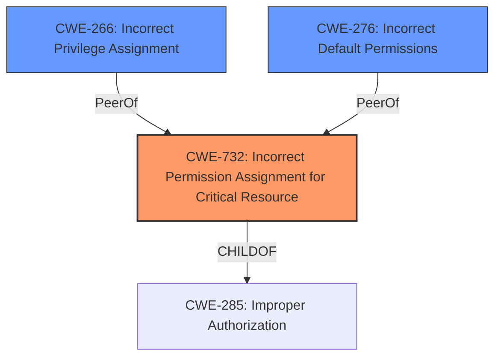

# Enhanced Analysis for CVE-2024-7571

# Summary

| CWE ID  | CWE Name                                                        | Confidence | CWE Abstraction Level | CWE Vulnerability Mapping Label | CWE-Vulnerability Mapping Notes |
| :-------- | :-------------------------------------------------------------- | :--------- | :-------------------- | :------------------------------ | :------------------------------ |
| CWE-732   | Incorrect Permission Assignment for Critical Resource           | 0.9        | Class                 | Primary CWE                     | Allowed-with-Review             |
| CWE-266   | Incorrect Privilege Assignment                                  | 0.7        | Base                  | Secondary Candidate             | Allowed                       |
| CWE-276   | Incorrect Default Permissions                                 | 0.6        | Base                  | Secondary Candidate             | Allowed                       |

## Evidence and Confidence

*   **Confidence Score:** 0.8
*   **Evidence Strength:** MEDIUM

## Relationship Analysis

The primary CWE is CWE-732, a class-level CWE. While more specific CWEs like variants might exist, the current description focuses on the general issue of incorrect permission assignment for critical resources. CWE-266 and CWE-276 are related CWEs; CWE-266 focuses on privilege assignment, while CWE-276 focuses on default permissions. CWE-732's parent is CWE-285: Improper Authorization, indicating a higher-level view of authorization issues. The selection is based on the vulnerability description emphasizing "incorrect permissions," making CWE-732 the most appropriate fit, though lacking details to select a variant.



## Vulnerability Chain

The vulnerability chain starts with **incorrect permissions** being set on a resource, leading to potential privilege escalation by a local attacker.

Incorrect Permission Assignment (CWE-732) -> Privilege Escalation

## Summary of Analysis

The initial assessment focused on identifying the **root cause** of the privilege escalation vulnerability. The description clearly states "**incorrect permissions**" as the **root cause**, which strongly suggests a permission-related CWE. After reviewing the retriever results, CWE-732 (Incorrect Permission Assignment for Critical Resource) emerged as the most relevant option.

CWE-732 aligns well with the vulnerability description, as it directly addresses the issue of incorrect permission assignment for critical resources, which in this case allows for privilege escalation. The mapping guidance for CWE-732 advises caution, noting that it's sometimes misused for authorization weaknesses. However, in this scenario, the explicit mention of "**incorrect permissions**" makes it a suitable choice.

CWE-266 (Incorrect Privilege Assignment) was also considered, but it focuses more on assigning incorrect privileges to actors, which is not the primary issue here. Similarly, CWE-276 (Incorrect Default Permissions) addresses default permission settings, but the vulnerability description doesn't explicitly mention default permissions being the problem.

The final decision to assign CWE-732 as the primary CWE is based on the direct match with the vulnerability description's emphasis on "**incorrect permissions**" and the potential for privilege escalation as a result. While the evidence is limited, the available information points towards a permission-related issue rather than a broader authorization flaw or privilege misassignment.

Relevant CWE Information:

# Enhanced Context (25 CWEs)
The following CWEs were identified as potentially relevant to this vulnerability:

## CWE-266: Incorrect Privilege Assignment
**Abstraction Level**: Base
**Similarity Score**: 0.79
**Source**: dense

**Description**:
A product incorrectly assigns a privilege to a particular actor, creating an unintended sphere of control for that actor.

**Mapping Guidance**:
- Usage: Allowed
- Rationale: This CWE entry is at the Base level of abstraction, which is a preferred level of abstraction for mapping to the root causes of vulnerabilities.


## CWE-280: Improper Handling of Insufficient Permissions or Privileges 
**Abstraction Level**: Base
**Similarity Score**: 0.77
**Source**: dense

**Description**:
The product does not handle or incorrectly handles when it has insufficient privileges to access resources or functionality as specified by their permissions. This may cause it to follow unexpected code paths that may leave the product in an invalid state.

**Mapping Guidance**:
- Usage: Allowed
- Rationale: This CWE entry is at the Base level of abstraction, which is a preferred level of abstraction for mapping to the root causes of vulnerabilities.


## CWE-274: Improper Handling of Insufficient Privileges
**Abstraction Level**: Base
**Similarity Score**: 0.76
**Source**: dense

**Description**:
The product does not handle or incorrectly handles when it has insufficient privileges to perform an operation, leading to resultant weaknesses.

**Mapping Guidance**:
- Usage: Discouraged
- Rationale: This CWE entry could be deprecated in a future version of CWE.


## CWE-267: Privilege Defined With Unsafe Actions
**Abstraction Level**: Base
**Similarity Score**: 0.76
**Source**: dense

**Description**:
A particular privilege, role, capability, or right can be used to perform unsafe actions that were not intended, even when it is assigned to the correct entity.

**Mapping Guidance**:
- Usage: Allowed
- Rationale: This CWE entry is at the Base level of abstraction, which is a preferred level of abstraction for mapping to the root causes of vulnerabilities.


## CWE-276: Incorrect Default Permissions
**Abstraction Level**: Base
**Similarity Score**: 0.74
**Source**: dense

**Description**:
During installation, installed file permissions are set to allow anyone to modify those files.

**Mapping Guidance**:
- Usage: Allowed
- Rationale: This CWE entry is at the Base level of abstraction, which is a preferred level of abstraction for mapping to the root causes of vulnerabilities.


## CWE-281: Improper Preservation of Permissions
**Abstraction Level**: Base
**Similarity Score**: 0.73
**Source**: dense

**Description**:
The product does not preserve permissions or incorrectly preserves permissions when copying, restoring, or sharing objects, which can cause them to have less restrictive permissions than intended.

**Mapping Guidance**:
- Usage: Allowed
- Rationale: This CWE entry is at the Base level of abstraction, which is a preferred level of abstraction for mapping to the root causes of vulnerabilities.


## CWE-668: Exposure of Resource to Wrong Sphere
**Abstraction Level**: Class
**Similarity Score**: 0.73
**Source**: dense

**Description**:
The product exposes a resource to the wrong control sphere, providing unintended actors with inappropriate access to the resource.

**Mapping Guidance**:
- Usage: Discouraged
- Rationale: CWE-668 is high-level and is often misused as a catch-all when lower-level CWE IDs might be applicable. It is sometimes used for low-information vulnerability reports [REF-1287]. It is a level-1 Class (i.e., a child of a Pillar). It is not useful for trend analysis.


## CWE-269: Improper Privilege Management
**Abstraction Level**: Class
**Similarity Score**: 0.72
**Source**: dense

**Description**:
The product does not properly assign, modify, track, or check privileges for an actor, creating an unintended sphere of control for that actor.

**Mapping Guidance**:
- Usage: Discouraged
- Rationale: CWE-269 is commonly misused. It can be conflated with "privilege escalation," which is a technical impact that is listed in many low-information vulnerability reports [REF-1287]. It is not useful for trend analysis.


## CWE-59: Improper Link Resolution Before File Access ('Link Following')
**Abstraction Level**: Base
**Similarity Score**: 0.72
**Source**: dense

**Description**:
The product attempts to access a file based on the filename, but it does not properly prevent that filename from identifying a link or shortcut that resolves to an unintended resource.

**Mapping Guidance**:
- Usage: Allowed
- Rationale: This CWE entry is at the Base level of abstraction, which is a preferred level of abstraction for mapping to the root causes of vulnerabilities.


## CWE-279: Incorrect Execution-Assigned Permissions
**Abstraction Level**: Variant
**Similarity Score**: 0.72
**Source**: dense

**Description**:
While it is executing, the product sets the permissions of an object in a way that violates the intended permissions that have been specified by the user.

**Mapping Guidance**:
- Usage: Allowed
- Rationale: This CWE entry is at the Variant level of abstraction,


## CWE Relationship Analysis

Current CWEs represent these abstraction levels: .


### Vulnerability Chain Analysis

**Chain starting from CWE-274:**
- 274 (Improper Handling of Insufficient Privileges) - ROOT


**Chain starting from CWE-280:**
- 280 (Improper Handling of Insufficient Permissions or Privileges ) - ROOT


### CWE Relationship Diagram

```mermaid
graph TD
    classDef primary fill:#f96,stroke:#333,stroke-width:2px
    classDef secondary fill:#69f,stroke:#333
    classDef tertiary fill:#9e9,stroke:#333
```