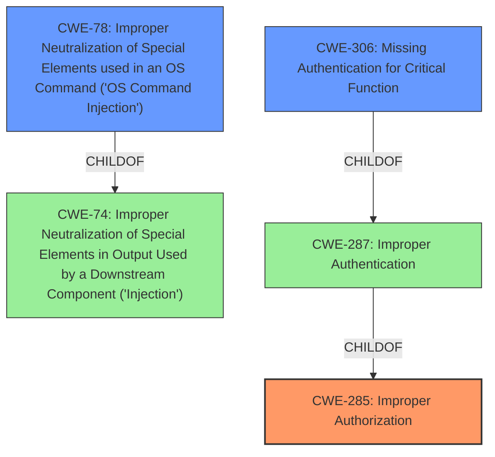

# Analysis for CVE-2024-7578

# Summary
| CWE ID | CWE Name | Confidence | CWE Abstraction Level | CWE Vulnerability Mapping Label | CWE-Vulnerability Mapping Notes |
|---|---|---|---|---|---|
| CWE-285 | Improper Authorization | 0.9 | Class | Primary | Allowed |
| CWE-306 | Missing Authentication for Critical Function | 0.7 | Base | Secondary | Allowed |
| CWE-78 | Improper Neutralization of Special Elements used in an OS Command ('OS Command Injection') | 0.6 | Base | Secondary | Allowed |

## Evidence and Confidence

*   **Confidence Score:** 0.8
*   **Evidence Strength:** MEDIUM

## Relationship Analysis
The primary CWE is CWE-285, "Improper Authorization", because the vulnerability description states that the manipulation of the argument `cmd` leads to **improper authorization**. CWE-306, "Missing Authentication for Critical Function", is a potential secondary CWE because the `/cmd.php` script allows arbitrary command execution without authentication. CWE-78, "Improper Neutralization of Special Elements used in an OS Command ('OS Command Injection')" is also a potential secondary CWE given the presence of command injection vulnerabilities in `/cgi-bin/upgrade.cgi` and `/admin/system.html`. CWE-285 is a Class-level CWE, while CWE-306 and CWE-78 are Base-level CWEs, offering a more specific representation of the weaknesses.

## Vulnerability Chain
The vulnerability chain starts with **improper authorization** in `/cmd.php` (CWE-285), potentially due to **missing authentication** (CWE-306). This allows an attacker to gain access to the system and then leverage **command injection** vulnerabilities (CWE-78) in `/cgi-bin/upgrade.cgi` and `/admin/system.html` to execute arbitrary commands and fully compromise the system.

## Summary of Analysis
The analysis is based on the vulnerability description and the CVE Reference Links Content Summary. The primary weakness is **improper authorization**, as the `/cmd.php` script allows command execution without proper checks. The detailed analysis provided in the CVE Reference Links Content Summary strengthens this assessment by explicitly stating the **lack of authorization** for `/cmd.php`. The secondary weaknesses are the **missing authentication** and the **command injection** vulnerabilities.

The graph relationships show how **improper authorization** can stem from **missing authentication**, and how **improper neutralization of special elements** can lead to command injection. The selection of CWE-285, CWE-306, and CWE-78 is based on the evidence provided, and these CWEs are at the appropriate level of specificity (Base and Class).

CWE-284, "Improper Access Control," was considered but not used because CWE-285, "Improper Authorization," is more specific and accurately reflects the **improper authorization** detailed in the vulnerability description. CWE-862 "Missing Authorization" was considered, but CWE-285 was deemed a better fit because the vulnerability description states "**improper authorization**" as opposed to simply "missing authorization." The presence of both **improper authorization** and **missing authentication** are present.
CWE-89, "Improper Neutralization of Special Elements used in an SQL Command ('SQL Injection')", CWE-79, "Improper Neutralization of Input During Web Page Generation ('Cross-site Scripting')", CWE-705, "Incorrect Control Flow Scoping", CWE-266, "Incorrect Privilege Assignment", CWE-863, "Incorrect Authorization", and CWE-184, "Incomplete List of Disallowed Inputs" were not chosen because they did not directly relate to the weaknesses described in the vulnerability.