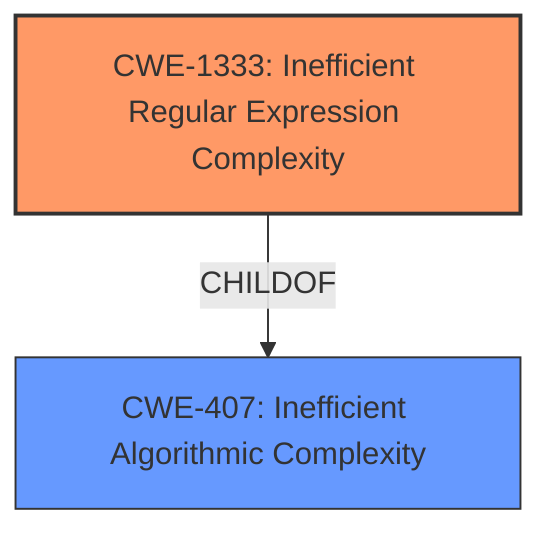

# Analysis Report for CVE-2024-7592

# Vulnerability Analysis Report: CVE-2024-7592

## Description

There is a LOW severity vulnerability affecting CPython, specifically the http.cookies standard library module. When parsing cookies that contained backslashes for quoted characters in the cookie value, the parser would use an algorithm with quadratic complexity, resulting in excess CPU resources being used while parsing the value.

## Vulnerability Description Key Phrases

- **Impact:** excess CPU resources
- **Vector:** parsing cookies
- **Product:** CPython
- **Component:** http.cookies standard library module

## Analysis (with Relationship Data)

# Summary
| CWE ID | CWE Name | Confidence | CWE Abstraction Level | CWE Vulnerability Mapping Label | CWE-Vulnerability Mapping Notes |
|---|---|---|---|---|---|
| CWE-1333 | Inefficient Regular Expression Complexity | 1.0 | Base | Primary | Allowed |
| CWE-407 | Inefficient Algorithmic Complexity | 0.7 | Class | Secondary | Allowed-with-Review |

## Evidence and Confidence

*   **Confidence Score:** 0.9
*   **Evidence Strength:** HIGH

## Relationship Analysis
The primary CWE is CWE-1333, which is a child of CWE-407. CWE-1333 provides a more specific characterization of the algorithmic inefficiency. The abstraction levels influenced the selection, favoring the base level CWE-1333 over the class level CWE-407.



## Vulnerability Chain
The vulnerability chain begins with the **inefficient regular expression** (CWE-1333) used within the `_unquote()` function. This leads to **inefficient algorithmic complexity** (CWE-407) as the function processes cookie values. The final impact is a denial-of-service (DoS) condition due to excessive CPU consumption.

## Summary of Analysis
The analysis strongly supports the selection of CWE-1333 as the primary CWE due to the vulnerability stemming from the **inefficient regular expression**. The CVE Reference Links Content Summary specifically mentions the use of regular expressions `_OctalPatt` and `_QuotePatt` within a while loop leading to quadratic time complexity.

The following excerpt highlights the root cause:
"root_cause": "The `_unquote()` function in the `http.cookies` module uses regular expressions `_OctalPatt` and `_QuotePatt` within a while loop to process input strings, leading to quadratic time complexity under certain conditions."

CWE-407 is also relevant as it describes the broader issue of **inefficient algorithmic complexity**. The chain relationship between CWE-1333 and CWE-407 (CWE-1333 is a child of CWE-407) further justifies the inclusion of CWE-407 as a secondary CWE.

The selected CWEs are at the optimal level of specificity because CWE-1333 directly addresses the type of inefficiency (regular expression complexity), while CWE-407 provides a more general characterization of the problem.

Relevant CWE Information:

# Enhanced Context (25 CWEs)
The following CWEs were identified as potentially relevant to this vulnerability:

## CWE-407: Inefficient Algorithmic Complexity
**Abstraction Level**: Class
**Similarity Score**: 0.76
**Source**: dense

**Description**:
An algorithm in a product has an inefficient worst-case computational complexity that may be detrimental to system performance and can be triggered by an attacker, typically using crafted manipulations that ensure that the worst case is being reached.

**Mapping Guidance**:
- Usage: Allowed-with-Review
- Rationale: This CWE entry is a Class and might have Base-level children that would be more appropriate

## CWE-1333: Inefficient Regular Expression Complexity
**Abstraction Level**: Base
**Similarity Score**: 844.01
**Source**: sparse

**Description**:
The product uses a regular expression with an inefficient, possibly exponential worst-case computational complexity that consumes excessive CPU cycles.

**Mapping Guidance**:
- Usage: Allowed
- Rationale: This CWE entry is at the Base level of abstraction, which is a preferred level of abstraction for mapping to the root causes of vulnerabilities.

### CWEs Considered but Not Used:

*   **CWE-835: Loop with Unreachable Exit Condition ('Infinite Loop')**: While the vulnerability involves a loop, the core issue isn't an unreachable exit condition, but rather the inefficiency of the regular expression processing within the loop.
*   **CWE-776: Improper Restriction of Recursive Entity References in DTDs ('XML Entity Expansion')**: This CWE is related to XML entity expansion, which is not relevant to the described vulnerability.
*   **CWE-400: Uncontrolled Resource Consumption**: While the impact is resource consumption, the root cause is the algorithmic inefficiency, making CWE-1333 and CWE-407 more accurate.
*   **CWE-784: Reliance on Cookies without Validation and Integrity Checking in a Security Decision**: Although cookies are involved, the issue is not related to the validation or integrity checking of the cookies themselves, but rather the inefficient processing of their values.
*   **CWE-770: Allocation of Resources Without Limits or Throttling**: This CWE is close, but the core issue here is not the allocation of resources, but the inefficient use of CPU resources due to the regular expression.

### Technical Explanation for CWE-1333: Inefficient Regular Expression Complexity
*   **How the vulnerability's details match the CWE's characteristics:** The vulnerability description and CVE Reference Links Content Summary explicitly state that the `http.cookies` module uses regular expressions with inefficient complexity. The crafted cookie values with backslashes cause the regular expression engine to consume excessive CPU cycles.
*   **The security implications and potential impact:** The primary security implication is Denial of Service (DoS). An attacker can send specially crafted HTTP requests with malicious cookie values, causing the server to become unresponsive due to high CPU usage.
*   **Any parent-child relationships or chain patterns that influenced your mapping:** CWE-1333 is a child of CWE-407 (Inefficient Algorithmic Complexity), indicating a hierarchical relationship. This influenced the decision to include CWE-407 as a secondary CWE.
*   **Whether the weakness is primary or secondary in the vulnerability:** CWE-1333 is the primary weakness, as it directly describes the root cause of the vulnerability.
*   **How the official MITRE mapping guidance influenced your decision:** The MITRE mapping guidance for CWE-1333 recommends its use as it's a Base level of abstraction, which is preferred.

### Technical Explanation for CWE-407: Inefficient Algorithmic Complexity
*   **How the vulnerability's details match the CWE's characteristics:** The cookie parsing algorithm exhibits quadratic complexity due to the inefficient regular expressions.
*   **The security implications and potential impact:** Similar to CWE-1333, the security implication is Denial of Service (DoS) due to excessive CPU resource consumption.
*   **Any parent-child relationships or chain patterns that influenced your mapping:** CWE-407 is the parent of CWE-1333, establishing a clear hierarchical relationship.
*   **Whether the weakness is primary or secondary in the vulnerability:** CWE-407 is a secondary weakness as it's a broader characterization of the algorithmic inefficiency.
*   **How the official MITRE mapping guidance influenced your decision:** The MITRE mapping guidance for CWE-407 suggests reviewing for more specific Base-level children, which further justifies the primary mapping to CWE-1333.


## CWE Relationship Analysis

Current CWEs represent these abstraction levels: .


### Vulnerability Chain Analysis

**Chain starting from CWE-400:**
- 400 (Uncontrolled Resource Consumption) - ROOT


**Chain starting from CWE-407:**
- 407 (Inefficient Algorithmic Complexity) - ROOT


### CWE Relationship Diagram

```mermaid
graph TD
    classDef primary fill:#f96,stroke:#333,stroke-width:2px
    classDef secondary fill:#69f,stroke:#333
    classDef tertiary fill:#9e9,stroke:#333
```


*Report generated on 2025-07-14 02:58:02*
