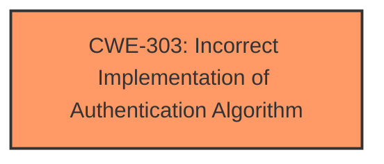

# Analysis for CVE-2024-7593

# Summary
| CWE ID | CWE Name | Confidence | CWE Abstraction Level | CWE Vulnerability Mapping Label | CWE-Vulnerability Mapping Notes |
|---|---|---|---|---|---|
| CWE-303 | Incorrect Implementation of Authentication Algorithm | 1.0 | Base | Primary | Allowed |

## Evidence and Confidence

*   **Confidence Score:** 1.0
*   **Evidence Strength:** HIGH

## Relationship Analysis
The primary CWE is CWE-303, which is a Base level CWE. Other CWEs are related to Authentication Bypass or Incorrect Authorization, but the vulnerability description specifically mentions an "**incorrect implementation of an authentication algorithm**", making CWE-303 the most direct and appropriate classification.

## Vulnerability Chain
The vulnerability chain starts with an **incorrect implementation of an authentication algorithm** (CWE-303) which leads to the bypass of the admin panel's authentication.

## Summary of Analysis
The primary focus of this vulnerability lies in the **incorrect implementation of an authentication algorithm**. The vulnerability description explicitly states this as the root cause. The retriever results also list CWE-303 as the top candidate with a similarity score of 0.243. Given the explicit mention of the root cause and the retriever results, CWE-303 is the most appropriate and specific classification. The evidence comes directly from the "**Vulnerability Description Key Phrases**" which states the rootcause as "**Incorrect implementation of an authentication algorithm**".

Relevant CWE Information:

# Enhanced Context (25 CWEs)
The following CWEs were identified as potentially relevant to this vulnerability:

## CWE-303: Incorrect Implementation of Authentication Algorithm
**Abstraction Level**: Base
**Similarity Score**: 0.78
**Source**: dense

**Description**:
The requirements for the product dictate the use of an established authentication algorithm, but the implementation of the algorithm is incorrect.

**Mapping Guidance**:
- Usage: Allowed
- Rationale: This CWE entry is at the Base level of abstraction, which is a preferred level of abstraction for mapping to the root causes of vulnerabilities.

# Complete CWE Specifications

CWE-303: Incorrect Implementation of Authentication Algorithm

CWE-916: Use of Password Hash With Insufficient Computational Effort

CWE-757: Selection of Less-Secure Algorithm During Negotiation ('Algorithm Downgrade')

CWE-287: Improper Authentication

CWE-347: Improper Verification of Cryptographic Signature

CWE-327: Use of a Broken or Risky Cryptographic Algorithm

CWE-1254: Incorrect Comparison Logic Granularity

CWE-325: Missing Cryptographic Step

CWE-304: Missing Critical Step in Authentication

CWE-178: Improper Handling of Case Sensitivity