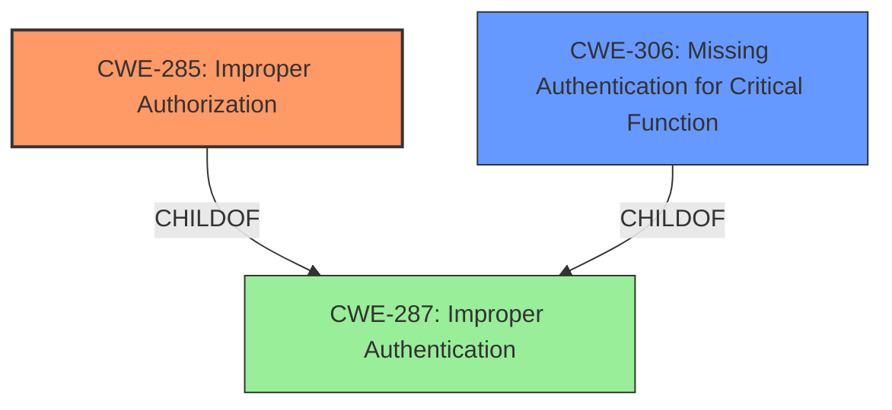

# Analysis Report for CVE-2024-7604

# Vulnerability Analysis Report: CVE-2024-7604

## Description

Logsign Unified SecOps Platform **Incorrect Authorization** Authentication Bypass Vulnerability. This vulnerability allows local attackers to bypass authentication on affected installations of Logsign Unified SecOps Platform. Authentication is required to exploit this vulnerability. The specific flaw exists within the HTTP API service, which listens on TCP port 443 by default. The issue results from the **lack of proper validation of the users license expiration date**. An attacker can leverage this vulnerability to bypass authentication on the system. Was ZDI-CAN-25029.

## Vulnerability Description Key Phrases

- **Rootcause:** ['Incorrect Authorization', 'lack of proper validation of the users license expiration date']
- **Impact:** authentication bypass
- **Attacker:** local attackers
- **Product:** Logsign Unified SecOps Platform
- **Component:** HTTP API service

## Analysis (with Relationship Data)

# Summary
| CWE ID  | CWE Name                                                                  | Confidence | CWE Abstraction Level | CWE Vulnerability Mapping Label | CWE-Vulnerability Mapping Notes |
| :-------- | :------------------------------------------------------------------------ | :--------- | :---------------------- | :------------------------------ | :------------------------------ |
| CWE-285 | Improper Authorization                                                              | 0.9        | Base                    | Primary                         | Allowed                         |
| CWE-306 | Missing Authentication for Critical Function                                                              | 0.7      | Base                    | Secondary                       | Allowed                         |

## Evidence and Confidence

*   **Confidence Score:** 0.8
*   **Evidence Strength:** HIGH

## Relationship Analysis
The primary weakness is **improper authorization** (CWE-285) because the system incorrectly grants access. A contributing factor is the **lack of proper validation**, which could be seen as related to missing authentication (CWE-306), since proper authentication would include validating the user's license and expiration date. The relationships indicate that improper authorization can stem from missing authentication.



## Vulnerability Chain
1.  The **lack of proper validation of the users license expiration date** (Root Cause).
2.  **Incorrect Authorization** within the HTTP API service.
3.  **Authentication Bypass** leads to unauthorized access.

## Summary of Analysis
The initial assessment focused on the **lack of proper validation**, leading to a bypass. The root cause is an **incorrect authorization** (CWE-285) due to the system's failure to properly validate the user's license expiration date. This failure results in an **authentication bypass**. While **missing authentication** (CWE-306) is a contributing factor, the core issue lies in the incorrect authorization process.

I am basing my assessment on the **lack of proper validation of the users license expiration date**.

The graph relationships influenced the selection by highlighting the connection between **improper authorization** and **missing authentication**, and how they both relate to the more general **improper authentication**.

CWE-285 and CWE-306 are chosen because they are at the Base level of abstraction and directly address the **incorrect authorization** and the **lack of proper validation** respectively.

Relevant CWE Information:

# Enhanced Context (25 CWEs)
The following CWEs were identified as potentially relevant to this vulnerability:

## CWE-303: Incorrect Implementation of Authentication Algorithm
**Abstraction Level**: Base
**Similarity Score**: 0.78
**Source**: dense

**Description**:
The requirements for the product dictate the use of an established authentication algorithm, but the implementation of the algorithm is incorrect.

**Mapping Guidance**:
- Usage: Allowed
- Rationale: This CWE entry is at the Base level of abstraction, which is a preferred level of abstraction for mapping to the root causes of vulnerabilities.

*Not Used:* The description mentions that the **implementation** of the authentication algorithm is incorrect. This doesn't align with the root cause "lack of proper validation of the users license expiration date".

## CWE-807: Reliance on Untrusted Inputs in a Security Decision
**Abstraction Level**: Base
**Similarity Score**: 0.75
**Source**: dense

**Description**:
The product uses a protection mechanism that relies on the existence or values of an input, but the input can be modified by an untrusted actor in a way that bypasses the protection mechanism.

**Mapping Guidance**:
- Usage: Allowed
- Rationale: This CWE entry is at the Base level of abstraction, which is a preferred level of abstraction for mapping to the root causes of vulnerabilities.

*Not Used:* This CWE focuses on relying on untrusted inputs, which isn't the primary issue here. The main problem is the **lack of proper validation** of the user's license expiration date.

## CWE-1391: Use of Weak Credentials
**Abstraction Level**: Class
**Similarity Score**: 0.75
**Source**: dense

**Description**:
The product uses weak credentials (such as a default key or hard-coded password) that can be calculated, derived, reused, or guessed by an attacker.

**Mapping Guidance**:
- Usage: Allowed-with-Review
- Rationale: This CWE entry is a Class and might have Base-level children that would be more appropriate

*Not Used:* The vulnerability isn't directly related to weak credentials. It's about the **lack of proper validation** of the user's license expiration date.

## CWE-288: Authentication Bypass Using an Alternate Path or Channel
**Abstraction Level**: Base
**Similarity Score**: 0.74
**Source**: dense

**Description**:
The product requires authentication, but the product has an alternate path or channel that does not require authentication.

**Mapping Guidance**:
- Usage: Allowed
- Rationale: This CWE entry is at the Base level of abstraction, which is a preferred level of abstraction for mapping to the root causes of vulnerabilities.

*Not Used:* The vulnerability doesn't involve bypassing authentication through an alternate path or channel. It's due to the **lack of proper validation** of the user's license expiration date.

## CWE-345: Insufficient Verification of Data Authenticity
**Abstraction Level**: Class
**Similarity Score**: 0.73
**Source**: dense

**Description**:
The product does not sufficiently verify the origin or authenticity of data, in a way that causes it to accept invalid data.

**Mapping Guidance**:
- Usage: Discouraged
- Rationale: This CWE entry is a level-1 Class (i.e., a child of a Pillar). It might have lower-level children that would be more appropriate

*Not Used:* Although the **lack of proper validation** is present, it's more specifically related to authorization, not just general data authenticity.

## CWE-1390: Weak Authentication
**Abstraction Level**: Class
**Similarity Score**: 0.73
**Source**: dense

**Description**:
The product uses an authentication mechanism to restrict access to specific users or identities, but the mechanism does not sufficiently prove that the claimed identity is correct.

**Mapping Guidance**:
- Usage: Allowed-with-Review
- Rationale: This CWE entry is a Class and might have Base-level children that would be more appropriate

*Not Used:* It's more specific to the authorization process because the authentication is performed, but access is incorrectly granted.

## CWE-798: Use of Hard-coded Credentials
**Abstraction Level**: Base
**Similarity Score**: 0.73
**Source**: dense

**Description**:
The product contains hard-coded credentials, such as a password or cryptographic key.

**Mapping Guidance**:
- Usage: Allowed
- Rationale: This CWE entry is at the Base level of abstraction, which is a preferred level of abstraction for mapping to the root causes of vulnerabilities.

*Not Used:* The vulnerability is not related to the use of hard-coded credentials. It's due to the **lack of proper validation** of the user's license expiration date.

## CWE-204: Observable Response Discrepancy
**Abstraction Level**: Base
**Similarity Score**: 0.73
**Source**: dense

**Description**:
The product provides different responses to incoming requests in a way that reveals internal state information to an unauthorized actor outside of the intended control sphere.

**Mapping Guidance**:
- Usage: Allowed
- Rationale: This CWE entry is at the Base level of abstraction, which is a preferred level of abstraction for mapping to the root causes of vulnerabilities.

*Not Used:* The vulnerability doesn't involve observable response discrepancies. It's due to the **lack of proper validation** of the user's license expiration date.

## CWE-305: Authentication Bypass by Primary Weakness
**Abstraction Level**: Base
**Similarity Score**: 0.72
**Source**: dense

**Description**:
The authentication algorithm is sound, but the implemented mechanism can be bypassed as the result of a separate weakness that is primary to the authentication error.

**Mapping Guidance**:
- Usage: Allowed
- Rationale: This CWE entry is at the Base level of abstraction, which is a preferred level of abstraction for mapping to the root causes of vulnerabilities.

*Not Used:* While there is a bypass, the primary weakness is not related to the authentication algorithm itself, but to the authorization process.

## CWE-294: Authentication Bypass by Capture-replay
**Abstraction Level**: Base
**Similarity Score**: 0.72
**Source**: dense

**Description**:
A capture-replay flaw exists when the design of the product makes it possible for a malicious user to sniff network traffic and bypass


## CWE Relationship Analysis

Current CWEs represent these abstraction levels: .


### Vulnerability Chain Analysis

**Chain starting from CWE-288:**
- 288 (Authentication Bypass Using an Alternate Path or Channel) - ROOT


**Chain starting from CWE-1390:**
- 1390 (Weak Authentication) - ROOT


### CWE Relationship Diagram

```mermaid
graph TD
    classDef primary fill:#f96,stroke:#333,stroke-width:2px
    classDef secondary fill:#69f,stroke:#333
    classDef tertiary fill:#9e9,stroke:#333
```


*Report generated on 2025-07-14 02:58:33*
