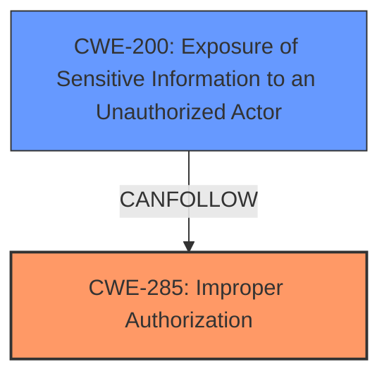

# Enhanced Analysis for CVE-2024-7630

# Summary
| CWE ID | CWE Name | Confidence | CWE Abstraction Level | CWE Vulnerability Mapping Label | CWE-Vulnerability Mapping Notes |
|---|---|---|---|---|---|
| CWE-285 | Improper Authorization | 0.8 | Class | Primary | Allowed-with-Review |
| CWE-200 | Exposure of Sensitive Information to an Unauthorized Actor | 0.7 | Class | Secondary | Discouraged |

## Evidence and Confidence

*   **Confidence Score:** 0.75
*   **Evidence Strength:** MEDIUM

## Relationship Analysis
The primary relationship that influenced the CWE selection is the parent-child relationship between CWE-285 (Improper Authorization) and more specific authorization-related CWEs. While the description points to authorization issues, the lack of specific details about *how* the authorization is incorrect makes CWE-285 a reasonable fit as a Class-level CWE.

CWE-200 (Exposure of Sensitive Information to an Unauthorized Actor) is a consequence of the authorization issue. The relationship is such that a failure in authorization (CWE-285) leads to the exposure of sensitive information (CWE-200).



## Vulnerability Chain
The vulnerability chain starts with **improper authorization** (CWE-285) in the `relevanssi_do_query()` function, leading to **exposure of sensitive information** (CWE-200) from password-protected posts. The initial flaw is the **insufficient limitations on the posts that are returned when searching**.

## Summary of Analysis
The initial assessment focused on authorization and information exposure. The vulnerability description clearly states that the root cause is the **insufficient limitations on the posts that are returned when searching**, which allows unauthenticated attackers to extract potentially sensitive information from password-protected posts.

The Retriever results suggested CWE-863 (Incorrect Authorization), CWE-201 (Insertion of Sensitive Information Into Sent Data), and CWE-200 (Exposure of Sensitive Information to an Unauthorized Actor). While CWE-200 is a valid impact, it's discouraged as a primary root cause. CWE-201 doesn't fit the scenario where the problem isn't the data being sent, but the data being accessible in the first place. CWE-863 is very close, but still at the Class level, so I looked at its parents.

CWE-285 (Improper Authorization) is chosen as the primary CWE because the plugin **does not properly** restrict access to password-protected posts in search results. This is direct evidence from the vulnerability description. The selection of CWE-285 is at the Class level as the provided information lacks specific details on exactly how the authorization is incorrect (e.g., missing checks, incorrect logic).

CWE-200 (Exposure of Sensitive Information to an Unauthorized Actor) is included as a secondary CWE because it represents the impact of the improper authorization. This CWE describes the result of the vulnerability, where sensitive information is exposed to unauthorized actors.

The selected CWEs are at an appropriate level of specificity given the available evidence. More specific CWEs could be considered if further details on the exact cause of the authorization failure were available.

Relevant CWE Information:

# Enhanced Context (25 CWEs)
The following CWEs were identified as potentially relevant to this vulnerability:

## CWE-352: Cross-Site Request Forgery (CSRF)
**Abstraction Level**: Compound
**Similarity Score**: 0.72
**Source**: dense

**Description**:
The web application does not, or can not, sufficiently verify whether a well-formed, valid, consistent request was intentionally provided by the user who submitted the request.

**Mapping Guidance**:
- Usage: Allowed
- Rationale: This is a well-known Composite of multiple weaknesses that must all occur simultaneously, although it is attack-oriented in nature.

*Not Selected*: Not relevant to this vulnerability as it doesn't involve CSRF.

## CWE-425: Direct Request ('Forced Browsing')
**Abstraction Level**: Base
**Similarity Score**: 0.71
**Source**: dense

**Description**:
The web application does not adequately enforce appropriate authorization on all restricted URLs, scripts, or files.

**Mapping Guidance**:
- Usage: Allowed
- Rationale: This CWE entry is at the Base level of abstraction, which is a preferred level of abstraction for mapping to the root causes of vulnerabilities.

*Not Selected*: While related to authorization, it's less fitting than CWE-285 as it focuses on direct requests, which isn't the primary issue.

## CWE-639: Authorization Bypass Through User-Controlled Key
**Abstraction Level**: Base
**Similarity Score**: 0.69
**Source**: dense

**Description**:
The system's authorization functionality does not prevent one user from gaining access to another user's data or record by modifying the key value identifying the data.

**Mapping Guidance**:
- Usage: Allowed
- Rationale: This CWE entry is at the Base level of abstraction, which is a preferred level of abstraction for mapping to the root causes of vulnerabilities.

*Not Selected*: Not relevant as it doesn't involve manipulating keys to bypass authorization.

## CWE-538: Insertion of Sensitive Information into Externally-Accessible File or Directory
**Abstraction Level**: Base
**Similarity Score**: 0.69
**Source**: dense

**Description**:
The product places sensitive information into files or directories that are accessible to actors who are allowed to have access to the files, but not to the sensitive information.

**Mapping Guidance**:
- Usage: Allowed
- Rationale: This CWE entry is at the Base level of abstraction, which is a preferred level of abstraction for mapping to the root causes of vulnerabilities.

*Not Selected*: Not relevant as the sensitive information is not placed into externally accessible files or directories.

## CWE-201: Insertion of Sensitive Information Into Sent Data
**Abstraction Level**: Base
**Similarity Score**: 0.69
**Source**: dense

**Description**:
The code transmits data to another actor, but a portion of the data includes sensitive information that should not be accessible to that actor.

**Mapping Guidance**:
- Usage: Allowed
- Rationale: This CWE entry is at the Base level of abstraction, which is a preferred level of abstraction for mapping to the root causes of vulnerabilities.

*Not Selected*: Not relevant as the issue isn't about sensitive data being sent, but about unauthorized access to it.

## CWE-116: Improper Encoding or Escaping of Output
**Abstraction Level**: Class
**Similarity Score**: 0.69
**Source**: dense

**Description**:
The product prepares a structured message for communication with another component, but encoding or escaping of the data is either missing or done incorrectly. As a result, the intended structure of the message is not preserved.

**Mapping Guidance**:
- Usage: Allowed-with-Review
- Rationale: This CWE entry is a Class and might have Base-level children that would be more appropriate

*Not Selected*: Not relevant as it doesn't involve encoding or escaping issues.

## CWE-472: External Control of Assumed-Immutable Web Parameter
**Abstraction Level**: Base
**Similarity Score**: 0.68
**Source**: dense

**Description**:
The web application does not sufficiently verify inputs that are assumed to be immutable but are actually externally controllable, such as hidden form fields.

**Mapping Guidance**:
- Usage: Allowed
- Rationale: This CWE entry is at the Base level of abstraction, which is a preferred level of abstraction for mapping to the root causes of vulnerabilities.

*Not Selected*: Not relevant as it doesn't involve externally controlled immutable parameters.

## CWE-434: Unrestricted Upload of File with Dangerous Type
**Abstraction Level**: Base
**Similarity Score**: 0.68
**Source**: dense

**Description**:
The product allows the upload or transfer of dangerous file types that are automatically processed within its environment.

**Mapping Guidance**:
- Usage: Allowed
- Rationale: This CWE entry is at the Base level of abstraction, which is a preferred level of abstraction for mapping to the root causes of vulnerabilities.

*Not Selected*: Not relevant as it doesn't involve unrestricted file uploads.

## CWE-359: Exposure of Private Personal Information to an Unauthorized Actor
**Abstraction Level**: Base
**Similarity Score**: 0.68
**Source**: dense

**Description**:
The product does not properly prevent a person's private, personal information from being accessed by actors who either (1) are not explicitly authorized to access the information or (2) do not have the implicit consent of the person about whom the information is collected.

**Mapping Guidance**:
- Usage: Allowed
- Rationale: This CWE entry is at the Base level of abstraction, which is a preferred level of abstraction for mapping to the root causes of vulnerabilities.

*Not Selected*: Similar to


## CWE Relationship Analysis

Current CWEs represent these abstraction levels: .


### Vulnerability Chain Analysis

**Chain starting from CWE-863:**
- 863 (Incorrect Authorization) - ROOT


**Chain starting from CWE-359:**
- 359 (Exposure of Private Personal Information to an Unauthorized Actor) - ROOT


### CWE Relationship Diagram

```mermaid
graph TD
    classDef primary fill:#f96,stroke:#333,stroke-width:2px
    classDef secondary fill:#69f,stroke:#333
    classDef tertiary fill:#9e9,stroke:#333
```