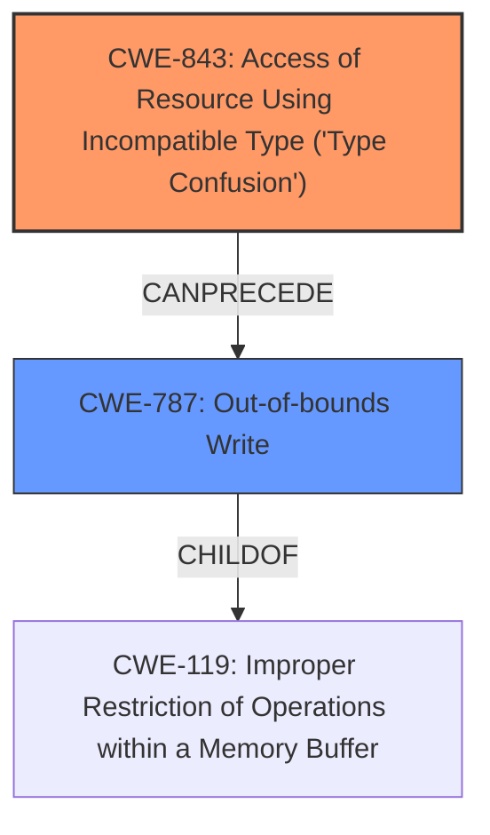

# Enhanced Analysis for CVE-2024-7652

# Summary
| CWE ID | CWE Name | Confidence | CWE Abstraction Level | CWE Vulnerability Mapping Label | CWE-Vulnerability Mapping Notes |
|---|---|---|---|---|---|
| CWE-843 | Access of Resource Using Incompatible Type ('Type Confusion') | 0.9 | Base | Primary CWE | Allowed |
| CWE-787 | Out-of-bounds Write | 0.7 | Base | Secondary Candidate | Allowed |

## Evidence and Confidence

*   **Confidence Score:** 0.8
*   **Evidence Strength:** HIGH

## Relationship Analysis
The primary relationship influencing the decision is the direct match of "**type confusion**" to CWE-843. While CWE-787 (Out-of-bounds Write) is a potential consequence, CWE-843 better captures the **root cause** of the vulnerability. CWE-787 is a child of CWE-119 (Improper Restriction of Operations within a Memory Buffer), indicating a potential path to memory corruption.



## Vulnerability Chain
The vulnerability chain starts with the **type confusion** (CWE-843) due to an error in the ECMA-262 specification, leading to potential **memory corruption** and ultimately an exploitable crash.
- CWE-843: Root cause - **Type Confusion** due to the error in the ECMA-262 specification.
- CWE-787: Potential consequence of the type confusion leading to **memory corruption**.

## Summary of Analysis
The initial analysis identified CWE-843 as the primary candidate due to the explicit mention of "**type confusion**" in both the vulnerability description and the CVE Reference Links Content Summary. The summary highlights that the vulnerability stems from an error in the ECMA-262 specification, leading to a **type confusion** where the async generator machinery incorrectly assumes that `IteratorResult` objects cannot be then-ables. This leads to potential **memory corruption** and an exploitable crash.

The relationship analysis reinforces this selection, as CWE-843 represents the root cause. The high retriever score for CWE-843 further supports this decision. CWE-787 is a secondary candidate because the type confusion *could* lead to memory corruption via out-of-bounds write, but this is a consequence, not the initial flaw.

The selected CWEs are at the optimal level of specificity because CWE-843 directly addresses the "**type confusion**" issue, while CWE-787 represents a potential outcome.

Relevant CWE Information:

# Enhanced Context (25 CWEs)
The following CWEs were identified as potentially relevant to this vulnerability:

## CWE-843: Access of Resource Using Incompatible Type ('Type Confusion')
**Abstraction Level**: Base
**Similarity Score**: 0.77
**Source**: dense

**Description**:
The product allocates or initializes a resource such as a pointer, object, or variable using one type, but it later accesses that resource using a type that is incompatible with the original type.

**Mapping Guidance**:
- Usage: Allowed
- Rationale: This CWE entry is at the Base level of abstraction, which is a preferred level of abstraction for mapping to the root causes of vulnerabilities.

**Technical Explanation for CWE-843:**
The vulnerability's details align with CWE-843 as the ECMA-262 specification error leads to a **type confusion**. This means that the async generator machinery accesses `IteratorResult` objects using an incompatible type, leading to unexpected behavior. The security implication is **memory corruption** and a potential exploitable crash. This CWE is the primary weakness because it represents the **root cause** of the vulnerability.

**Technical Explanation for CWE-787:**
CWE-787 (Out-of-bounds Write) could be a consequence of the type confusion, where the incorrect type usage leads to writing data outside the intended buffer. However, it's not the direct **root cause**, but a potential outcome. Therefore, it's considered a secondary candidate.


## CWE Relationship Analysis

Current CWEs represent these abstraction levels: .


### Vulnerability Chain Analysis

**Chain starting from CWE-843:**
- 843 (Access of Resource Using Incompatible Type ('Type Confusion')) - ROOT


**Chain starting from CWE-787:**
- 787 (Out-of-bounds Write) - ROOT


### CWE Relationship Diagram

```mermaid
graph TD
    classDef primary fill:#f96,stroke:#333,stroke-width:2px
    classDef secondary fill:#69f,stroke:#333
    classDef tertiary fill:#9e9,stroke:#333
```