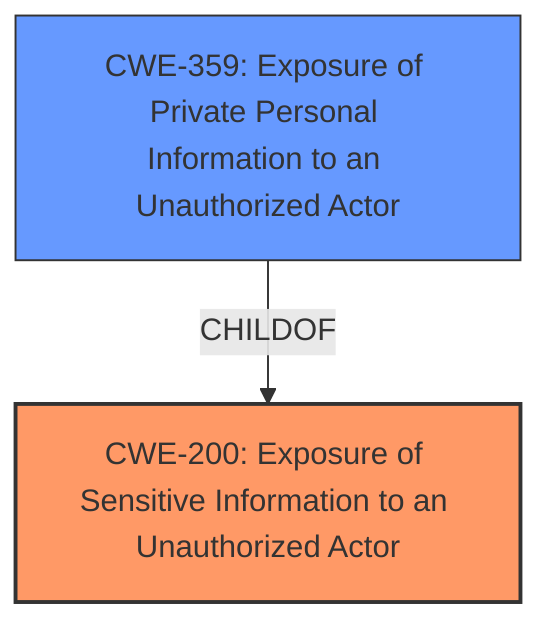

# Raw Analyzer Response for CVE-2024-7697

# Summary
| CWE ID  | CWE Name                                                        | Confidence | CWE Abstraction Level | CWE Vulnerability Mapping Label | CWE-Vulnerability Mapping Notes |
| :-------- | :-------------------------------------------------------------- | :--------- | :-------------------- | :------------------------------ | :------------------------------ |
| CWE-200 | Exposure of Sensitive Information to an Unauthorized Actor | 0.8        | Class                 | Primary CWE                     | Discouraged                     |
| CWE-359 | Exposure of Private Personal Information to an Unauthorized Actor | 0.5        | Base                  | Secondary Candidate             | Allowed                         |

## Evidence and Confidence

*   **Confidence Score:** 0.8
*   **Evidence Strength:** LOW

## Relationship Analysis
The primary relationship impacting the decision is the hierarchical relationship where CWE-359 (Exposure of Private Personal Information to an Unauthorized Actor) is a more specific type of CWE-200 (Exposure of Sensitive Information to an Unauthorized Actor). While CWE-359 is more specific, the provided vulnerability description only mentions "user information leakage risks" without specifying if it is private personal information. Therefore, I'm choosing the more general CWE-200 with the understanding that if more specific details were available, CWE-359 would be preferable.

## Vulnerability Chain
The vulnerability chain starts with a logical flaw in the mobile application, which leads to the exposure of user information.

Logical Flaw -> **Exposure of Sensitive Information** (CWE-200)

## Summary of Analysis
The initial analysis focused on identifying the **root cause** of the vulnerability based on the description provided. The description explicitly mentions "user information leakage risks," which directly relates to the exposure of sensitive information.

CWE-200 (Exposure of Sensitive Information to an Unauthorized Actor) was selected as the primary CWE because it aligns with the described **impact** of the vulnerability. The retriever results also listed CWE-200 as the top candidate.

CWE-359 (Exposure of Private Personal Information to an Unauthorized Actor) was considered as a more specific alternative since it is a child of CWE-200. However, the vulnerability description lacks the specificity to confirm whether the leaked information is "private personal information."

Ultimately, CWE-200 was chosen due to its broader applicability to the available evidence. If there were more details in the Vulnerability Description Key Phrases about the type of user information, the mapping could be refined to CWE-359.

The evidence is relatively weak because the "CVE Reference Links Content Summary" is unrelated. Therefore, the confidence is not at its highest.

Relevant CWE Information:
# Enhanced Context (25 CWEs)
The following CWEs were identified as potentially relevant to this vulnerability:

## CWE-200: Exposure of Sensitive Information to an Unauthorized Actor
**Abstraction Level**: Class
**Similarity Score**: 0.70
**Source**: dense

**Description**:
The product exposes sensitive information to an actor that is not explicitly authorized to have access to that information.

**Mapping Guidance**:
- Usage: Discouraged
- Rationale: CWE-200 is commonly misused to represent the loss of confidentiality in a vulnerability, but confidentiality loss is a technical impact - not a root cause error. As of CWE 4.9, over 400 CWE entries can lead to a loss of confidentiality. Other options are often available. [REF-1287].

## CWE-359: Exposure of Private Personal Information to an Unauthorized Actor
**Abstraction Level**: Base
**Similarity Score**: 0.71
**Source**: dense

**Description**:
The product does not properly prevent a person's private, personal information from being accessed by actors who either (1) are not explicitly authorized to access the information or (2) do not have the implicit consent of the person about whom the information is collected.

**Mapping Guidance**:
- Usage: Allowed
- Rationale: This CWE entry is at the Base level of abstraction, which is a preferred level of abstraction for mapping to the root causes of vulnerabilities.