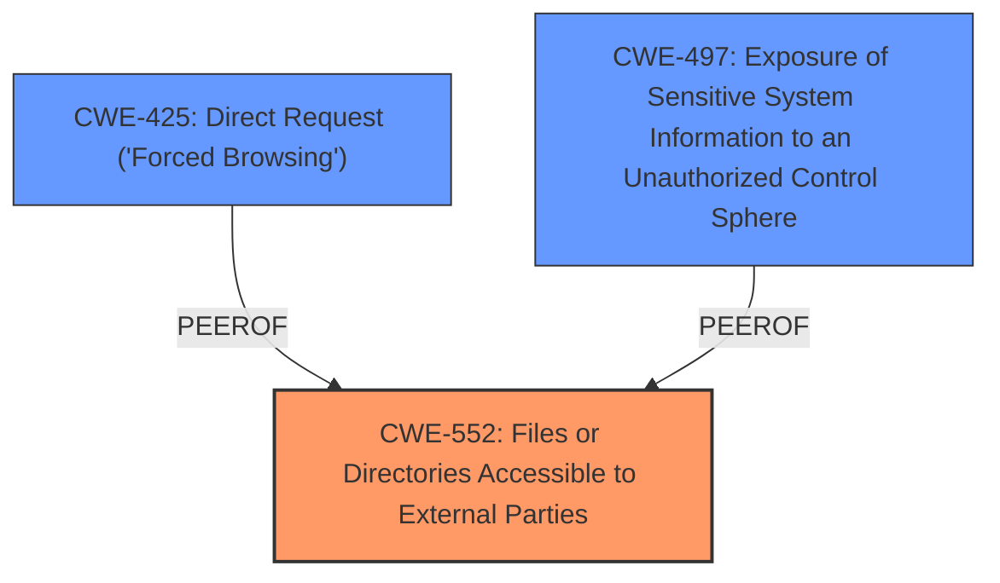

# Analysis Report for CVE-2024-7704

# Vulnerability Analysis Report: CVE-2024-7704

## Description

A vulnerability was found in Weaver e-cology 8. It has been classified as problematic. Affected is an unknown function of the file /cloudstore/ecode/setup/ecology_dev.zip of the component Source Code Handler. The manipulation leads to information disclosure. It is possible to launch the attack remotely. The exploit has been disclosed to the public and may be used. NOTE The vendor was contacted early about this disclosure but did not respond in any way.

## Vulnerability Description Key Phrases

- **Impact:** information disclosure
- **Product:** Weaver e-cology
- **Version:** 8
- **Component:** /cloudstore/ecode/setup/ecology_dev.zip

## Analysis (with Relationship Data)

# Summary
| CWE ID | CWE Name | Confidence | CWE Abstraction Level | CWE Vulnerability Mapping Label | CWE-Vulnerability Mapping Notes |
|---|---|---|---|---|---|
| CWE-552 | Files or Directories Accessible to External Parties | 1 | Base | Allowed | Primary CWE. The **root cause** is that the application allows external access to sensitive files. |

## Evidence and Confidence

*   **Confidence Score:** 1
*   **Evidence Strength:** HIGH

## Relationship Analysis
The primary relationship considered was the direct match of the vulnerability description to CWE-552, which represents the **root cause** of the information disclosure. Other CWEs considered, such as CWE-425, could be related but do not represent the **root cause** of the vulnerability. CWE-552 is at the Base level, which is the preferred level of abstraction.



## Vulnerability Chain
The vulnerability chain starts with the **root cause**: **improper access control** (CWE-552), which leads directly to **information disclosure**.
  - **Root Cause:** CWE-552 (Files or Directories Accessible to External Parties) - The application **fails to restrict access** to the `ecology_dev.zip` file.
  - **Impact:** Information Disclosure - Unauthorized users can download the file and potentially gain access to sensitive information.

## Summary of Analysis
The primary weakness is the **lack of proper access control**, allowing unauthorized external access to sensitive files. The vulnerability description explicitly states that the `/cloudstore/ecode/setup/ecology_dev.zip` file is accessible, leading to information disclosure. This aligns directly with CWE-552 (Files or Directories Accessible to External Parties).

The evidence is strong, as the vulnerability description and CVE Reference Links Content Summary both highlight the direct accessibility of the file as the **root cause**.

CWE-552 is at the Base level of abstraction, which is the preferred level. Other CWEs, such as CWE-425 (Direct Request ('Forced Browsing')), could be considered related, but they describe the method of exploitation rather than the **underlying weakness**.

Relevant CWE Information:

# Enhanced Context (25 CWEs)
The following CWEs were identified as potentially relevant to this vulnerability:

## CWE-552: Files or Directories Accessible to External Parties
**Abstraction Level**: Base
**Similarity Score**: 0.77
**Source**: dense

**Description**:
The product makes files or directories accessible to unauthorized actors, even though they should not be.

**Mapping Guidance**:
- Usage: Allowed
- Rationale: This CWE entry is at the Base level of abstraction, which is a preferred level of abstraction for mapping to the root causes of vulnerabilities.

## CWE-497: Exposure of Sensitive System Information to an Unauthorized Control Sphere
**Abstraction Level**: Base
**Similarity Score**: 0.77
**Source**: dense

**Description**:
The product does not properly prevent sensitive system-level information from being accessed by unauthorized actors who do not have the same level of access to the underlying system as the product does.

**Mapping Guidance**:
- Usage: Allowed
- Rationale: This CWE entry is at the Base level of abstraction, which is a preferred level of abstraction for mapping to the root causes of vulnerabilities.

## CWE-425: Direct Request ('Forced Browsing')
**Abstraction Level**: Base
**Similarity Score**: 0.77
**Source**: dense

**Description**:
The web application does not adequately enforce appropriate authorization on all restricted URLs, scripts, or files.

**Mapping Guidance**:
- Usage: Allowed
- Rationale: This CWE entry is at the Base level of abstraction, which is a preferred level of abstraction for mapping to the root causes of vulnerabilities.


## CWE Relationship Analysis

Current CWEs represent these abstraction levels: .


### Vulnerability Chain Analysis

**Chain starting from CWE-552:**
- 552 (Files or Directories Accessible to External Parties) - ROOT


**Chain starting from CWE-497:**
- 497 (Exposure of Sensitive System Information to an Unauthorized Control Sphere) - ROOT


### CWE Relationship Diagram

```mermaid
graph TD
    classDef primary fill:#f96,stroke:#333,stroke-width:2px
    classDef secondary fill:#69f,stroke:#333
    classDef tertiary fill:#9e9,stroke:#333
```


*Report generated on 2025-07-14 03:03:24*
