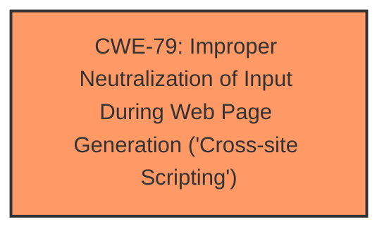

# Enhanced Analysis for CVE-2024-7759

# Summary
| CWE ID | CWE Name | Confidence | CWE Abstraction Level | CWE Vulnerability Mapping Label | CWE-Vulnerability Mapping Notes |
|---|---|---|---|---|---|
| CWE-79 | Improper Neutralization of Input During Web Page Generation ('Cross-site Scripting') | 1.0 | Base | Primary | Allowed |

## Evidence and Confidence

*   **Confidence Score:** 1.0
*   **Evidence Strength:** HIGH

## Relationship Analysis
The primary CWE identified is CWE-79, which is a base-level CWE. There are no direct parent-child or chain relationships that significantly influence the selection in this case, as the evidence points directly to improper neutralization of input leading to XSS. The abstraction level is appropriate as it represents the specific weakness directly.



## Vulnerability Chain
The vulnerability chain starts with the **failure to sanitize and escape settings**, leading to the injection of malicious scripts. This directly results in Stored Cross-Site Scripting (XSS).

## Summary of Analysis
The analysis is based on the provided evidence, which clearly indicates that the plugin **does not sanitise and escape some of its settings**. This **weakness** directly enables Stored **Cross-Site Scripting** (XSS) attacks. The selection of CWE-79 is primarily driven by the explicit mention of "Cross-Site Scripting" and the root cause of **improper neutralization of input**. The evidence from the "Vulnerability Description Key Phrases" and "Analysis of CVE-2024-7759 Content" supports this: "**does not sanitise and escape some of its settings**" and "The plugin does not sanitize and escape some of its settings, allowing for the injection of malicious scripts." The choice of CWE-79 is at the optimal level of specificity, as it directly addresses the nature of the vulnerability.

Relevant CWE Information:

# Enhanced Context (25 CWEs)
The following CWEs were identified as potentially relevant to this vulnerability:

## CWE-79: Improper Neutralization of Input During Web Page Generation ('Cross-site Scripting')
**Abstraction Level**: base
**Similarity Score**: 4.47
**Source**: graph

**Description**:
CWE-79: Improper Neutralization of Input During Web Page Generation ('Cross-site Scripting')

**Mapping Guidance**:
- Usage: Allowed
- Rationale: This CWE entry is at the Base level of abstraction, which is a preferred level of abstraction for mapping to the root causes of vulnerabilities.

**Relationships**:
- PARENTOF -> CWE-87
- PARENTOF -> CWE-86
- PARENTOF -> CWE-85
- PARENTOF -> CWE-84
- PARENTOF -> CWE-83


## CWE Relationship Analysis

Current CWEs represent these abstraction levels: .


### Vulnerability Chain Analysis

**Chain starting from CWE-87:**
- 87 (Improper Neutralization of Alternate XSS Syntax) - ROOT


**Chain starting from CWE-79:**
- 79 (Improper Neutralization of Input During Web Page Generation ('Cross-site Scripting')) - ROOT


### CWE Relationship Diagram

```mermaid
graph TD
    classDef primary fill:#f96,stroke:#333,stroke-width:2px
    classDef secondary fill:#69f,stroke:#333
    classDef tertiary fill:#9e9,stroke:#333
```