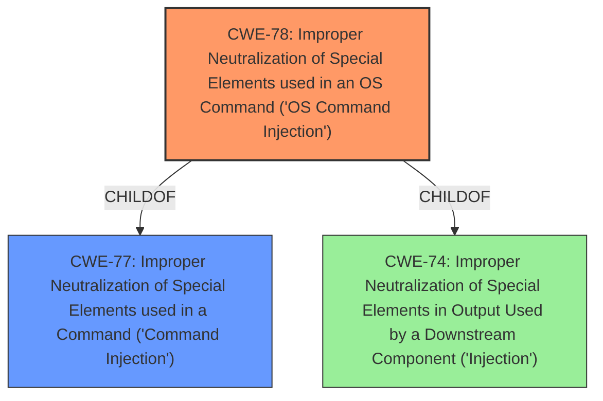

# Analysis for CVE-2024-7833

# Summary
| CWE ID | CWE Name | Confidence | CWE Abstraction Level | CWE Vulnerability Mapping Label | CWE-Vulnerability Mapping Notes |
|---|---|---|---|---|---|
| CWE-78 | Improper Neutralization of Special Elements used in an OS Command ('OS Command Injection') | 1.0 | Base | Allowed | Primary CWE |

## Evidence and Confidence

*   **Confidence Score:** 1.0
*   **Evidence Strength:** HIGH

## Relationship Analysis
The primary relationship that influenced the decision was the parent-child relationship between CWE-78 (OS Command Injection) and CWE-77 (Command Injection). Since the vulnerability specifically involves the execution of OS commands, CWE-78 was chosen as the more specific and appropriate classification. Other relationships, such as those involving SQL Injection (CWE-89) or Cross-Site Scripting (CWE-79), were not relevant as they did not align with the technical details of the vulnerability. Abstraction levels were considered to ensure that the selected CWE was at the base level for accuracy.

## Vulnerability Chain
The vulnerability chain starts with the **improper sanitization** of the `cmd` parameter, leading to **command injection**, and ultimately resulting in the ability to execute arbitrary commands on the underlying operating system.

1.  **Root Cause:** **Improper sanitization** of the `cmd` parameter.
2.  **Weakness:** **Command injection** (CWE-78).
3.  **Impact:** Execution of arbitrary commands on the operating system.

## Summary of Analysis
The analysis strongly supports the classification of this vulnerability as CWE-78 (Improper Neutralization of Special Elements used in an OS Command ('OS Command Injection')). The vulnerability description clearly states that the manipulation of the `path` argument leads to **command injection**, and the CVE reference summary explicitly mentions that the root cause is due to the insufficient sanitization of the `cmd` parameter in the `upgrade_filter.asp` file, allowing an attacker to execute arbitrary commands on the underlying OS.

The selection of CWE-78 is based on the following evidence:

*   Vulnerability Description Key Phrases: **weakness: command injection**
*   CVE Reference Links Content Summary: Root cause of vulnerability is command injection due to insufficient sanitization of the `cmd` parameter.
*   CVE Reference Links Content Summary: Impact of exploitation is that an attacker can execute arbitrary commands on the underlying operating system.

The retriever results also support this classification, with CWE-78 being a top candidate. The relationship analysis further reinforces this decision, as CWE-78 is a more specific child of the more general CWE-77 (Improper Neutralization of Special Elements used in a Command ('Command Injection')), which is also listed in the retriever results. The base abstraction level is appropriate given the specificity of the vulnerability.

Other CWEs Considered:

*   CWE-77 (Improper Neutralization of Special Elements used in a Command ('Command Injection')): While relevant, it is a more general class. Since the vulnerability specifically involves OS commands, CWE-78 is more appropriate.
*   CWE-89 (Improper Neutralization of Special Elements used in an SQL Command ('SQL Injection')): Not applicable as the vulnerability does not involve SQL commands.
*   CWE-79 (Improper Neutralization of Input During Web Page Generation ('Cross-site Scripting')): Not applicable as the vulnerability does not involve cross-site scripting.
*   CWE-74 (Improper Neutralization of Special Elements in Output Used by a Downstream Component ('Injection')): This is a high-level class, and CWE-78 is a more specific and appropriate classification.