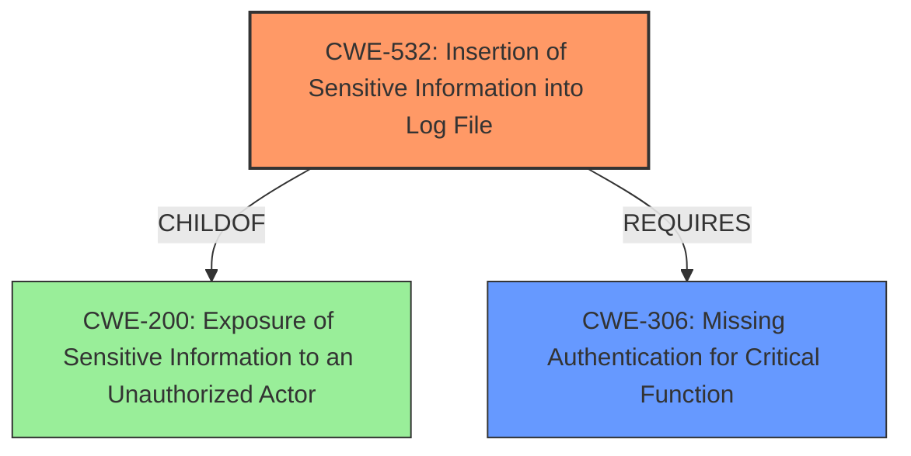

# Enhanced Analysis for CVE-2024-7870

# Summary

| CWE ID  | CWE Name                                                              | Confidence | CWE Abstraction Level | CWE Vulnerability Mapping Label | CWE-Vulnerability Mapping Notes |
| ------- | --------------------------------------------------------------------- | ---------- | ----------------------- | ------------------------------- | ----------------------------- |
| CWE-532 | Insertion of Sensitive Information into Log File                      | 0.9        | Base                    | Primary                         | Allowed                       |
| CWE-306 | Missing Authentication for Critical Function                        | 0.8        | Base                    | Secondary                       | Allowed                       |

## Evidence and Confidence

*   **Confidence Score:** 0.85
*   **Evidence Strength:** HIGH

## Relationship Analysis

The primary relationship that influenced the selection was the parent-child relationship between CWE-532 (Insertion of Sensitive Information into Log File) and CWE-200 (Exposure of Sensitive Information to an Unauthorized Actor). CWE-532 is a child of CWE-200, but CWE-532 provides a more specific description of the vulnerability as it directly involves sensitive information being written to a log file, which is the core issue. CWE-306 (Missing Authentication for Critical Function) is included as a secondary weakness because the vulnerability involves unauthenticated access to log files. This indicates a lack of proper access control mechanisms.



## Vulnerability Chain

The vulnerability chain starts with **CWE-532 (Insertion of Sensitive Information into Log File)** where sensitive information is written to log files. Then, **CWE-306 (Missing Authentication for Critical Function)** leads to exposure of these log files to unauthenticated users, which results in **Sensitive Information Exposure**.

## Summary of Analysis

The primary vulnerability is **CWE-532 (Insertion of Sensitive Information into Log File)** because the root cause is the logging of sensitive information. The CVE description states that the plugin writes debug logs to a publicly accessible directory. The presence of **Sensitive Information Exposure** in the vulnerability description further supports this classification. The Retriever Results also list CWE-532 as the top candidate, further supporting its selection.

**CWE-306 (Missing Authentication for Critical Function)** is a secondary weakness since the log files are publicly accessible without any authentication mechanism. The "CVE Reference Links Content Summary" section explicitly mentions that the plugin's logging functionality makes log files publicly accessible without any authentication. This absence of authentication is a critical aspect of the vulnerability, leading to the unauthorized access and deletion of log files.

CWE-200 was considered but not selected as the primary CWE because it is a more general class that describes the exposure of sensitive information. While the vulnerability does result in the exposure of sensitive information, the root cause is more accurately described by CWE-532, which specifically addresses the insertion of sensitive information into log files. The MITRE mapping guidance discourages using CWE-200 as a primary CWE because it is a technical impact and not a root cause error.
The vulnerability description explicitly mentions publicly exposed log files containing potentially sensitive information. The CVE Reference Links Content Summary confirms that the plugin stores debug logs in a publicly accessible directory and exposes functionality to download and delete these files without proper authentication. These details align directly with the characteristics of CWE-532 and CWE-306.
The selected CWEs are at the optimal level of specificity because they accurately describe the root cause and contributing factors of the vulnerability. CWE-532 identifies the specific issue of sensitive information being written to log files, while CWE-306 highlights the lack of authentication that allows unauthorized access to these files. These CWEs provide a more detailed and precise understanding of the vulnerability than more general classifications like CWE-200.


## CWE Relationship Analysis

Current CWEs represent these abstraction levels: .


### Vulnerability Chain Analysis

**Chain starting from CWE-306:**
- 306 (Missing Authentication for Critical Function) - ROOT


**Chain starting from CWE-200:**
- 200 (Exposure of Sensitive Information to an Unauthorized Actor) - ROOT


### CWE Relationship Diagram

```mermaid
graph TD
    classDef primary fill:#f96,stroke:#333,stroke-width:2px
    classDef secondary fill:#69f,stroke:#333
    classDef tertiary fill:#9e9,stroke:#333
```