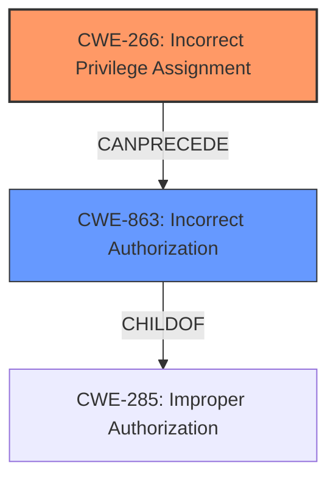

# Analysis for CVE-2024-7960

# Summary

| CWE ID  | CWE Name                                                        | Confidence | CWE Abstraction Level | CWE Vulnerability Mapping Label | CWE-Vulnerability Mapping Notes |
| :-------- | :-------------------------------------------------------------- | :--------- | :-------------------- | :------------------------------ | :------------------------------ |
| CWE-266 | Incorrect Privilege Assignment                                  | 1          | Base                  | Primary                         | Allowed                         |
| CWE-863 | Incorrect Authorization                                         | 0.7        | Class                 | Secondary                       | Allowed-with-Review             |
| CWE-285 | Improper Authorization                                          | 0.3        | Class                 | Alternative                     | Discouraged                     |

## Evidence and Confidence

*   **Confidence Score:** 0.8
*   **Evidence Strength:** HIGH

## Relationship Analysis

The primary CWE is CWE-266, which is a Base level CWE. CWE-863 is a Class-level CWE and a potential consequence of CWE-266. CWE-285 is also a Class-level CWE, representing a more general authorization issue. The relationship is as follows: CWE-266 (Incorrect Privilege Assignment) leads to CWE-863 (Incorrect Authorization), as the **incorrect privilege assignment** results in **incorrect authorization**.

## Vulnerability Chain

The vulnerability chain starts with the **incorrect privilege matrix** (CWE-266). This leads to users having access to functions they should not, which is an **incorrect authorization** (CWE-863). The impact of this is that a threat actor can view sensitive information and change settings.
  - CWE-266: Incorrect Privilege Assignment (**Root Cause**)
  - CWE-863: Incorrect Authorization
  - Impact: View sensitive information and change settings

## Summary of Analysis

The primary weakness is CWE-266 (Incorrect Privilege Assignment). The description explicitly states "**incorrect privilege matrix** that allows users to have access to functions they should not". This directly aligns with CWE-266, which describes a product that "incorrectly assigns a privilege to a particular actor, creating an unintended sphere of control for that actor." This is further supported by the "CVE Reference Links Content Summary" section, which states "**Root cause of vulnerability:** Incorrect privilege matrix allows users access to functions they should not." The mapping guidance also suggests CWE-266 when there is a role misassignment.

CWE-863 (Incorrect Authorization) is a secondary CWE. The **incorrect privilege assignment** leads to **incorrect authorization**, as users are able to access functions they shouldn't. While authorization is technically happening, it's flawed due to the initial privilege misconfiguration.

CWE-285 (Improper Authorization) was considered but not selected as the primary CWE because it is more general. While it's true that there is an authorization issue, the root cause is the privilege assignment. CWE-285 is also discouraged.

The selected CWEs are at the optimal level of specificity. CWE-266 is a Base-level CWE, representing the root cause, and CWE-863 is a Class-level CWE, representing the immediate consequence.

Relevant CWE Information:

# Enhanced Context (25 CWEs)

## CWE-266: Incorrect Privilege Assignment
**Abstraction Level**: Base
**Similarity Score**: 0.79
**Source**: dense

**Description**:
A product incorrectly assigns a privilege to a particular actor, creating an unintended sphere of control for that actor.

**Mapping Guidance**:
- Usage: Allowed
- Rationale: This CWE entry is at the Base level of abstraction, which is a preferred level of abstraction for mapping to the root causes of vulnerabilities.

## CWE-863: Incorrect Authorization
**Abstraction Level**: Class
**Similarity Score**: 1386.08
**Source**: sparse

**Description**:
The product performs an authorization check when an actor attempts to access a resource or perform an action, but it does not correctly perform the check.

**Mapping Guidance**:
- Usage: Allowed-with-Review
- Rationale: This CWE entry is a Class and might have Base-level children that would be more appropriate