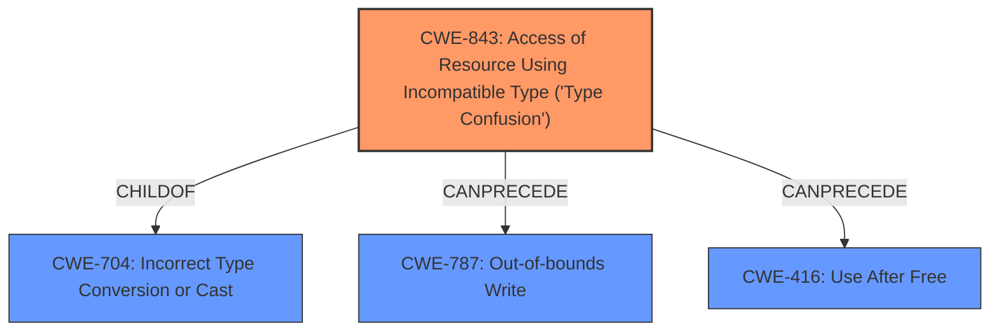

# Analysis for CVE-2024-7969

# Summary
| CWE ID | CWE Name | Confidence | CWE Abstraction Level | CWE Vulnerability Mapping Label | CWE-Vulnerability Mapping Notes |
|---|---|---|---|---|---|
| CWE-843 | Access of Resource Using Incompatible Type ('Type Confusion') | 1.0 | Base | Allowed | Primary CWE |
| CWE-787 | Out-of-bounds Write | 0.5 | Base | Allowed | Secondary Candidate |
| CWE-416 | Use After Free | 0.5 | Variant | Allowed | Secondary Candidate |

## Evidence and Confidence

*   **Confidence Score:** 0.8
*   **Evidence Strength:** HIGH

## Relationship Analysis
The primary CWE identified is CWE-843 (**Access of Resource Using Incompatible Type ('Type Confusion')**), which is a Base level CWE. CWE-843 is a child of CWE-704 (**Incorrect Type Conversion or Cast**), which is a Class level CWE. CWE-843 can lead to other issues such as out-of-bounds write (CWE-787) or use-after-free (CWE-416). These relationships help understand the potential consequences of the type confusion. We selected CWE-843 as it directly matches the **rootcause** described in the vulnerability description.

## Vulnerability Chain
The vulnerability chain starts with **Type Confusion** (CWE-843), which leads to heap corruption. The heap corruption may then result in an out-of-bounds write or use-after-free condition, potentially leading to arbitrary code execution.

CWE-843 (Root Cause: Type Confusion) -> Heap Corruption -> Potential Exploitation (Out-of-bounds Write/Use-After-Free).

## Summary of Analysis
The primary weakness is **Type Confusion** in the V8 JavaScript engine, as indicated by the vulnerability description and CVE reference summary.

The vulnerability description states "Type Confusion in V8 in Google Chrome prior to 128.0.6613.113 allowed a remote attacker to potentially exploit heap corruption via a crafted HTML page." The **rootcause** is explicitly identified as **Type Confusion**. The CVE Reference Links Content Summary also confirms "**Type confusion**: This occurs when a variable or object is treated as one type when it's actually another. This can lead to memory corruption or unexpected behavior."

CWE-843 (**Access of Resource Using Incompatible Type ('Type Confusion')**) is the most appropriate CWE because it directly describes the **rootcause** of the vulnerability.

The Retriever Results also list CWE-843 as the top candidate.

CWE-787 (**Out-of-bounds Write**) and CWE-416 (**Use After Free**) are considered as secondary candidates, as they are potential consequences of the type confusion leading to heap corruption. However, without further information, it's difficult to confirm whether the type confusion *definitely* leads to these conditions. Therefore, they are assigned lower confidence.

The selection of CWE-843 is at the optimal level of specificity because it directly represents the **rootcause** as described in the vulnerability description.

Relevant CWE Information:

# Enhanced Context (25 CWEs)
The following CWEs were identified as potentially relevant to this vulnerability:

## CWE-843: Access of Resource Using Incompatible Type ('Type Confusion')
**Abstraction Level**: Base
**Similarity Score**: 0.82
**Source**: dense

**Description**:
The product allocates or initializes a resource such as a pointer, object, or variable using one type, but it later accesses that resource using a type that is incompatible with the original type.

**Mapping Guidance**:
- Usage: Allowed
- Rationale: This CWE entry is at the Base level of abstraction, which is a preferred level of abstraction for mapping to the root causes of vulnerabilities.

## CWE-787: Out-of-bounds Write
**Abstraction Level**: base
**Similarity Score**: 3.30
**Source**: graph

**Description**:
CWE-787: Out-of-bounds Write

**Mapping Guidance**:
- Usage: Allowed
- Rationale: This CWE entry is at the Base level of abstraction, which is a preferred level of abstraction for mapping to the root causes of vulnerabilities.

## CWE-416: Use After Free
**Abstraction Level**: Variant
**Similarity Score**: 2.51
**Source**: graph

**Description**:
The product reuses or references memory after it has been freed. At some point afterward, the memory may be allocated again and saved in another pointer, while the original pointer references a location somewhere within the new allocation. Any operations using the original pointer are no longer valid because the memory "belongs" to the code that operates on the new pointer.