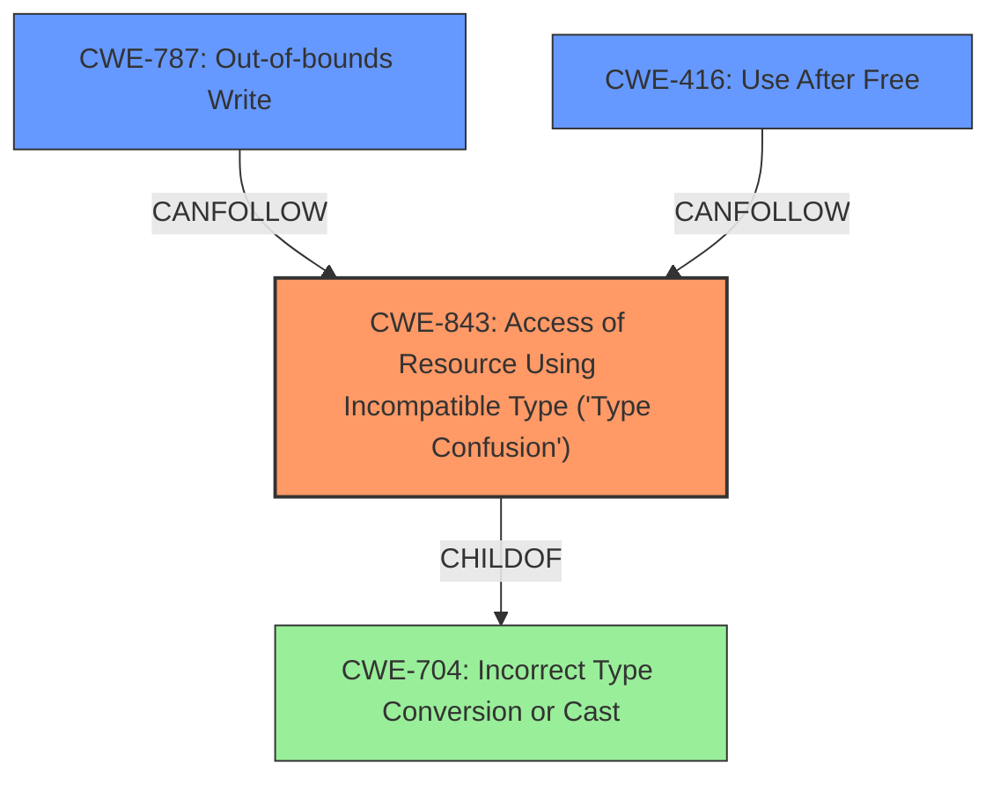

# Raw Analyzer Response for CVE-2024-7971

# Summary
| CWE ID | CWE Name | Confidence | CWE Abstraction Level | CWE Vulnerability Mapping Label | CWE-Vulnerability Mapping Notes |
|---|---|---|---|---|---|
| CWE-843 | Access of Resource Using Incompatible Type ('Type Confusion') | 1.0 | Base | Primary | Allowed |
| CWE-787 | Out-of-bounds Write | 0.3 | Base | Secondary | Allowed |
| CWE-416 | Use After Free | 0.3 | Variant | Secondary | Allowed |

## Evidence and Confidence

*   **Confidence Score:** 0.8
*   **Evidence Strength:** HIGH

## Relationship Analysis
The primary relationship that influenced the CWE selection is the direct match of the vulnerability description to **CWE-843 (Access of Resource Using Incompatible Type ('Type Confusion'))**. While other CWEs like **CWE-787 (Out-of-bounds Write)** and **CWE-416 (Use After Free)** are potentially related as consequences of type confusion, **CWE-843** most accurately represents the root cause. The choice of **CWE-843** is also supported by its Base abstraction level, which is preferred for root cause analysis.

## Vulnerability Chain
The vulnerability chain starts with **CWE-843 (Access of Resource Using Incompatible Type ('Type Confusion'))**, which leads to heap corruption. Exploitation of this heap corruption may then lead to **CWE-787 (Out-of-bounds Write)** or **CWE-416 (Use After Free)**. The ultimate impact is Remote Code Execution (RCE) and potentially system compromise due to the exploitation of a sandbox escape.

## Summary of Analysis
The primary CWE selected is **CWE-843 (Access of Resource Using Incompatible Type ('Type Confusion'))** because the **rootcause** in the vulnerability description is "**Type confusion**". This is supported by the "CVE Reference Links Content Summary" which states, "The vulnerability is a **type confusion** issue in the V8 JavaScript and WebAssembly engine within Chromium." This is the most accurate representation of the vulnerability's underlying cause based on the provided evidence.

**CWE-787 (Out-of-bounds Write)** and **CWE-416 (Use After Free)** were considered as secondary CWEs because the vulnerability description mentions heap corruption and the "CVE Reference Links Content Summary" states that successful exploitation leads to remote code execution (RCE) and potentially system compromise. These vulnerabilities often arise as a result of type confusion leading to memory corruption.

The abstraction level of **CWE-843** is Base, which aligns well with the aim of identifying the root cause of the vulnerability.

The other CWEs were considered, but they were not selected because they did not match the vulnerability description as closely as **CWE-843**, **CWE-787**, and **CWE-416**.

Relevant CWE Information:

# Enhanced Context (25 CWEs)
The following CWEs were identified as potentially relevant to this vulnerability:

## CWE-843: Access of Resource Using Incompatible Type ('Type Confusion')
**Abstraction Level**: Base
**Similarity Score**: 0.84
**Source**: dense

**Description**:
The product allocates or initializes a resource such as a pointer, object, or variable using one type, but it later accesses that resource using a type that is incompatible with the original type.

**Mapping Guidance**:
- Usage: Allowed
- Rationale: This CWE entry is at the Base level of abstraction, which is a preferred level of abstraction for mapping to the root causes of vulnerabilities.