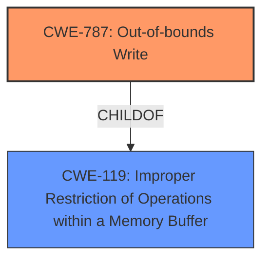

# Raw Analyzer Response for CVE-2024-7972

# Summary
| CWE ID | CWE Name | Confidence | CWE Abstraction Level | CWE Vulnerability Mapping Label | CWE-Vulnerability Mapping Notes |
|---|---|---|---|---|---|
| CWE-787 | Out-of-bounds Write | 0.8 | Base | Primary | Allowed |
| CWE-119 | Improper Restriction of Operations within a Memory Buffer | 0.6 | Class | Secondary | Allowed |

## Evidence and Confidence

*   **Confidence Score:** 0.7
*   **Evidence Strength:** MEDIUM

## Relationship Analysis
The primary relationship is the parent-child relationship between CWE-787 **CWE-787: Out-of-bounds Write** and CWE-119 **CWE-119: Improper Restriction of Operations within a Memory Buffer**. CWE-787 **CWE-787: Out-of-bounds Write** is a more specific case of CWE-119 **CWE-119: Improper Restriction of Operations within a Memory Buffer**, where the operation is writing data. The chain relationship is that improper memory restrictions (CWE-119 **CWE-119: Improper Restriction of Operations within a Memory Buffer**) can lead to out-of-bounds writes (CWE-787 **CWE-787: Out-of-bounds Write**).

## Vulnerability Chain
The vulnerability chain starts with an **inappropriate implementation** in V8, leading to out-of-bounds memory access.

1.  **Root Cause:** **Inappropriate implementation** within the V8 JavaScript engine.
2.  **Weakness:** Improper memory restrictions (CWE-119 **CWE-119: Improper Restriction of Operations within a Memory Buffer**) due to the **inappropriate implementation**.
3.  **Impact:** Out-of-bounds memory write (CWE-787 **CWE-787: Out-of-bounds Write**).

## Summary of Analysis
The initial analysis pointed to CWE-787 **CWE-787: Out-of-bounds Write** as the primary CWE due to the direct mention of "out of bounds memory access" in the vulnerability description. The phrase "**Inappropriate implementation** in V8 in Google Chrome prior to 128.0.6613.84 allowed a remote attacker to potentially perform out of bounds memory access via a crafted HTML page" clearly indicates that the root cause leads to writing data outside the intended memory region. This is supported by the "CVE Reference Links Content Summary" which states: "**Root cause of vulnerability**: Inappropriate implementation in V8." and "**Weaknesses/vulnerabilities**: An unspecified vulnerability exists due to an inappropriate implementation within the V8 JavaScript engine. This could allow for unexpected behavior."

The retriever results also listed CWE-787 **CWE-787: Out-of-bounds Write** with a high score.

CWE-119 **CWE-119: Improper Restriction of Operations within a Memory Buffer** is included as a secondary CWE because it represents a broader class of memory safety issues where operations are not properly restricted within a buffer. The **inappropriate implementation** could result in lacking proper bounds checking, leading to an out-of-bounds write.

The selected CWEs are at the optimal level of specificity, with CWE-787 **CWE-787: Out-of-bounds Write** being the most descriptive of the actual vulnerability and CWE-119 **CWE-119: Improper Restriction of Operations within a Memory Buffer** providing context about the general class of the vulnerability.

Other CWEs Considered:

*   CWE-416 **CWE-416: Use After Free**: While this is a memory safety issue, the description specifically mentions "out of bounds memory access", which is better captured by CWE-787 **CWE-787: Out-of-bounds Write**.
*   CWE-843 **CWE-843: Access of Resource Using Incompatible Type ('Type Confusion')**: This CWE relates to type confusion, which isn't explicitly mentioned in the provided vulnerability description. The focus is on writing outside the bounds of memory, not necessarily using the wrong type.
*   CWE-122 **CWE-122: Heap-based Buffer Overflow**: This is a type of buffer overflow that occurs in the heap. The description doesn't specifically mention the heap, but it does mention out of bounds access. CWE-787 **CWE-787: Out-of-bounds Write** is more general, and therefore, is preferred.