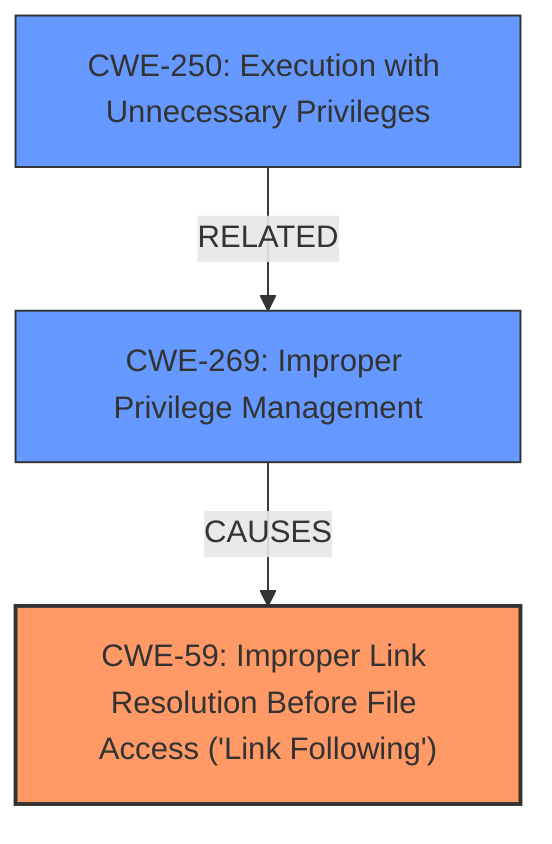

# Raw Analyzer Response for CVE-2024-7979

# Summary
| CWE ID | CWE Name | Confidence | CWE Abstraction Level | CWE Vulnerability Mapping Label | CWE-Vulnerability Mapping Notes |
|---|---|---|---|---|---|
| CWE-59 | Improper Link Resolution Before File Access ('Link Following') | 0.9 | Base | Primary | Allowed |
| CWE-269 | Improper Privilege Management | 0.6 | Class | Secondary Candidate | Discouraged |
| CWE-250 | Execution with Unnecessary Privileges | 0.5 | Base | Secondary Candidate | Allowed |

## Evidence and Confidence

*   **Confidence Score:** 0.8
*   **Evidence Strength:** MEDIUM

## Relationship Analysis
The primary CWE is CWE-59, which describes the **improper handling of symbolic links**, leading to unauthorized file access. CWE-269 and CWE-250 are considered as secondary candidates because the vulnerability ultimately leads to privilege escalation, which involves improper privilege management. The relationship between CWE-59 and the privilege escalation impact is that the ability to manipulate file access can be leveraged to gain higher privileges. CWE-59 is a Base level CWE, providing a more specific description of the vulnerability compared to the Class level CWE-269.

## Vulnerability Chain
The vulnerability chain starts with **insufficient data validation** in the installer, which allows a local attacker to create a crafted symbolic link (CWE-59). This leads to improper file access, and ultimately, privilege escalation.
- **Root Cause:** Insufficient data validation
- **Weakness:** CWE-59 Improper Link Resolution Before File Access ('Link Following')
- **Impact:** Privilege escalation

## Summary of Analysis
The primary focus is on the **insufficient data validation** in the installer, leading to the ability to exploit symbolic links. CWE-59 directly addresses the **improper handling of the symbolic link**, which is the core weakness exploited by the attacker. The vulnerability description mentions that a local attacker can perform privilege escalation via a crafted symbolic link, which aligns with the CWE-59 description. The retriever results also list CWE-59 as a potential candidate with a decent score.
CWE-269 and CWE-250 were considered due to the privilege escalation impact, but CWE-59 more accurately describes the root cause of the vulnerability.

Based on the provided evidence, CWE-59 is the most specific and relevant CWE to represent the vulnerability.

Relevant CWE Information:

# Enhanced Context (25 CWEs)
The following CWEs were identified as potentially relevant to this vulnerability:

## CWE-59: Improper Link Resolution Before File Access ('Link Following')
**Abstraction Level**: Base
**Similarity Score**: 0.77
**Source**: dense

**Description**:
The product attempts to access a file based on the filename, but it does not properly prevent that filename from identifying a link or shortcut that resolves to an unintended resource.

**Mapping Guidance**:
- Usage: Allowed
- Rationale: This CWE entry is at the Base level of abstraction, which is a preferred level of abstraction for mapping to the root causes of vulnerabilities.

# Complete CWE Specifications

CWE-59: Improper Link Resolution Before File Access ('Link Following')

CWE-269: Improper Privilege Management

CWE-250: Execution with Unnecessary Privileges