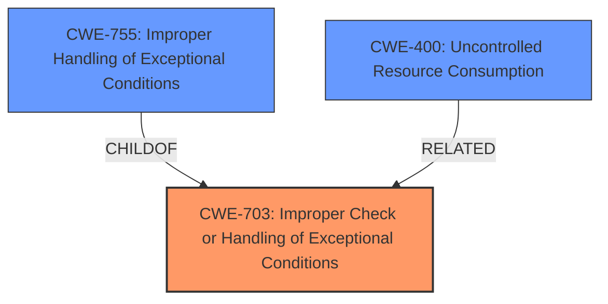

# Analysis for CVE-2024-8020

# Summary
| CWE ID | CWE Name | Confidence | CWE Abstraction Level | CWE Vulnerability Mapping Label | CWE-Vulnerability Mapping Notes |
|---|---|---|---|---|---|
| CWE-703 | Improper Check or Handling of Exceptional Conditions | 0.75 | Pillar | Allowed | Primary CWE |
| CWE-755 | Improper Handling of Exceptional Conditions | 0.60 | Class | Discouraged | Secondary Candidate |
| CWE-400 | Uncontrolled Resource Consumption | 0.50 | Class | Discouraged | Secondary Candidate |

## Evidence and Confidence

*   **Confidence Score:** 0.70
*   **Evidence Strength:** MEDIUM

## Relationship Analysis
The primary relationship influencing my decision is the parent-child relationship between CWE-703 and CWE-755. CWE-703 is a high-level *Pillar*, while CWE-755 is a *Class* directly below it. I considered the more specific CWE-755 but ultimately determined that the description is too general to warrant the child class.

## Vulnerability Chain
The vulnerability chain is relatively simple:

1.  **Root Cause:** **Improper handling of unexpected state values** (CWE-703)
2.  **Impact:** Denial of Service

## Summary of Analysis
The primary CWE is CWE-703, which maps directly to the **improper handling of unexpected state values**. The evidence is drawn directly from the "Vulnerability Description Key Phrases" section. While the impact is a denial of service, the root cause is the handling of the unexpected state, making CWE-703 the most appropriate.

CWE-755 was considered but deemed too specific, as the description only mentions "improper handling" without further detail, while CWE-703 is a broader category that fits better. CWE-400 describes uncontrolled resource consumption, which is a typical result of a denial of service, but does not describe the root cause.

Relevant CWE Information:

*   **CWE-703: Improper Check or Handling of Exceptional Conditions**: This CWE's description aligns with the vulnerability's root cause. The description states the server shuts down because of the **improper handling**.
*   **CWE-755: Improper Handling of Exceptional Conditions**: This CWE is more specific than CWE-703 but still aligns with the description. It could be applicable if the exceptional condition can be identified.
*   **CWE-400: Uncontrolled Resource Consumption**: This CWE describes the impact, but not the root cause.

The evidence from the Vulnerability Description Key Phrases:
*   **rootcause:** **improper handling of unexpected state values**

I am selecting CWE-703 because it directly relates to the **improper handling of unexpected state values**, which is the root cause of the vulnerability.