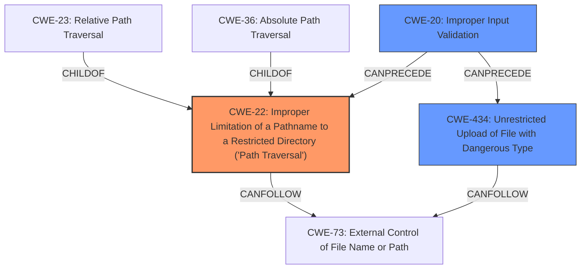

# Analysis Report for CVE-2024-8060

# Vulnerability Analysis Report: CVE-2024-8060

## Description

OpenWebUI version 0.3.0 contains a vulnerability in the audio API endpoint `/audio/api/v1/transcriptions` that allows for arbitrary file upload. The application performs **insufficient validation** on the `file.content_type` and allows user-controlled filenames, leading to a path traversal vulnerability. This can be exploited by an authenticated user to overwrite critical files within the Docker container, potentially leading to remote code execution as the root user.

## Vulnerability Description Key Phrases

- **Component:** audio API endpoint /audio/api/v1/transcriptions
- **Rootcause:** Insufficient validation on the `file.content_type`, path traversal vulnerability
- **Weakness:** insufficient validation
- **Product:** OpenWebUI
- **Impact:** ['arbitrary file upload', 'overwrite critical files', 'remote code execution']
- **Attacker:** authenticated user
- **Version:** 0.3.0

## Analysis (with Relationship Data)

# Summary
| CWE ID | CWE Name | Confidence | CWE Abstraction Level | CWE Vulnerability Mapping Label | CWE-Vulnerability Mapping Notes |
|---|---|---|---|---|---|
| CWE-22 | Improper Limitation of a Pathname to a Restricted Directory ('Path Traversal') | 0.9 | Base | Primary | Allowed |
| CWE-434 | Unrestricted Upload of File with Dangerous Type | 0.7 | Base | Secondary | Allowed |
| CWE-20 | Improper Input Validation | 0.6 | Class | Secondary | Discouraged |

## Evidence and Confidence

*   **Confidence Score:** 0.8
*   **Evidence Strength:** MEDIUM

## Relationship Analysis
The primary CWE is CWE-22, which is a base-level CWE and a parent of CWE-23 (Relative Path Traversal) and CWE-36 (Absolute Path Traversal). CWE-22 describes the root cause of the path traversal vulnerability. CWE-434 (Unrestricted Upload of File with Dangerous Type) is related because the vulnerability involves uploading a file. CWE-20 (Improper Input Validation) is a more general weakness that encompasses the **insufficient validation** mentioned in the vulnerability description.



## Vulnerability Chain
1.  **Insufficient validation** of `file.content_type` (CWE-20).
2.  Improper Limitation of a Pathname to a Restricted Directory ('Path Traversal') (CWE-22) due to user-controlled filenames.
3.  Unrestricted Upload of File with Dangerous Type (CWE-434)
4.  Overwrite critical files within the Docker container.
5.  Remote code execution as the root user.

## Summary of Analysis
The vulnerability description clearly states that the application performs **insufficient validation** on the `file.content_type` and allows user-controlled filenames, leading to a path traversal vulnerability. This directly aligns with CWE-22 (Improper Limitation of a Pathname to a Restricted Directory ('Path Traversal')). The ability to upload arbitrary files is represented by CWE-434 (Unrestricted Upload of File with Dangerous Type). CWE-20 (Improper Input Validation) is a general weakness and is included as a secondary weakness because it is **insufficient validation** that leads to the Path Traversal.

The retriever results also support this assessment, with CWE-22 being the top result. The relationships between CWEs further solidify this choice, as CWE-22 is a base-level CWE that accurately represents the weakness.

The chosen CWEs are at the optimal level of specificity, as they directly address the root cause and contributing factors to the vulnerability.

Relevant CWE Information:

*   **CWE-22: Improper Limitation of a Pathname to a Restricted Directory ('Path Traversal')**
    *   The product uses external input to construct a pathname that is intended to identify a file or directory that is located underneath a restricted parent directory, but the product does not properly neutralize special elements within the pathname that can cause the pathname to resolve to a location that is outside of the restricted directory.
    *   The vulnerability description states that the application allows user-controlled filenames, leading to a path traversal vulnerability. This directly matches the description of CWE-22.
*   **CWE-434: Unrestricted Upload of File with Dangerous Type**
    *   The product allows the upload or transfer of dangerous file types that are automatically processed within its environment.
    *   The vulnerability description states that the vulnerability allows for arbitrary file upload, which directly maps to CWE-434.
*   **CWE-20: Improper Input Validation**
    *   The product does not validate or incorrectly validates input.
    *   The vulnerability description states that the application performs **insufficient validation** on the `file.content_type`, which is a form of improper input validation.

CWEs considered but not used:

*   CWE-23 (Relative Path Traversal) and CWE-36 (Absolute Path Traversal) are children of CWE-22. Since the description doesn't specify whether the path traversal is relative or absolute, CWE-22 is more appropriate.
*   CWE-59 (Improper Link Resolution Before File Access ('Link Following')) is not applicable because the vulnerability description does not mention anything about links or shortcuts.
*   CWE-306 (Missing Authentication for Critical Function) is not the primary cause, as the vulnerability exists for authenticated users.
*   CWE-284 (Improper Access Control) is too general and doesn't accurately capture the specifics of the path traversal vulnerability.
*   CWE-732 (Incorrect Permission Assignment for Critical Resource) is not directly related to the vulnerability description.
*   CWE-41 (Improper Resolution of Path Equivalence) is not applicable as there is no mention of path equivalence or special characters in file and directory names.


## CWE Relationship Analysis

Current CWEs represent these abstraction levels: .


### Vulnerability Chain Analysis

**Chain starting from CWE-732:**
- 732 (Incorrect Permission Assignment for Critical Resource) - ROOT


**Chain starting from CWE-41:**
- 41 (Improper Resolution of Path Equivalence) - ROOT


### CWE Relationship Diagram

```mermaid
graph TD
    classDef primary fill:#f96,stroke:#333,stroke-width:2px
    classDef secondary fill:#69f,stroke:#333
    classDef tertiary fill:#9e9,stroke:#333
```


*Report generated on 2025-07-14 03:26:06*
