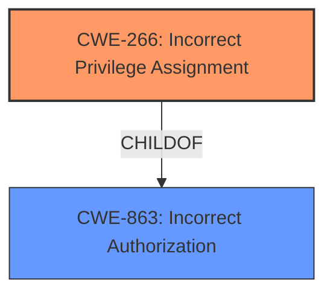

# Analysis Report for CVE-2024-8071

# Vulnerability Analysis Report: CVE-2024-8071

## Description

Mattermost versions 9.9.x <= 9.9.1, 9.5.x <= 9.5.7, 9.10.x <= 9.10.0 and 9.8.x <= 9.8.2 **fail to restrict which roles can promote a user as system admin** which allows a System Role with edit access to the permissions section of system console to update their role (e.g. member) to include the `manage_system` permission, effectively becoming a System Admin.

## Vulnerability Description Key Phrases

- **Rootcause:** fail to restrict which roles can promote a user as system admin
- **Impact:** become a System Admin
- **Vector:** update their role to include the `manage_system` permission
- **Attacker:** System Role with edit access to the permissions section of system console
- **Product:** Mattermost
- **Version:** 9.9.x <= 9.9.1, 9.5.x <= 9.5.7, 9.10.x <= 9.10.0 and 9.8.x <= 9.8.2

## Analysis (with Relationship Data)

# Summary
| CWE ID | CWE Name | Confidence | CWE Abstraction Level | CWE Vulnerability Mapping Label | CWE-Vulnerability Mapping Notes |
|---|---|---|---|---|---|
| CWE-266 | Incorrect Privilege Assignment | 0.9 | Base | Allowed | Primary CWE: This CWE best captures the **failure to restrict which roles can promote a user as system admin**. |
| CWE-863 | Incorrect Authorization | 0.7 | Class | Allowed-with-Review | Secondary Candidate: The product performs an authorization check, but it does not correctly perform the check. |

## Evidence and Confidence

*   **Confidence Score:** 0.9
*   **Evidence Strength:** HIGH

## Relationship Analysis
The primary CWE is CWE-266, which is a base-level CWE. CWE-863 is a class-level CWE that could be a parent. The vulnerability involves assigning incorrect privileges, which aligns directly with CWE-266.



## Vulnerability Chain
The vulnerability chain starts with the **failure to restrict which roles can promote a user as system admin** (CWE-266). This leads to the impact of a system role gaining `manage_system` permission and effectively becoming a System Admin.

## Summary of Analysis
The primary weakness is **failing to restrict which roles can promote a user as system admin**. This aligns directly with **CWE-266 - Incorrect Privilege Assignment**. The description states that the system **fails to restrict**, which is the root cause. The impact is that a user can become a System Admin. The retriever results also list CWE-266 with a good score.

CWE-863 (Incorrect Authorization) was considered, as authorization is related to privilege management. However, the description is more specific about the *assignment* of privileges rather than a general authorization failure, which is the root cause.

The mapping guidance confirms that CWE-266 is appropriate when a user is assigned the wrong role due to a misconfiguration.

Relevant CWE Information:

# Enhanced Context (25 CWEs)
The following CWEs were identified as potentially relevant to this vulnerability:

## CWE-266: Incorrect Privilege Assignment
**Abstraction Level**: Base
**Similarity Score**: 0.80
**Source**: dense

**Description**:
A product incorrectly assigns a privilege to a particular actor, creating an unintended sphere of control for that actor.

**Mapping Guidance**:
- Usage: Allowed
- Rationale: This CWE entry is at the Base level of abstraction, which is a preferred level of abstraction for mapping to the root causes of vulnerabilities.

## CWE-863: Incorrect Authorization
**Abstraction Level**: Class
**Similarity Score**: 1555.80
**Source**: sparse

**Description**:
The product performs an authorization check when an actor attempts to access a resource or perform an action, but it does not correctly perform the check.

**Mapping Guidance**:
- Usage: Allowed-with-Review
- Rationale: This CWE entry is a Class and might have Base-level children that would be more appropriate


## CWE Relationship Analysis

Current CWEs represent these abstraction levels: .


### Vulnerability Chain Analysis

**Chain starting from CWE-266:**
- 266 (Incorrect Privilege Assignment) - ROOT


**Chain starting from CWE-863:**
- 863 (Incorrect Authorization) - ROOT


### CWE Relationship Diagram

```mermaid
graph TD
    classDef primary fill:#f96,stroke:#333,stroke-width:2px
    classDef secondary fill:#69f,stroke:#333
    classDef tertiary fill:#9e9,stroke:#333
```


*Report generated on 2025-07-14 03:27:22*
