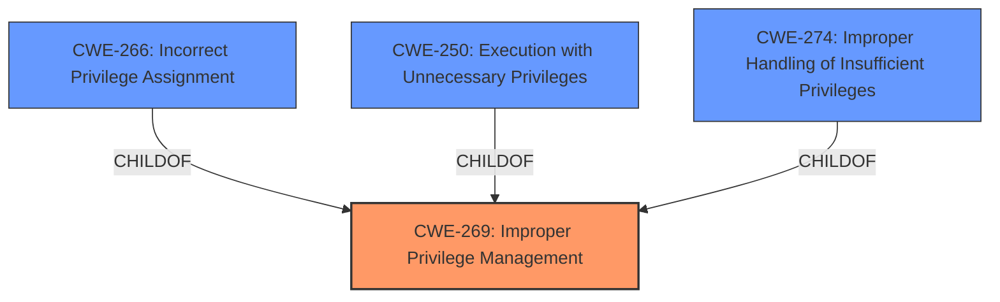

# Raw Analyzer Response for CVE-2024-8074

# Summary

| CWE ID  | CWE Name                       | Confidence | CWE Abstraction Level | CWE Vulnerability Mapping Label | CWE-Vulnerability Mapping Notes |
| :------- | :----------------------------- | :--------- | :-------------------- | :------------------------------ | :------------------------------ |
| CWE-269 | Improper Privilege Management  | 0.75       | Class                 | Primary                         | Discouraged                     |

## Evidence and Confidence

*   **Confidence Score:** 0.75
*   **Evidence Strength:** LOW

## Relationship Analysis

The primary identified CWE, CWE-269, is a Class-level CWE. It is the parent of more specific Base-level CWEs such as CWE-266, CWE-250, and CWE-274. While the description indicates an issue with privilege management, the lack of specific details makes it difficult to select a more precise CWE. The provided guidance discourages the use of CWE-269 when more specific options are available.

## Vulnerability Chain

The vulnerability chain, based on the description, starts with **Improper Privilege Management** (CWE-269) leading to the impact of being able to "Collect Data as Provided by Users". Since the description is very limited, we can only identify the first link in the chain, the root cause.

## Summary of Analysis

The initial analysis identified **Improper Privilege Management** as the root cause, as indicated by the "Vulnerability Description Key Phrases".

The selection of CWE-269 is largely based on the explicit mention of "**Improper Privilege Management**" in the vulnerability description. While the retriever results suggest other potential CWEs like CWE-266 (Incorrect Privilege Assignment) and CWE-285 (Improper Authorization), the lack of detailed information makes it difficult to choose a more specific Base-level CWE.

The limited evidence and the discouraged usage of the Class-level CWE contribute to a confidence score of 0.75. More information would be needed to refine the assessment and potentially identify a more precise CWE. The selection is based on the provided evidence, with awareness that the specificity is limited by the available details.

Relevant CWE Information:
*   **CWE-269: Improper Privilege Management**
    *   **Description:** The product does not properly assign, modify, track, or check privileges for an actor, creating an unintended sphere of control for that actor.
    *   **Why it applies:** The vulnerability description explicitly states "**Improper Privilege Management**" as the root cause.
    *   **Why not others:** While CWE-266, CWE-285, and others are related to privilege and permission issues, there isn't enough information to determine if it's an assignment issue, authorization failure, or other specific problem. Therefore, the broader CWE-269 is selected.
    *   **Usage:** Discouraged. However, given the limited information, it serves as the best high-level classification.