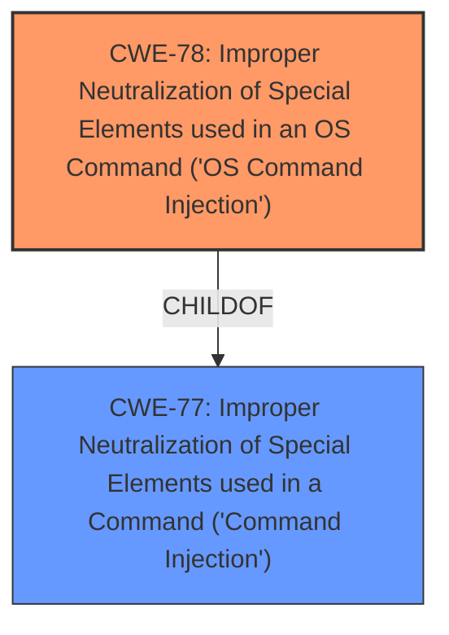

# Analysis Report for CVE-2024-8129

# Vulnerability Analysis Report: CVE-2024-8129

## Description

A vulnerability, which was classified as critical, was found in D-Link DNS-120, DNR-202L, DNS-315L, DNS-320, DNS-320L, DNS-320LW, DNS-321, DNR-322L, DNS-323, DNS-325, DNS-326, DNS-327L, DNR-326, DNS-340L, DNS-343, DNS-345, DNS-726-4, DNS-1100-4, DNS-1200-05 and DNS-1550-04 up to 20240814. Affected is the function cgi_s3_modify of the file /cgi-bin/s3.cgi of the component HTTP POST Request Handler. The manipulation of the argument f_job_name leads to **command injection**. It is possible to launch the attack remotely. The exploit has been disclosed to the public and may be used. NOTE This vulnerability only affects products that are no longer supported by the maintainer. NOTE Vendor was contacted early and confirmed that the product is end-of-life. It should be retired and replaced.

## Vulnerability Description Key Phrases

- **Weakness:** command injection
- **Vector:** manipulation of f_job_name argument
- **Product:** D-Link DNS-120, DNR-202L, DNS-315L, DNS-320, DNS-320L, DNS-320LW, DNS-321, DNR-322L, DNS-323, DNS-325, DNS-326, DNS-327L, DNR-326, DNS-340L, DNS-343, DNS-345, DNS-726-4, DNS-1100-4, DNS-1200-05 and DNS-1550-04
- **Version:** up to 20240814
- **Component:** /cgi-bin/s3.cgi

## Analysis (with Relationship Data)

# Summary

| CWE ID | CWE Name | Confidence | CWE Abstraction Level | CWE Vulnerability Mapping Label | CWE-Vulnerability Mapping Notes |
|---|---|---|---|---|---|
| CWE-78 | Improper Neutralization of Special Elements used in an OS Command ('OS Command Injection') | 1.0 | Base | Allowed | Primary CWE: The `f_job_name` argument is not properly neutralized, leading to OS command injection. |

## Evidence and Confidence

*   **Confidence Score:** 1.0
*   **Evidence Strength:** HIGH

## Relationship Analysis
The primary relationship influencing the decision is the hierarchical relationship between CWE-77 (Improper Neutralization of Special Elements used in a Command ('Command Injection')) and CWE-78 (Improper Neutralization of Special Elements used in an OS Command ('OS Command Injection')). CWE-78 is a specific type of command injection, making it a more precise classification given the context of OS commands.



## Vulnerability Chain
The vulnerability chain starts with the **improper neutralization** of the `f_job_name` argument. This leads directly to the ability to inject and execute OS commands on the affected system.

## Summary of Analysis
The initial analysis correctly identifies **command injection** as the root cause. The description clearly states that manipulating the `f_job_name` argument leads to **command injection**, and the CVE reference links further confirm that the `f_job_name` variable is used in a `popen` command without proper sanitization.

The choice of CWE-78 is based on the evidence that the injection occurs within the context of OS commands. The vulnerability description explicitly mentions the file `/cgi-bin/s3.cgi` and the `popen` command, which are indicators of OS command execution. CWE-78 is a 'Base' level CWE which is a preferred level of abstraction for mapping to the root causes of vulnerabilities.

The retriever results also support this choice, with CWE-78 having a high score.

Relevant CWE Information:

# Enhanced Context (25 CWEs)
The following CWEs were identified as potentially relevant to this vulnerability:

## CWE-78: Improper Neutralization of Special Elements used in an OS Command ('OS Command Injection')
**Abstraction Level**: Base
**Similarity Score**: 0.78
**Source**: dense

**Description**:
The product constructs all or part of an OS command using externally-influenced input from an upstream component, but it does not neutralize or incorrectly neutralizes special elements that could modify the intended OS command when it is sent to a downstream component.

**Mapping Guidance**:
- Usage: Allowed
- Rationale: This CWE entry is at the Base level of abstraction, which is a preferred level of abstraction for mapping to the root causes of vulnerabilities.

CWE-77 was considered but not used because CWE-78 is a more specific type of command injection, fitting the context of OS commands better. Other CWEs such as CWE-74, CWE-79, CWE-89, CWE-134, CWE-346, and CWE-923 were also considered but deemed less relevant as they address broader injection issues or specific attack vectors not directly related to OS command execution.


## CWE Relationship Analysis

Current CWEs represent these abstraction levels: .


### Vulnerability Chain Analysis

**Chain starting from CWE-89:**
- 89 (Improper Neutralization of Special Elements used in an SQL Command ('SQL Injection')) - ROOT


**Chain starting from CWE-77:**
- 77 (Improper Neutralization of Special Elements used in a Command ('Command Injection')) - ROOT


### CWE Relationship Diagram

```mermaid
graph TD
    classDef primary fill:#f96,stroke:#333,stroke-width:2px
    classDef secondary fill:#69f,stroke:#333
    classDef tertiary fill:#9e9,stroke:#333
```


*Report generated on 2025-07-14 03:30:40*
