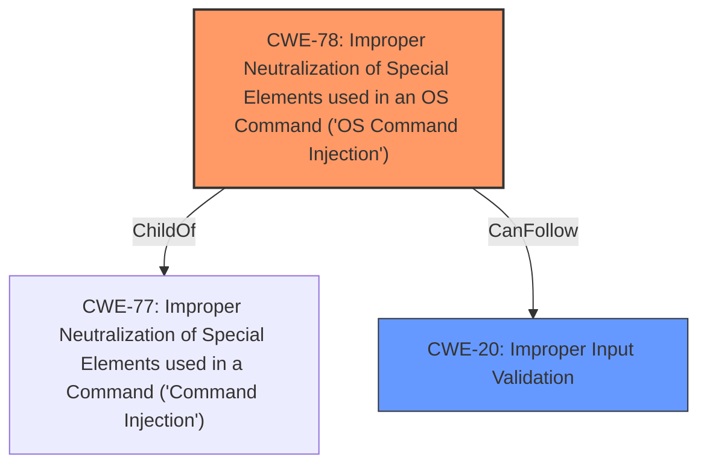

# Analysis Report for CVE-2024-8134

# Vulnerability Analysis Report: CVE-2024-8134

## Description

A vulnerability was found in D-Link DNS-120, DNR-202L, DNS-315L, DNS-320, DNS-320L, DNS-320LW, DNS-321, DNR-322L, DNS-323, DNS-325, DNS-326, DNS-327L, DNR-326, DNS-340L, DNS-343, DNS-345, DNS-726-4, DNS-1100-4, DNS-1200-05 and DNS-1550-04 up to 20240814. It has been rated as critical. This issue affects the function cgi_FMT_Std2R5_1st_DiskMGR of the file /cgi-bin/hd_config.cgi of the component HTTP POST Request Handler. The manipulation of the argument f_source_dev leads to **command injection**. The attack may be initiated remotely. The exploit has been disclosed to the public and may be used. NOTE This vulnerability only affects products that are no longer supported by the maintainer. NOTE Vendor was contacted early and confirmed that the product is end-of-life. It should be retired and replaced.

## Vulnerability Description Key Phrases

- **Weakness:** command injection
- **Product:** ['D-Link DNS-120', 'DNR-202L', 'DNS-315L', 'DNS-320', 'DNS-320L', 'DNS-320LW', 'DNS-321', 'DNR-322L', 'DNS-323', 'DNS-325', 'DNS-326', 'DNS-327L', 'DNR-326', 'DNS-340L', 'DNS-343', 'DNS-345', 'DNS-726-4', 'DNS-1100-4', 'DNS-1200-05', 'DNS-1550-04']
- **Version:** up to 20240814
- **Component:** cgi_FMT_Std2R5_1st_DiskMGR in /cgi-bin/hd_config.cgi

## Analysis (with Relationship Data)

# Summary
| CWE ID | CWE Name | Confidence | CWE Abstraction Level | CWE Vulnerability Mapping Label | CWE-Vulnerability Mapping Notes |
|---|---|---|---|---|---|
| CWE-78 | Improper Neutralization of Special Elements used in an OS Command ('OS Command Injection') | 1.0 | Base | Primary | Allowed |
| CWE-20 | Improper Input Validation | 0.6 | Class | Secondary | Discouraged |

## Evidence and Confidence

*   **Confidence Score:** 0.9
*   **Evidence Strength:** HIGH

## Relationship Analysis
The primary relationship influencing the decision is the hierarchical relationship between CWE-77 (Improper Neutralization of Special Elements used in a Command ('Command Injection')) and CWE-78 (Improper Neutralization of Special Elements used in an OS Command ('OS Command Injection')). CWE-78 is a specific type of CWE-77, focusing on OS commands. Since the vulnerability description explicitly mentions OS command injection, CWE-78 is the more appropriate choice. CWE-20 is a high-level class that can precede many other more specific CWEs.



## Vulnerability Chain
The vulnerability chain starts with **improper input validation** (or lack thereof), leading to **command injection**, which then allows for arbitrary command execution.

1.  **Root Cause:** Lack of input validation on the `f_source_dev` parameter.
2.  **Weakness:** Improper neutralization of special elements in OS commands.
3.  **Impact:** Arbitrary command execution, system compromise.

## Summary of Analysis
The analysis strongly supports the selection of CWE-78 as the primary CWE. The vulnerability description explicitly states "**command injection**" in the context of a function handling HTTP POST requests. The CVE Reference Links Content Summary further reinforces this by detailing the **lack of input validation** on the `f_source_dev` parameter, which is then used in a system command via `sprintf` without sanitization.

The selection is primarily based on the vulnerability description and the CVE Reference Links Content Summary, which provide sufficient evidence.

The graph relationships guided the selection of CWE-78 over its parent CWE-77, due to the specific mention of "OS command" injection.

CWE-78 is at the optimal level of specificity, as it directly addresses the **improper neutralization** of special elements in OS commands, which is the core weakness.

Relevant CWE Information:

# Enhanced Context (25 CWEs)
The following CWEs were identified as potentially relevant to this vulnerability:

## CWE-78: Improper Neutralization of Special Elements used in an OS Command ('OS Command Injection')
**Abstraction Level**: Base
**Similarity Score**: 0.78
**Source**: dense

**Description**:
The product constructs all or part of an OS command using externally-influenced input from an upstream component, but it does not neutralize or incorrectly neutralizes special elements that could modify the intended OS command when it is sent to a downstream component.

**Mapping Guidance**:
- Usage: Allowed
- Rationale: This CWE entry is at the Base level of abstraction, which is a preferred level of abstraction for mapping to the root causes of vulnerabilities.

## CWE-78: Improper Neutralization of Special Elements used in an OS Command ('OS Command Injection')
**Abstraction Level**: Base
**Similarity Score**: 1443.63
**Source**: sparse

**Description**:
The product constructs all or part of an OS command using externally-influenced input from an upstream component, but it does not neutralize or incorrectly neutralizes special elements that could modify the intended OS command when it is sent to a downstream component.

**Mapping Guidance**:
- Usage: Allowed
- Rationale: This CWE entry is at the Base level of abstraction, which is a preferred level of abstraction for mapping to the root causes of vulnerabilities.

**CWE Selection Details**

*   **CWE-78: Improper Neutralization of Special Elements used in an OS Command ('OS Command Injection')**
    *   **Rationale:** The vulnerability description explicitly mentions "**command injection**". The manipulation of the `f_source_dev` argument leads to the injection. This aligns directly with the CWE description, which focuses on the **improper neutralization** of special elements used in OS commands.
    *   **Evidence:** "The manipulation of the argument f_source_dev leads to **command injection**."
    *   **Abstraction Level:** Base
    *   **Usage:** Allowed
    *   **Confidence:** 1.0
*   **CWE-20: Improper Input Validation**
    *   **Rationale:** The root cause of the vulnerability is the **lack of input validation** of the `f_source_dev` parameter before it's used in the system command. However, since the immediate cause is command injection, CWE-78 is the primary weakness, and CWE-20 is a secondary, more general weakness.
    *   **Evidence:** CVE Reference Links Content Summary describes the **lack of input validation**
    *   **Abstraction Level:** Class
    *   **Usage:** Discouraged (but included because it is part of the vulnerability chain)
    *   **Confidence:** 0.6

**CWEs Considered but Not Used:**

*   **CWE-77: Improper Neutralization of Special Elements used in a Command ('Command Injection'):** While similar to CWE-78, it is a more general case. CWE-78 is more specific because it explicitly concerns OS commands, making it a better fit.
*   **CWE-134: Use of Externally-Controlled Format String:** This CWE was considered because the CVE Reference Links Content Summary mentions the use of `sprintf`. However, the primary issue is command injection, not necessarily a format string vulnerability.
*   **CWE-74: Improper Neutralization of Special Elements in Output Used by a Downstream Component ('Injection'):** This is a very general "Injection" CWE, and CWE-78 provides a more precise characterization.
*   **CWE-22: Improper Limitation of a Pathname to a Restricted Directory ('Path Traversal'):** Not applicable, as the vulnerability does not involve path traversal.
*   **CWE-120: Buffer Copy without Checking Size of Input ('Classic Buffer Overflow'):** Not applicable, as the vulnerability is command injection, not a buffer overflow.
*   **CWE-346: Origin Validation Error, CWE-923: Improper Restriction of Communication Channel to Intended Endpoints, CWE-138: Improper Neutralization of Special Elements:** These CWEs are not directly related to the **command injection** vulnerability described.


## CWE Relationship Analysis

Current CWEs represent these abstraction levels: .


### Vulnerability Chain Analysis

**Chain starting from CWE-77:**
- 77 (Improper Neutralization of Special Elements used in a Command ('Command Injection')) - ROOT


**Chain starting from CWE-22:**
- 22 (Improper Limitation of a Pathname to a Restricted Directory ('Path Traversal')) - ROOT


### CWE Relationship Diagram

```mermaid
graph TD
    classDef primary fill:#f96,stroke:#333,stroke-width:2px
    classDef secondary fill:#69f,stroke:#333
    classDef tertiary fill:#9e9,stroke:#333
```


*Report generated on 2025-07-14 03:32:19*
