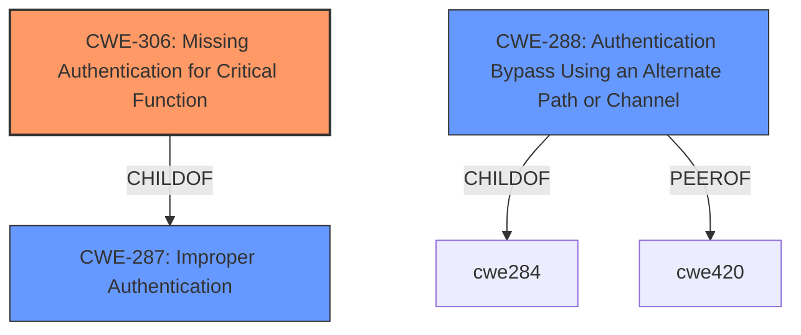

# Raw Analyzer Response for CVE-2024-8181

# Summary
| CWE ID | CWE Name | Confidence | CWE Abstraction Level | CWE Vulnerability Mapping Label | CWE-Vulnerability Mapping Notes |
|---|---|---|---|---|---|
| CWE-306 | Missing Authentication for Critical Function | 0.9 | Base | Primary CWE | Allowed |
| CWE-288 | Authentication Bypass Using an Alternate Path or Channel | 0.7 | Base | Secondary Candidate | Allowed |

## Evidence and Confidence

*   **Confidence Score:** 0.8
*   **Evidence Strength:** HIGH

## Relationship Analysis
The primary relationship that influenced my decision was the parent-child relationship between CWE-287 (Improper Authentication) and CWE-306 (Missing Authentication for Critical Function), where CWE-306 is a child of CWE-287. CWE-306 is a more specific case of authentication failure, specifically when authentication is entirely missing for a critical function, which aligns well with the vulnerability description indicating an authentication bypass leading to unauthenticated access to API endpoints and restricted functionality. The retriever results also listed many authorization-related CWEs, but the description indicates that authentication is missing entirely, not that authorization checks are flawed after authentication.

## Vulnerability Chain
The vulnerability chain starts with the **missing authentication** (**CWE-306**), which allows an unauthenticated attacker to access API endpoints and restricted functionality. The absence of authentication is the root cause that directly leads to unauthorized access.

## Summary of Analysis
The initial analysis focused on identifying the root cause of the vulnerability, which is the **authentication bypass** allowing unauthenticated access. The vulnerability description and CVE summary clearly indicate that the application **fails to require authentication** for critical API endpoints.

The evidence supporting CWE-306 as the primary weakness is: "This could allow a remote, unauthenticated attacker to access API endpoints as an administrator and allow them to access restricted functionality," and "An authentication bypass vulnerability exists in Flowise versions prior to 2.0.6" and "Remote network access. Unauthenticated access to API endpoints."

Based on this analysis, CWE-306 (Missing Authentication for Critical Function) is the most appropriate primary CWE. It accurately reflects the **lack of authentication** for critical functions, which is the direct cause of the vulnerability.

CWE-288 (Authentication Bypass Using an Alternate Path or Channel) was considered as a secondary CWE because it also describes a method to bypass authentication.

Relevant CWE Information:

# Enhanced Context (25 CWEs)
The following CWEs were identified as potentially relevant to this vulnerability:

## CWE-288: Authentication Bypass Using an Alternate Path or Channel
**Abstraction Level**: Base
**Similarity Score**: 0.74
**Source**: dense

**Description**:
The product requires authentication, but the product has an alternate path or channel that does not require authentication.

**Mapping Guidance**:
- Usage: Allowed
- Rationale: This CWE entry is at the Base level of abstraction, which is a preferred level of abstraction for mapping to the root causes of vulnerabilities.

## CWE-306: Missing Authentication for Critical Function
**Abstraction Level**: Base
**Similarity Score**: 1284.15
**Source**: sparse

**Description**:
The product does not perform any authentication for functionality that requires a provable user identity or consumes a significant amount of resources.

**Mapping Guidance**:
- Usage: Allowed
- Rationale: This CWE entry is at the Base level of abstraction, which is a preferred level of abstraction for mapping to the root causes of vulnerabilities.