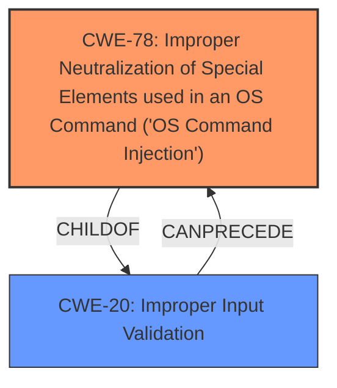

# Analysis Report for CVE-2024-8211

# Vulnerability Analysis Report: CVE-2024-8211

## Description

A vulnerability was found in D-Link DNS-120, DNR-202L, DNS-315L, DNS-320, DNS-320L, DNS-320LW, DNS-321, DNR-322L, DNS-323, DNS-325, DNS-326, DNS-327L, DNR-326, DNS-340L, DNS-343, DNS-345, DNS-726-4, DNS-1100-4, DNS-1200-05 and DNS-1550-04 up to 20240814. It has been declared as critical. This vulnerability affects the function cgi_FMT_Std2R1_DiskMGR of the file /cgi-bin/hd_config.cgi. The manipulation of the argument f_newly_dev leads to **command injection**. The attack can be initiated remotely. The exploit has been disclosed to the public and may be used. NOTE This vulnerability only affects products that are no longer supported by the maintainer. NOTE Vendor was contacted early and confirmed that the product is end-of-life. It should be retired and replaced.

## Vulnerability Description Key Phrases

- **Weakness:** command injection
- **Product:** ['D-Link DNS-120', 'DNR-202L', 'DNS-315L', 'DNS-320', 'DNS-320L', 'DNS-320LW', 'DNS-321', 'DNR-322L', 'DNS-323', 'DNS-325', 'DNS-326', 'DNS-327L', 'DNR-326', 'DNS-340L', 'DNS-343', 'DNS-345', 'DNS-726-4', 'DNS-1100-4', 'DNS-1200-05', 'DNS-1550-04']
- **Version:** up to 20240814
- **Component:** /cgi-bin/hd_config.cgi

## Analysis (with Relationship Data)

# Summary
| CWE ID | CWE Name | Confidence | CWE Abstraction Level | CWE Vulnerability Mapping Label | CWE-Vulnerability Mapping Notes |
|---|---|---|---|---|---|
| CWE-78 | Improper Neutralization of Special Elements used in an OS Command ('OS Command Injection') | 1.0 | Base | Primary CWE | Allowed |
| CWE-20 | Improper Input Validation | 0.6 | Class | Secondary Candidate | Discouraged |

## Evidence and Confidence

*   **Confidence Score:** 0.9
*   **Evidence Strength:** HIGH

## Relationship Analysis
The primary relationship influencing the CWE selection is the parent-child relationship between CWE-20 and CWE-78. CWE-78 is a child of CWE-20, representing a specific type of input validation failure that leads to OS command injection. Since the vulnerability description explicitly mentions "command injection," CWE-78 is the more specific and appropriate choice.
Additionally, the relationship of CANPRECEDE from CWE-20 to CWE-78 suggests that improper input validation can lead to command injection.



## Vulnerability Chain
The vulnerability chain starts with the **improper handling of the 'f_newly_dev' argument**, leading to **command injection** and culminating in **arbitrary command execution**.
  - **Root Cause:** **Improper neutralization of special elements** in the `f_newly_dev` argument.
  - **Weakness:** **Command injection** due to the lack of input sanitization.
  - **Impact:** Arbitrary command execution on the affected device.

## Summary of Analysis
The initial analysis strongly points to CWE-78 due to the explicit mention of "command injection" in the vulnerability description and the **lack of input sanitization**. The "CVE Reference Links Content Summary" section confirms that the `f_newly_dev` argument is not sanitized before being used in a system command.
The retriever results further support this selection, with CWE-78 being a top match.
The hierarchical relationship between CWE-20 and CWE-78 reinforces the decision to choose the more specific CWE-78.

The vulnerability description states: "The manipulation of the argument f_newly_dev leads to **command injection**." The "CVE Reference Links Content Summary" states: "The `f_newly_dev` variable, received from a POST request, is used to construct a command via the `sprintf` function without proper sanitization. This allows an attacker to inject arbitrary commands into the system call."

The selected CWE, CWE-78, is at the optimal level of specificity because it directly addresses the root cause of the vulnerability, which is the improper neutralization of special elements used in an OS command.

Relevant CWE Information:

# Enhanced Context (25 CWEs)
The following CWEs were identified as potentially relevant to this vulnerability:

## CWE-78: Improper Neutralization of Special Elements used in an OS Command ('OS Command Injection')
**Abstraction Level**: Base
**Similarity Score**: 0.78
**Source**: dense

**Description**:
The product constructs all or part of an OS command using externally-influenced input from an upstream component, but it does not neutralize or incorrectly neutralizes special elements that could modify the intended OS command when it is sent to a downstream component.

**Mapping Guidance**:
- Usage: Allowed
- Rationale: This CWE entry is at the Base level of abstraction, which is a preferred level of abstraction for mapping to the root causes of vulnerabilities.

## CWE-78: Improper Neutralization of Special Elements used in an OS Command ('OS Command Injection')
**Abstraction Level**: Base
**Similarity Score**: 1432.66
**Source**: sparse

**Description**:
The product constructs all or part of an OS command using externally-influenced input from an upstream component, but it does not neutralize or incorrectly neutralizes special elements that could modify the intended OS command when it is sent to a downstream component.

**Mapping Guidance**:
- Usage: Allowed
- Rationale: This CWE entry is at the Base level of abstraction, which is a preferred level of abstraction for mapping to the root causes of vulnerabilities.

## CWE-20: Improper Input Validation
**Abstraction Level**: Class
**Similarity Score**: 1316.85
**Source**: sparse

**Description**:
The product receives input or data, but it does
        not validate or incorrectly validates that the input has the
        properties that are required to process the data safely and
        correctly.

**Mapping Guidance**:
- Usage: Discouraged
- Rationale: CWE-20 is commonly misused in low-information vulnerability reports when lower-level CWEs could be used instead, or when more details about the vulnerability are available [REF-1287]. It is not useful for trend analysis. It is also a level-1 Class (i.e., a child of a Pillar).

## CWE-20: Improper Input Validation
**Abstraction Level**: class
**Similarity Score**: 2.55
**Source**: graph

**Description**:
CWE-20: Improper Input Validation

**Mapping Guidance**:
- Usage: Discouraged
- Rationale: CWE-20 is commonly misused in low-information vulnerability reports when lower-level CWEs could be used instead, or when more details about the vulnerability are available [REF-1287]. It is not useful for trend analysis. It is also a level-1 Class (i.e., a child of a Pillar).

### CWEs considered but not used:
- CWE-77: Improper Neutralization of Special Elements used in a Command ('Command Injection') - Although similar to CWE-78, CWE-78 is more specific as it explicitly mentions OS commands.
- CWE-20: Improper Input Validation - While input validation is missing, CWE-78 directly captures the command injection aspect.


## CWE Relationship Analysis

Current CWEs represent these abstraction levels: .


### Vulnerability Chain Analysis

**Chain starting from CWE-77:**
- 77 (Improper Neutralization of Special Elements used in a Command ('Command Injection')) - ROOT


**Chain starting from CWE-78:**
- 78 (Improper Neutralization of Special Elements used in an OS Command ('OS Command Injection')) - ROOT


### CWE Relationship Diagram

```mermaid
graph TD
    classDef primary fill:#f96,stroke:#333,stroke-width:2px
    classDef secondary fill:#69f,stroke:#333
    classDef tertiary fill:#9e9,stroke:#333
```


*Report generated on 2025-07-14 03:34:56*
