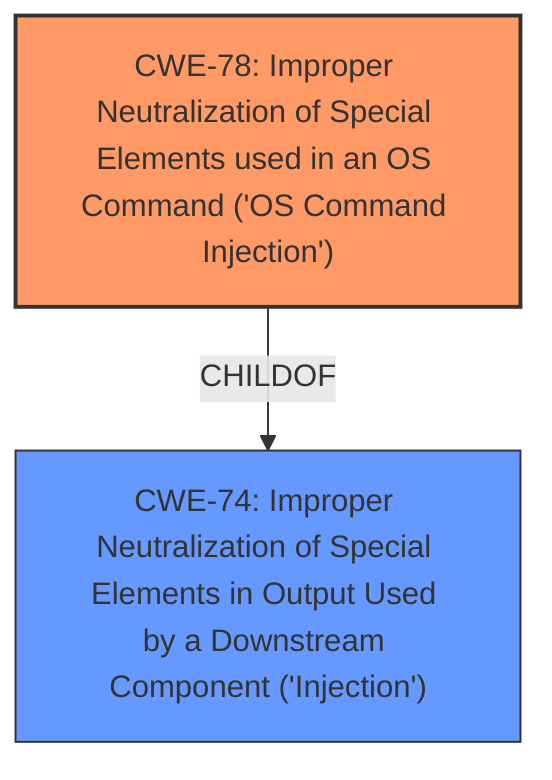

# Raw Analyzer Response for CVE-2024-8212

# Summary
| CWE ID | CWE Name | Confidence | CWE Abstraction Level | CWE Vulnerability Mapping Label | CWE-Vulnerability Mapping Notes |
|---|---|---|---|---|---|
| CWE-78 | Improper Neutralization of Special Elements used in an OS Command ('OS Command Injection') | 1.0 | Base | Primary | Allowed |
| CWE-74 | Improper Neutralization of Special Elements in Output Used by a Downstream Component ('Injection') | 0.5 | Class | Secondary | Discouraged |

## Evidence and Confidence

*   **Confidence Score:** 1.0
*   **Evidence Strength:** HIGH

## Relationship Analysis
The primary relationship influencing the decision is the parent-child relationship between CWE-74 (Injection) and CWE-78 (OS Command Injection). CWE-78 is a more specific case of CWE-74. The vulnerability description clearly indicates **command injection**, making CWE-78 the more appropriate choice.

## Vulnerability Chain
The vulnerability chain starts with the **improper neutralization** of special elements within the `f_source_dev` argument, leading directly to OS **command injection**. This allows an attacker to execute arbitrary commands on the system. The chain is:

1.  **Improper Neutralization of Input** (**ROOT CAUSE**: Implicit in CWE-78)
2.  **Command Injection** (CWE-78)
3.  **Arbitrary Command Execution** (Impact)

## Summary of Analysis
The initial analysis identified CWE-78 as the primary candidate due to the explicit mention of "**command injection**" in the vulnerability description. The description states: "The manipulation of the argument f_source_dev leads to **command injection**". This directly aligns with the definition of CWE-78, which focuses on the **improper neutralization** of special elements in OS commands.

CWE-74 was considered because it's a broader category of injection vulnerabilities. However, since the description specifically mentions "command injection," opting for the more specific CWE-78 is the best decision.

The evidence clearly points to CWE-78 as the root cause. The hierarchical relationship confirms that CWE-78 is a more specific instance of CWE-74, further supporting the choice of CWE-78. The retriever results also support the selection of CWE-78.

The decision is based on direct evidence from the vulnerability description and is supported by the CWE relationships and retriever results. CWE-78 is at the optimal level of specificity, as it directly reflects the nature of the vulnerability.

Relevant CWE Information:

# Enhanced Context (25 CWEs)
The following CWEs were identified as potentially relevant to this vulnerability:

## CWE-78: Improper Neutralization of Special Elements used in an OS Command ('OS Command Injection')
**Abstraction Level**: Base
**Similarity Score**: 0.78
**Source**: dense

**Description**:
The product constructs all or part of an OS command using externally-influenced input from an upstream component, but it does not neutralize or incorrectly neutralizes special elements that could modify the intended OS command when it is sent to a downstream component.

**Mapping Guidance**:
- Usage: Allowed
- Rationale: This CWE entry is at the Base level of abstraction, which is a preferred level of abstraction for mapping to the root causes of vulnerabilities.

## CWE-74: Improper Neutralization of Special Elements in Output Used by a Downstream Component ('Injection')
**Abstraction Level**: Class
**Similarity Score**: 0.77
**Source**: dense

**Description**:
The product constructs all or part of a command, data structure, or record using externally-influenced input from an upstream component, but it does not neutralize or incorrectly neutralizes special elements that could modify how it is parsed or interpreted when it is sent to a downstream component.

**Mapping Guidance**:
- Usage: Discouraged
- Rationale: CWE-74 is high-level and often misused when lower-level weaknesses are more appropriate.