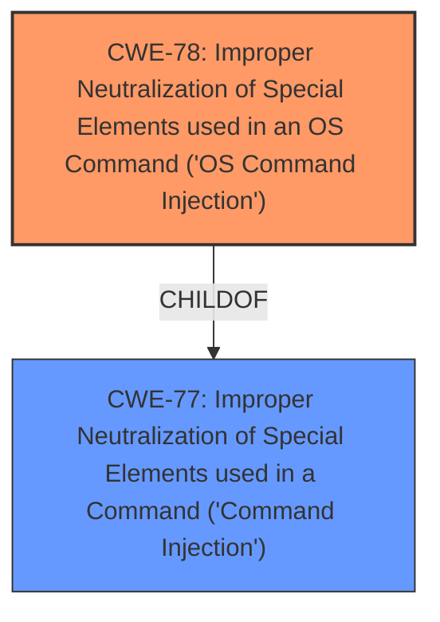

# Raw Analyzer Response for CVE-2024-8213

# Summary
| CWE ID | CWE Name | Confidence | CWE Abstraction Level | CWE Vulnerability Mapping Label | CWE-Vulnerability Mapping Notes |
|---|---|---|---|---|---|
| CWE-78 | Improper Neutralization of Special Elements used in an OS Command ('OS Command Injection') | 1.0 | Base | Allowed | Primary CWE. The **command injection** vulnerability occurs due to the **improper neutralization** of special elements in an OS command. |

## Evidence and Confidence

*   **Confidence Score:** 1.0
*   **Evidence Strength:** HIGH

## Relationship Analysis
The primary relationship considered was the parent-child relationship between CWE-77 (Improper Neutralization of Special Elements used in a Command) and CWE-78 (Improper Neutralization of Special Elements used in an OS Command). CWE-78 is a specific type of CWE-77, focusing on OS commands, which aligns directly with the vulnerability description.

## Vulnerability Chain
The vulnerability chain begins with **improper sanitization** of the `f_source_dev` parameter, leading to **command injection**, and ultimately resulting in arbitrary command execution on the affected device.

## Summary of Analysis
The analysis is based on the provided vulnerability description, key phrases, and CVE reference links. The description clearly states that the manipulation of the `f_source_dev` argument leads to **command injection**. The CVE reference confirms that the `cgi_FMT_R12R5_1st_DiskMGR` function does not properly sanitize the `f_source_dev` variable, and the `sprintf` function is used to assign the unsanitized value to a variable that is then invoked by the system command. This confirms the **improper neutralization** of special elements and resulting **command injection**, making CWE-78 the most appropriate classification.

The retriever results also support this classification, with CWE-78 being a top match. The relationship between CWE-77 and CWE-78 influenced the final decision to choose the more specific CWE-78.

Relevant CWE Information:

# Enhanced Context (25 CWEs)
The following CWEs were identified as potentially relevant to this vulnerability:

## CWE-78: Improper Neutralization of Special Elements used in an OS Command ('OS Command Injection')
**Abstraction Level**: Base
**Similarity Score**: 0.78
**Source**: dense

**Description**:
The product constructs all or part of an OS command using externally-influenced input from an upstream component, but it does not neutralize or incorrectly neutralizes special elements that could modify the intended OS command when it is sent to a downstream component.

**Mapping Guidance**:
- Usage: Allowed
- Rationale: This CWE entry is at the Base level of abstraction, which is a preferred level of abstraction for mapping to the root causes of vulnerabilities.

## CWE-77: Improper Neutralization of Special Elements used in a Command ('Command Injection')
**Abstraction Level**: Class
**Similarity Score**: 0.78
**Source**: dense

**Description**:
The product constructs all or part of a command using externally-influenced input from an upstream component, but it does not neutralize or incorrectly neutralizes special elements that could modify the intended OS command when it is sent to a downstream component.

**Mapping Guidance**:
- Usage: Allowed-with-Review
- Rationale: This CWE entry is a Class and might have Base-level children that would be more appropriate

### Additional CWE Considerations (and why they were not selected):

*   **CWE-77 (Improper Neutralization of Special Elements used in a Command ('Command Injection'))**: While this is a parent of CWE-78, CWE-78 is more specific because the **command injection** occurs in the context of an OS command, as stated in the vulnerability description. The vulnerability description specifically refers to the manipulation of an argument leading to **command injection**.
*   **CWE-134 (Use of Externally-Controlled Format String)** and **CWE-74 (Improper Neutralization of Special Elements in Output Used by a Downstream Component ('Injection'))**: These were considered but deemed less relevant as the vulnerability is directly related to **command injection** rather than format string issues or general injection flaws.
*   **CWE-346 (Origin Validation Error), CWE-941 (Incorrectly Specified Destination in a Communication Channel), CWE-940 (Improper Verification of Source of a Communication Channel), CWE-923 (Improper Restriction of Communication Channel to Intended Endpoints)**: These CWEs relate to communication channel issues, which are not the primary cause of the vulnerability described. The core issue is the **improper neutralization** of input leading to **command injection**, not the communication channel itself.
*   **CWE-184 (Incomplete List of Disallowed Inputs)**: Considered, but the root cause isn't simply an incomplete list of bad inputs. It's the **improper handling** of a specific input in the context of an OS command.
*   **CWE-88 (Improper Neutralization of Argument Delimiters in a Command ('Argument Injection'))**: This is related to argument injection, but the description doesn't specifically mention delimiters. It describes a general **command injection** vulnerability.