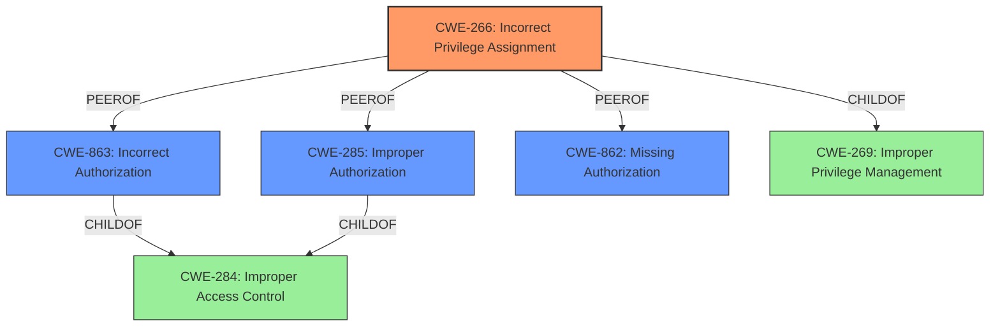

# Analysis for CVE-2024-8247

# Summary
| CWE ID  | CWE Name                                                                 | Confidence | CWE Abstraction Level | CWE Vulnerability Mapping Label | CWE-Vulnerability Mapping Notes |
| :-------- | :----------------------------------------------------------------------- | :--------- | :-------------------- | :------------------------------ | :------------------------------ |
| CWE-266 | Incorrect Privilege Assignment                                           | 0.95       | Base                  | Primary                         | Allowed                       |
| CWE-863 | Incorrect Authorization                                                  | 0.75      | Class                 | Secondary                       | Allowed-with-Review           |
| CWE-285 | Improper Authorization                                                 | 0.65       | Class                 | Secondary                       | Discouraged                   |
| CWE-862 | Missing Authorization                                                  | 0.60       | Class                 | Secondary                       | Allowed-with-Review           |

## Evidence and Confidence

*   **Confidence Score:** 0.9
*   **Evidence Strength:** HIGH

## Relationship Analysis
The primary CWE is CWE-266, which is a Base level CWE. The other CWEs (CWE-863, CWE-285, CWE-862) are Class level CWEs. These are related to authorization issues, but the root cause is an incorrect privilege assignment. CWE-266 is the most specific and accurate representation of the vulnerability. The guidance specifically suggests CWE-266 for scenarios where a user is assigned the wrong role due to misconfiguration.

## Vulnerability Chain
The vulnerability chain starts with the **plugin not restricting what user meta can be updated as screen options** (CWE-266). This leads to an attacker being able to modify their user meta to escalate their privileges (CWE-863 or CWE-285), ultimately resulting in privilege escalation and unauthorized access to sensitive functionality.

## Summary of Analysis
The analysis indicates that the primary weakness is **CWE-266 (Incorrect Privilege Assignment)** because the **plugin is not restricting what user meta can be updated as screen options**. This allows authenticated attackers to escalate their privileges. The evidence for this comes directly from the "Vulnerability Description Key Phrases" section, which identifies the **rootcause** as "**plugin not restricting what user meta can be updated as screen options**." The "CVE Reference Links Content Summary" also supports this, stating, "The Newsletters plugin for WordPress does not restrict what user meta can be updated as screen options."

The mapping guidance for privileges vs. permissions clearly states that if a user is assigned the wrong role due to misconfiguration, **CWE-266** is the appropriate choice.

The other CWEs considered (CWE-863, CWE-285, CWE-862) are related to authorization but are more general. While an attacker is performing actions they are not authorized to do (CWE-863 or CWE-285), the underlying issue is the incorrect privilege assignment.

CWE-862 (Missing Authorization) could also be considered, but since the plugin is performing some level of authorization (albeit incorrectly due to the incorrect privilege assignment), CWE-266 is a better fit.

The selected CWEs are at the optimal level of specificity because **CWE-266** directly addresses the root cause, and the other options describe authorization issues that are a result of the incorrect privilege assignment.

Relevant CWE Information:

# Enhanced Context (25 CWEs)
The following CWEs were identified as potentially relevant to this vulnerability:

## CWE-266: Incorrect Privilege Assignment
**Abstraction Level**: Base
**Similarity Score**: 0.80
**Source**: dense

**Description**:
A product incorrectly assigns a privilege to a particular actor, creating an unintended sphere of control for that actor.

**Mapping Guidance**:
- Usage: Allowed
- Rationale: This CWE entry is at the Base level of abstraction, which is a preferred level of abstraction for mapping to the root causes of vulnerabilities.

## CWE-863: Incorrect Authorization
**Abstraction Level**: Class
**Similarity Score**: 1794.58
**Source**: sparse

**Description**:
The product performs an authorization check when an actor attempts to access a resource or perform an action, but it does not correctly perform the check.

**Mapping Guidance**:
- Usage: Allowed-with-Review
- Rationale: This CWE entry is a Class and might have Base-level children that would be more appropriate

## CWE-285: Improper Authorization
**Abstraction Level**: Class
**Similarity Score**: 1729.16
**Source**: sparse

**Description**:
The product does not perform or incorrectly performs an authorization check when an actor attempts to access a resource or perform an action.

**Mapping Guidance**:
- Usage: Discouraged
- Rationale: CWE-285 is high-level and lower-level CWEs can frequently be used instead. It is a level-1 Class (i.e., a child of a Pillar).

## CWE-862: Missing Authorization
**Abstraction Level**: Class
**Similarity Score**: 1667.19
**Source**: sparse

**Description**:
The product does not perform an authorization check when an actor attempts to access a resource or perform an action.

**Mapping Guidance**:
- Usage: Allowed-with-Review
- Rationale: This CWE entry is a Class and might have Base-level children that would be more appropriate