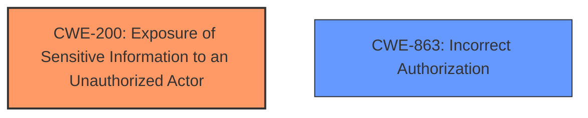

# Raw Analyzer Response for CVE-2024-8326

# Summary
| CWE ID | CWE Name | Confidence | CWE Abstraction Level | CWE Vulnerability Mapping Label | CWE-Vulnerability Mapping Notes |
|---|---|---|---|---|---|
| CWE-200 | Exposure of Sensitive Information to an Unauthorized Actor | 0.9 | Class | Primary | Allowed |
| CWE-863 | Incorrect Authorization | 0.6 | Class | Secondary | Allowed-with-Review |

## Evidence and Confidence

*   **Confidence Score:** 0.75
*   **Evidence Strength:** MEDIUM

## Relationship Analysis
The primary CWE is CWE-200 [Exposure of Sensitive Information to an Unauthorized Actor] which is a Class-level CWE. The retriever results suggest some base-level CWEs related to authorization, such as CWE-639 [Authorization Bypass Through User-Controlled Key] or CWE-306 [Missing Authentication for Critical Function]. However, the vulnerability description indicates that authenticated users with Contributor-level access could access sensitive information. The vulnerability description indicates there is **Sensitive Information Exposure** but there is no mention of bypassing authentication or authorization. Therefore, CWE-200 [Exposure of Sensitive Information to an Unauthorized Actor] is a better fit as the primary weakness. A secondary weakness could be CWE-863 [Incorrect Authorization] since a contributor should not have access to the exposed data.

## Vulnerability Chain
The vulnerability chain starts with **Sensitive Information Exposure** via the `sc_get_details` function. Authenticated users with Contributor-level access can extract sensitive data including user data and database configuration information. This leads to potential account hijacking, data breaches, and complete site compromise.

## Summary of Analysis
The initial analysis focused on identifying the root cause of the vulnerability, which is the **Sensitive Information Exposure** via the `sc_get_details` function. The retriever results suggested several CWEs, including CWE-200 [Exposure of Sensitive Information to an Unauthorized Actor], CWE-863 [Incorrect Authorization], and CWE-306 [Missing Authentication for Critical Function].

The vulnerability description states that the `sc_get_details` function allows retrieval of sensitive information via the `[s2Get /]` shortcode. The shortcode did not properly validate the `constant`, `user_field`, and `user_option` attributes, allowing for the extraction of various user data, site configuration details and even arbitrary constants. This aligns well with CWE-200 [Exposure of Sensitive Information to an Unauthorized Actor], which describes a scenario where sensitive information is exposed to an unauthorized actor.

While the attacker needs to be authenticated, the primary issue is that they can access information they should not be able to access, suggesting a potential authorization issue. Therefore, CWE-863 [Incorrect Authorization] is considered as a secondary weakness, indicating that the authorization checks are not correctly performed, allowing contributors to access data they should not have access to.

CWE-306 [Missing Authentication for Critical Function] is not applicable, as authentication is present, but it does not prevent the described data exposure.

The selected CWEs are at the optimal level of specificity, with CWE-200 [Exposure of Sensitive Information to an Unauthorized Actor] at the Class level and CWE-863 [Incorrect Authorization] at the Class level, providing a clear understanding of the vulnerability's nature.

Relevant CWE Information:
- "The s2Member Excellent for All Kinds of Memberships, Content Restriction Paywalls & Member Access Subscriptions plugin for WordPress is vulnerable to **Sensitive Information Exposure** in all versions up to, and including, 241114 via the sc_get_details function."
- "**weakness:** **Sensitive Information Exposure**"
- "This makes it possible for authenticated attackers, with Contributor-level access and above, to extract sensitive data including user data and database configuration information, which can lead to reading, updating, or dropping database tables."