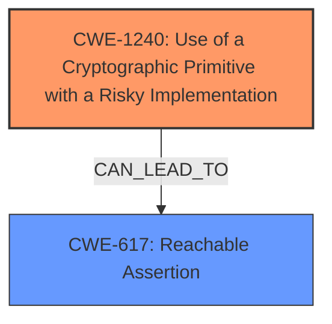

# Analysis for CVE-2024-8361

# Summary
| CWE ID | CWE Name | Confidence | CWE Abstraction Level | CWE Vulnerability Mapping Label | CWE-Vulnerability Mapping Notes |
|---|---|---|---|---|---|
| CWE-1240 | Use of a Cryptographic Primitive with a Risky Implementation | 0.75 | Base | Allowed | Primary CWE: The vulnerability stems from the use of a SHA2/224 algorithm implementation that returns an incorrect hash length. This constitutes a risky implementation of a cryptographic primitive. |
| CWE-617 | Reachable Assertion | 0.65 | Base | Allowed | Secondary CWE: The incorrect hash length triggers a software assertion, leading to a denial-of-service. |

## Evidence and Confidence

*   **Confidence Score:** 0.7
*   **Evidence Strength:** MEDIUM

## Relationship Analysis
The primary CWE, CWE-1240, directly addresses the **incorrect implementation** of the SHA2/224 algorithm. CWE-617 is a consequence of the primary weakness, where the incorrect hash length leads to a reachable assertion and subsequent denial of service. There isn't a direct parent-child relationship between CWE-1240 and CWE-617, but CWE-617 can be seen as a result of the insecure cryptographic implementation described in CWE-1240.

## Vulnerability Chain
The vulnerability chain starts with the **risky implementation** of the SHA2/224 algorithm (CWE-1240). This leads to an **incorrect hash length**, which then triggers a software assertion (CWE-617), resulting in a Denial of Service (DoS).

## Summary of Analysis
Based on the vulnerability description, the most relevant CWE is CWE-1240 because the root cause of the issue is the **incorrect implementation** of a cryptographic primitive (SHA2/224). The description states that the algorithm returns a hash of 256 bits instead of 224 bits, indicating a deviation from the standard implementation. This **incorrect hash length** subsequently triggers a software assertion, leading to a Denial of Service (DoS). Therefore, CWE-617, Reachable Assertion, is also relevant as it describes the direct consequence of the **incorrect hash length**. The evidence supporting this decision is the vulnerability description itself: "the SHA2/224 algorithm returns a hash of 256 bits instead of 224 bits. This **incorrect hash length triggers** a software assertion, which subsequently causes a Denial of Service (DoS)."

The selection of CWE-1240 and CWE-617 is at the optimal level of specificity, as they accurately represent the root cause and immediate consequence of the vulnerability. Other CWEs, such as CWE-328 (Use of Weak Hash), were considered but deemed less appropriate because the vulnerability is not related to the weakness of the hashing algorithm itself but rather to its **incorrect implementation**. Similarly, CWE-476 (NULL Pointer Dereference) and CWE-789 (Memory Allocation with Excessive Size Value) were considered but not selected because they do not align with the provided vulnerability description.

Relevant CWE Information:

# Enhanced Context (25 CWEs)
The following CWEs were identified as potentially relevant to this vulnerability:

## CWE-328: Use of Weak Hash
**Abstraction Level**: Base
**Similarity Score**: 0.75
**Source**: dense

**Description**:
The product uses an algorithm that produces a digest (output value) that does not meet security expectations for a hash function that allows an adversary to reasonably determine the original input (preimage attack), find another input that can produce the same hash (2nd preimage attack), or find multiple inputs that evaluate to the same hash (birthday attack).

**Mapping Guidance**:
- Usage: Allowed
- Rationale: This CWE entry is at the Base level of abstraction, which is a preferred level of abstraction for mapping to the root causes of vulnerabilities.

## CWE-617: Reachable Assertion
**Abstraction Level**: Base
**Similarity Score**: 0.74
**Source**: dense

**Description**:
The product contains an assert() or similar statement that can be triggered by an attacker, which leads to an application exit or other behavior that is more severe than necessary.

**Mapping Guidance**:
- Usage: Allowed
- Rationale: This CWE entry is at the Base level of abstraction, which is a preferred level of abstraction for mapping to the root causes of vulnerabilities.

## CWE-1285: Improper Validation of Specified Index, Position, or Offset in Input
**Abstraction Level**: Base
**Similarity Score**: 0.73
**Source**: dense

**Description**:
The product receives input that is expected to specify an index, position, or offset into an indexable resource such as a buffer or file, but it does not validate or incorrectly validates that the specified index/position/offset has the required properties.

**Mapping Guidance**:
- Usage: Allowed
- Rationale: This CWE entry is at the Base level of abstraction, which is a preferred level of abstraction for mapping to the root causes of vulnerabilities.

## CWE-703: Improper Check or Handling of Exceptional Conditions
**Abstraction Level**: Pillar
**Similarity Score**: 0.73
**Source**: dense

**Description**:
The product does not properly anticipate or handle exceptional conditions that rarely occur during normal operation of the product.

**Mapping Guidance**:
- Usage: Discouraged
- Rationale: This CWE entry is extremely high-level, a Pillar.

## CWE-1391: Use of Weak Credentials
**Abstraction Level**: Class
**Similarity Score**: 0.73
**Source**: dense

**Description**:
The product uses weak credentials (such as a default key or hard-coded password) that can be calculated, derived, reused, or guessed by an attacker.

**Mapping Guidance**:
- Usage: Allowed-with-Review
- Rationale: This CWE entry is a Class and might have Base-level children that would be more appropriate

## CWE-345: Insufficient Verification of Data Authenticity
**Abstraction Level**: Class
**Similarity Score**: 0.73
**Source**: dense

**Description**:
The product does not sufficiently verify the origin or authenticity of data, in a way that causes it to accept invalid data.

**Mapping Guidance**:
- Usage: Discouraged
- Rationale: This CWE entry is a level-1 Class (i.e., a child of a Pillar). It might have lower-level children that would be more appropriate

## CWE-330: Use of Insufficiently Random Values
**Abstraction Level**: Class
**Similarity Score**: 0.73
**Source**: dense

**Description**:
The product uses insufficiently random numbers or values in a security context that depends on unpredictable numbers.

**Mapping Guidance**:
- Usage: Discouraged
- Rationale: This CWE entry is a level-1 Class (i.e., a child of a Pillar). It might have lower-level children that would be more appropriate

## CWE-755: Improper Handling of Exceptional Conditions
**Abstraction Level**: Class
**Similarity Score**: 0.73
**Source**: dense

**Description**:
The product does not handle or incorrectly handles an exceptional condition.

**Mapping Guidance**:
- Usage: Discouraged
- Rationale: This CWE entry is a level-1 Class (i.e., a child of a Pillar). It might have lower-level children that would be more appropriate

## CWE-696: Incorrect Behavior Order
**Abstraction Level**: Class
**Similarity Score**: 0.72
**Source**: dense

**Description**:
The product performs multiple related behaviors, but the behaviors are performed in the wrong order in ways which may produce resultant weaknesses.

**Mapping Guidance**:
- Usage: Allowed-with-Review
- Rationale: This CWE entry is a Class and might have Base-level children that would be more appropriate

## CWE-916: Use of Password Hash With Insufficient Computational Effort
**Abstraction Level**: Base
**Similarity Score**: 0.72
**Source**: dense

**Description**:
The product generates a hash for a password, but it uses a scheme that does not provide a sufficient level of computational effort that would make password cracking attacks infeasible or expensive.

**Mapping Guidance**:
- Usage: Allowed
- Rationale: This CWE entry is at the Base level of abstraction, which is a preferred level of abstraction for mapping to the root causes of vulnerabilities.

## CWE-916: Use of Password Hash With Insufficient Computational Effort
**Abstraction Level**: Base
**Similarity Score**: 411.59
**Source**: sparse

**Description**:
The product generates a hash for a password, but it uses a scheme that does not provide a sufficient level of computational effort that would make password cracking attacks infeasible