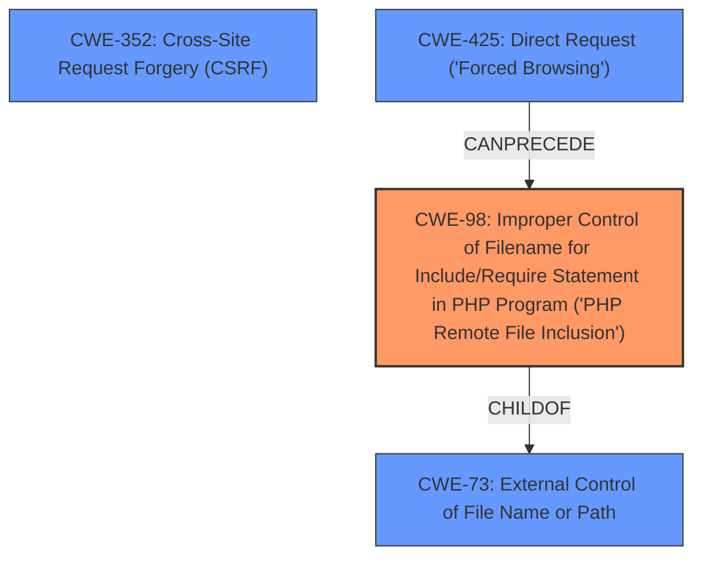

# Enhanced Analysis for CVE-2024-8392

# Summary
| CWE ID | CWE Name | Confidence | CWE Abstraction Level | CWE Vulnerability Mapping Label | CWE-Vulnerability Mapping Notes |
|---|---|---|---|---|---|
| CWE-98 | Improper Control of Filename for Include/Require Statement in PHP Program ('PHP Remote File Inclusion') | 1.0 | Variant | Primary | Allowed |
| CWE-352 | Cross-Site Request Forgery (CSRF) | 0.7 | Compound | Secondary | Allowed |

## Evidence and Confidence

*   **Confidence Score:** 0.85
*   **Evidence Strength:** HIGH

## Relationship Analysis
The primary CWE, CWE-98, is a variant of CWE-73 (External Control of File Name or Path). The vulnerability involves an improper control of the filename used in an include/require statement, which directly aligns with CWE-98. CWE-352 (CSRF) is listed as a potential attack vector, which means it can facilitate the exploitation of the primary weakness. CWE-425 Direct Request ('Forced Browsing') is also related as it can CANPRECEDE CWE-98. The abstraction levels were considered, and CWE-98 at the Variant level provides the most specific description of the vulnerability.



## Vulnerability Chain
The vulnerability chain starts with **improper control of the filename** (CWE-98), leading to potential **Local File Inclusion**. This then allows attackers to **bypass access controls**, **obtain sensitive data**, and achieve **code execution**. The CSRF (CWE-352) can be an attack vector to exploit the LFI.

## Summary of Analysis
The primary assessment is based on the evidence provided in the "CVE Reference Links Content Summary," which explicitly states that the vulnerability stems from **improper control of the filename** used in an include/require statement. The plugin uses the `$_GET['tab']` parameter without sufficient sanitization, leading to Local File Inclusion. This aligns perfectly with CWE-98.

> Root Cause of Vulnerability:
> The vulnerability stems from an **improper control of the filename** used in an include/require statement within the `panel.php` file of the Sogrid WordPress plugin. Specifically, the plugin uses the `$_GET['tab']` parameter to determine which file to include, without sufficient sanitization.

The retriever results also show that CWE-98 is the top candidate with a score of 1.0. While other CWEs like CWE-22 (Path Traversal) and CWE-434 (Unrestricted File Upload) were considered, they do not accurately represent the root cause. CWE-22 could be a means of exploiting CWE-98, but is not the root cause. CWE-434 is not relevant as there is no file upload involved. CWE-352 is a secondary weakness as it can be an attack vector.

CWE-98 is at the Variant level, which is the most specific and appropriate level of abstraction for this vulnerability.


## CWE Relationship Analysis

Current CWEs represent these abstraction levels: .


### Vulnerability Chain Analysis

**Chain starting from CWE-22:**
- 22 (Improper Limitation of a Pathname to a Restricted Directory ('Path Traversal')) - ROOT


**Chain starting from CWE-73:**
- 73 (External Control of File Name or Path) - ROOT


### CWE Relationship Diagram

```mermaid
graph TD
    classDef primary fill:#f96,stroke:#333,stroke-width:2px
    classDef secondary fill:#69f,stroke:#333
    classDef tertiary fill:#9e9,stroke:#333
```