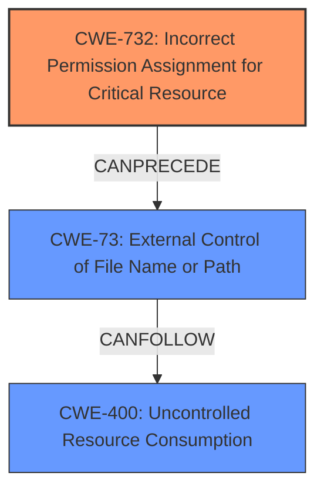

# Raw Analyzer Response for CVE-2024-8405

# Summary
| CWE ID | CWE Name | Confidence | CWE Abstraction Level | CWE Vulnerability Mapping Label | CWE-Vulnerability Mapping Notes |
|---|---|---|---|---|---|
| CWE-732 | Incorrect Permission Assignment for Critical Resource | 0.75 | Class | Allowed-with-Review | Primary CWE - **Root cause** |
| CWE-73 | External Control of File Name or Path | 0.65 | Base | Allowed | Secondary Candidate |
| CWE-400 | Uncontrolled Resource Consumption | 0.5 | Class | Discouraged | Secondary Candidate |

## Evidence and Confidence

*   **Confidence Score:** 0.7
*   **Evidence Strength:** MEDIUM

## Relationship Analysis
The primary relationship that impacted the decision was the need to identify the root cause of the vulnerability. CWE-732 is a Class-level CWE that can be further refined. The **incorrect permission assignment** is the primary issue. This leads to **external control of the filename or path (CWE-73)**, which can then lead to **uncontrolled resource consumption (CWE-400)** and ultimately a Denial of Service.

## Vulnerability Chain
The vulnerability chain starts with the **incorrect permission assignment (CWE-732)**, which allows for **external control of the file name or path (CWE-73)**. This can then lead to **uncontrolled resource consumption (CWE-400)**, ultimately resulting in a denial-of-service (DoS) attack.

## Summary of Analysis
The initial analysis focused on identifying the **root cause** of the vulnerability. The vulnerability description mentions an **"arbitrary file creation"** vulnerability. The CVE Reference Links Content Summary states that the "`web-print.exe` process incorrectly creating files that don't exist when a maliciously formed payload is provided."

The Retriever Results provided several candidate CWEs, including CWE-59, CWE-400, CWE-121, CWE-367, CWE-20, CWE-787, CWE-732, CWE-119, and CWE-770.

CWE-732, Incorrect Permission Assignment for Critical Resource, was selected as the **primary CWE** because it addresses the **root cause** of the arbitrary file creation. The `web-print.exe` process should not be creating files based on **untrusted input**, suggesting an issue with how permissions are assigned or validated.

CWE-73, External Control of File Name or Path, was considered as a secondary CWE because the vulnerability involves a **maliciously formed payload** influencing file creation. This suggests that the attacker can control the filename or path to some extent, leading to the arbitrary file creation.

CWE-400, Uncontrolled Resource Consumption, was considered because the ultimate impact is a Denial of Service (DoS) due to disk space exhaustion. However, this is a consequence of the **arbitrary file creation**, not the root cause.

The graph relationships influenced the final selection by highlighting the potential chain of events: **incorrect permissions leading to external control, which in turn leads to resource consumption**.

The selected CWEs are at the optimal level of specificity because they accurately represent the root cause (CWE-732) and the immediate consequence (CWE-73) of the vulnerability.

CWE-59, Improper Link Resolution Before File Access ('Link Following'), was considered but not selected because the description does not mention anything about links or shortcuts.

CWE-787, Out-of-bounds Write, and CWE-119, Improper Restriction of Operations within the Bounds of a Memory Buffer, were considered but not selected as the vulnerability is related to file creation, and not a memory corruption issue.

CWE-770, Allocation of Resources Without Limits or Throttling, was considered, but not selected as it is the arbitrary file creation that leads to the resource consumption, and not necessarily a direct allocation issue.