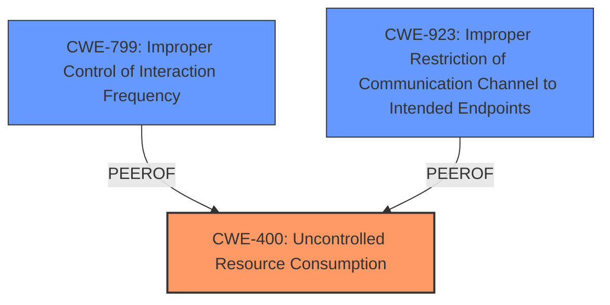

# Analysis Report for CVE-2024-8418

# Vulnerability Analysis Report: CVE-2024-8418

## Description

A flaw was found in Aardvark-dns, which is vulnerable to a Denial of Service attack due to the **serial processing of TCP DNS queries**. An attacker can exploit this flaw by keeping a TCP connection open indefinitely, causing the server to become unresponsive and resulting in other DNS queries timing out. This issue prevents legitimate users from accessing DNS services, thereby disrupting normal operations and causing service downtime.

## Vulnerability Description Key Phrases

- **Rootcause:** serial processing of TCP DNS queries
- **Impact:** Denial of Service attack
- **Vector:** keeping a TCP connection open indefinitely
- **Attacker:** attacker
- **Product:** Aardvark-dns

## Analysis (with Relationship Data)

# Summary
| CWE ID | CWE Name | Confidence | CWE Abstraction Level | CWE Vulnerability Mapping Label | CWE-Vulnerability Mapping Notes |
|---|---|---|---|---|---|
| **CWE-400** | **Uncontrolled Resource Consumption** | 0.9 | Class | Primary | Discouraged, but applicable given the DoS context due to resource exhaustion |
| CWE-799 | Improper Control of Interaction Frequency | 0.7 | Class | Secondary | Allowed-with-Review, as it describes the lack of limits on TCP connection frequency |
| CWE-923 | Improper Restriction of Communication Channel to Intended Endpoints | 0.6 | Class | Secondary | Allowed-with-Review, could be related to lack of endpoint validation, but less direct than CWE-400 |

## Evidence and Confidence

*   **Confidence Score:** 0.8
*   **Evidence Strength:** HIGH

## Relationship Analysis
The primary CWE is CWE-400, which is a Class-level CWE. It has child CWEs that are more specific but don't directly apply to the serial processing aspect of this vulnerability. CWE-799 is related as it describes the lack of limits on interaction frequency which leads to resource exhaustion. CWE-923 is a Class that is not a good fit, but related to the weakness.



## Vulnerability Chain
The vulnerability chain starts with **serial processing of TCP DNS queries** and **Lack of connection management**, leading to **Uncontrolled Resource Consumption** and ultimately resulting in a Denial of Service.

## Summary of Analysis
The initial assessment, based on the vulnerability description and the retriever results, points to **CWE-400 (Uncontrolled Resource Consumption)** as the primary weakness. The vulnerability involves the **serial processing of TCP DNS queries** which allows an attacker to keep a TCP connection open indefinitely, exhausting server resources.

The retriever results also list CWE-799 (Improper Control of Interaction Frequency) and CWE-923 (Improper Restriction of Communication Channel to Intended Endpoints) as potential candidates.

CWE-400 is chosen as the primary CWE because the core issue is that the server does not properly control the allocation and maintenance of resources (TCP connections), leading to resource exhaustion and a DoS. While CWE-400 is discouraged, the rationale fits the root cause well.

CWE-799 is chosen as a secondary CWE because the server does not properly limit the frequency of interactions, allowing a single attacker to exhaust resources.

CWE-923 is a less direct fit, but is added since it is possible the service does not properly ensure it is communicating with the correct endpoint.

The selected CWEs are at an appropriate level of specificity, with CWE-400 being a Class that adequately describes the resource consumption issue, and the others representing related aspects of the vulnerability.

Relevant CWE Information:

# Enhanced Context (25 CWEs)
The following CWEs were identified as potentially relevant to this vulnerability:

## CWE-617: Reachable Assertion
**Abstraction Level**: Base
**Similarity Score**: 0.72
**Source**: dense

**Description**:
The product contains an assert() or similar statement that can be triggered by an attacker, which leads to an application exit or other behavior that is more severe than necessary.

**Mapping Guidance**:
- Usage: Allowed
- Rationale: This CWE entry is at the Base level of abstraction, which is a preferred level of abstraction for mapping to the root causes of vulnerabilities.

*Not used because:* This vulnerability does not involve assertions.

## CWE-923: Improper Restriction of Communication Channel to Intended Endpoints
**Abstraction Level**: Class
**Similarity Score**: 0.71
**Source**: dense

**Description**:
The product establishes a communication channel to (or from) an endpoint for privileged or protected operations, but it does not properly ensure that it is communicating with the correct endpoint.

**Mapping Guidance**:
- Usage: Allowed-with-Review
- Rationale: This CWE entry is a Class and might have Base-level children that would be more appropriate

*Not used because:* While possibly related, the core issue is resource exhaustion.

## CWE-346: Origin Validation Error
**Abstraction Level**: Class
**Similarity Score**: 0.70
**Source**: dense

**Description**:
The product does not properly verify that the source of data or communication is valid.

**Mapping Guidance**:
- Usage: Allowed-with-Review
- Rationale: This CWE entry is a Class and might have Base-level children that would be more appropriate

*Not used because:* Origin validation is not the primary issue.

## CWE-407: Inefficient Algorithmic Complexity
**Abstraction Level**: Class
**Similarity Score**: 0.69
**Source**: dense

**Description**:
An algorithm in a product has an inefficient worst-case computational complexity that may be detrimental to system performance and can be triggered by an attacker, typically using crafted manipulations that ensure that the worst case is being reached.

**Mapping Guidance**:
- Usage: Allowed-with-Review
- Rationale: This CWE entry is a Class and might have Base-level children that would be more appropriate

*Not used because:* Algorithmic complexity is not the root cause.

## CWE-755: Improper Handling of Exceptional Conditions
**Abstraction Level**: Class
**Similarity Score**: 0.69
**Source**: dense

**Description**:
The product does not handle or incorrectly handles an exceptional condition.

**Mapping Guidance**:
- Usage: Discouraged
- Rationale: This CWE entry is a level-1 Class (i.e., a child of a Pillar). It might have lower-level children that would be more appropriate

*Not used because:* Exceptional conditions are not the root cause.

## CWE-178: Improper Handling of Case Sensitivity
**Abstraction Level**: Base
**Similarity Score**: 0.69
**Source**: dense

**Description**:
The product does not properly account for differences in case sensitivity when accessing or determining the properties of a resource, leading to inconsistent results.

**Mapping Guidance**:
- Usage: Allowed
- Rationale: This CWE entry is at the Base level of abstraction, which is a preferred level of abstraction for mapping to the root causes of vulnerabilities.

*Not used because:* Case sensitivity is not relevant.

## CWE-799: Improper Control of Interaction Frequency
**Abstraction Level**: Class
**Similarity Score**: 0.69
**Source**: dense

**Description**:
The product does not properly limit the number or frequency of interactions that it has with an actor, such as the number of incoming requests.

**Mapping Guidance**:
- Usage: Allowed-with-Review
- Rationale: This CWE entry is a Class and might have Base-level children that would be more appropriate

*Chosen as secondary because:* The lack of limits on TCP connection frequency directly contributes to the DoS.

## CWE-941: Incorrectly Specified Destination in a Communication Channel
**Abstraction Level**: Base
**Similarity Score**: 0.69
**Source**: dense

**Description**:
The product creates a communication channel to initiate an outgoing request to an actor, but it does not correctly specify the intended destination for that actor.

**Mapping Guidance**:
- Usage: Allowed
- Rationale: This CWE entry is at the Base level of abstraction, which is a preferred level of abstraction for mapping to the root causes of vulnerabilities.

*Not used because:* Incorrect destination is not the issue.

## CWE-789: Memory Allocation with Excessive Size Value
**Abstraction Level**: Variant
**Similarity Score**: 0.68
**Source**: dense

**Description**:
The product allocates memory based on an untrusted, large size value, but it does not ensure that the size is within expected limits, allowing arbitrary amounts of memory to be allocated.

**Mapping Guidance**:
- Usage: Allowed
- Rationale: This CWE entry is at the Variant level of abstraction, which is a preferred level of abstraction for mapping to the root causes of vulnerabilities.

*Not used because:* Memory allocation is not the primary issue.

## CWE-918: Server-Side Request Forgery (SSRF)
**Abstraction Level**: Base
**Similarity Score**: 0.68
**Source**: dense

**Description**:
The web server receives a URL or similar request from an upstream component and retrieves the contents of this URL, but it does not sufficiently ensure that the request is being sent to the expected destination.

**Mapping Guidance**:
- Usage: Allowed
- Rationale: This CWE entry is at the Base level of abstraction, which is a preferred level of abstraction for mapping to the root causes


## CWE Relationship Analysis

Current CWEs represent these abstraction levels: .


### Vulnerability Chain Analysis

**Chain starting from CWE-400:**
- 400 (Uncontrolled Resource Consumption) - ROOT


**Chain starting from CWE-407:**
- 407 (Inefficient Algorithmic Complexity) - ROOT


### CWE Relationship Diagram

```mermaid
graph TD
    classDef primary fill:#f96,stroke:#333,stroke-width:2px
    classDef secondary fill:#69f,stroke:#333
    classDef tertiary fill:#9e9,stroke:#333
```


*Report generated on 2025-07-14 03:44:52*
