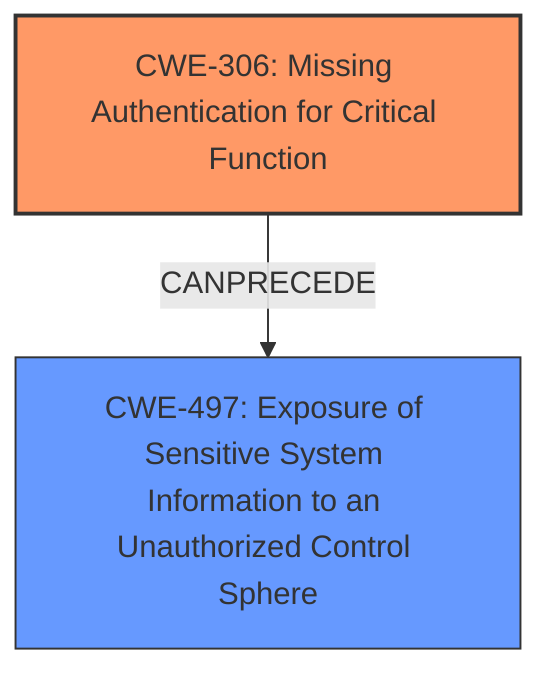

# Analysis Report for CVE-2024-8460

# Vulnerability Analysis Report: CVE-2024-8460

## Description

A vulnerability, which was classified as problematic, has been found in D-Link DNS-320 2.02b01. Affected by this issue is some unknown functionality of the file /cgi-bin/widget_api.cgi of the component Web Management Interface. The manipulation of the argument getHD/getSer/getSys leads to information disclosure. The attack may be launched remotely. The complexity of an attack is rather high. The exploitation is known to be difficult. The exploit has been disclosed to the public and may be used. NOTE This vulnerability only affects products that are no longer supported by the maintainer. Vendor was contacted early and confirmed that the product is end-of-life. It should be retired and replaced.

## Vulnerability Description Key Phrases

- **Impact:** information disclosure
- **Vector:** manipulation of the argument getHD/getSer/getSys
- **Product:** D-Link DNS-320
- **Version:** 2.02b01
- **Component:** /cgi-bin/widget_api.cgi

## Analysis (with Relationship Data)

# Summary
| CWE ID | CWE Name | Confidence | CWE Abstraction Level | CWE Vulnerability Mapping Label | CWE-Vulnerability Mapping Notes |
|---|---|---|---|---|---|
| CWE-306 | Missing Authentication for Critical Function | 0.9 | Base | Allowed | Primary CWE: The root cause is the lack of authentication for a critical function. |
| CWE-497 | Exposure of Sensitive System Information to an Unauthorized Control Sphere | 0.8 | Base | Allowed | Secondary CWE: This describes the impact of missing authentication, leading to information exposure. |

## Evidence and Confidence

*   **Confidence Score:** 0.85
*   **Evidence Strength:** MEDIUM

## Relationship Analysis
The primary weakness is the **Missing Authentication for Critical Function (CWE-306)**, which directly leads to the **Exposure of Sensitive System Information to an Unauthorized Control Sphere (CWE-497)**. CWE-306 is a base-level CWE, providing a suitable level of specificity. CWE-497 is a consequence of the missing authentication, thus forming a chain.



## Vulnerability Chain
The vulnerability chain starts with **CWE-306 (Missing Authentication for Critical Function)**. The absence of authentication for the `/cgi-bin/widget_api.cgi` endpoint allows unauthorized access, leading to **CWE-497 (Exposure of Sensitive System Information to an Unauthorized Control Sphere)**. This chain reflects the progression from the initial **flaw** to the resulting **impact**.

## Summary of Analysis
The analysis focuses on the lack of authentication leading to information disclosure. The primary CWE, **CWE-306**, accurately represents the **root cause**: the absence of authentication for a critical function. This allows unauthorized access to sensitive system information, as described in **CWE-497**.
The selection of CWE-306 and CWE-497 is based on the evidence from the "CVE Reference Links Content Summary" section, which explicitly states, "...information disclosure via a hidden interface that lacks authentication/authorization" and "attackers to access sensitive information from a hidden interface without any permission. Specifically, the information exposed through `/cgi-bin/widget_api.cgi` includes details about the hard drives, serial numbers, and system information."
The provided evidence directly supports the selection of these CWEs, making them the most appropriate and specific classifications.

Relevant CWE Information:

# Enhanced Context (25 CWEs)
The following CWEs were identified as potentially relevant to this vulnerability:

## CWE-923: Improper Restriction of Communication Channel to Intended Endpoints
**Abstraction Level**: Class
**Similarity Score**: 0.79
**Source**: dense

**Description**:
The product establishes a communication channel to (or from) an endpoint for privileged or protected operations, but it does not properly ensure that it is communicating with the correct endpoint.

**Mapping Guidance**:
- Usage: Allowed-with-Review
- Rationale: This CWE entry is a Class and might have Base-level children that would be more appropriate

*Not Selected*: While there's a communication channel, the primary issue isn't restricting it to intended endpoints, but rather the missing authentication.

## CWE-425: Direct Request ('Forced Browsing')
**Abstraction Level**: Base
**Similarity Score**: 0.79
**Source**: dense

**Description**:
The web application does not adequately enforce appropriate authorization on all restricted URLs, scripts, or files.

**Mapping Guidance**:
- Usage: Allowed
- Rationale: This CWE entry is at the Base level of abstraction, which is a preferred level of abstraction for mapping to the root causes of vulnerabilities.

*Not Selected*: While related, the core issue is the complete **lack of authentication**, not inadequate authorization. Thus CWE-306 is the more appropriate selection.

## CWE-497: Exposure of Sensitive System Information to an Unauthorized Control Sphere
**Abstraction Level**: Base
**Similarity Score**: 0.78
**Source**: dense

**Description**:
The product does not properly prevent sensitive system-level information from being accessed by unauthorized actors who do not have the same level of access to the underlying system as the product does.

**Mapping Guidance**:
- Usage: Allowed
- Rationale: This CWE entry is at the Base level of abstraction, which is a preferred level of abstraction for mapping to the root causes of vulnerabilities.

*Selected as Secondary*: This accurately describes the result of the missing authentication. Attackers gain access to sensitive system information.

## CWE-1391: Use of Weak Credentials
**Abstraction Level**: Class
**Similarity Score**: 0.78
**Source**: dense

**Description**:
The product uses weak credentials (such as a default key or hard-coded password) that can be calculated, derived, reused, or guessed by an attacker.

**Mapping Guidance**:
- Usage: Allowed-with-Review
- Rationale: This CWE entry is a Class and might have Base-level children that would be more appropriate

*Not Selected*: The vulnerability description indicates a **lack of authentication**, not the use of weak credentials.

## CWE-755: Improper Handling of Exceptional Conditions
**Abstraction Level**: Class
**Similarity Score**: 0.78
**Source**: dense

**Description**:
The product does not handle or incorrectly handles an exceptional condition.

**Mapping Guidance**:
- Usage: Discouraged
- Rationale: This CWE entry is a level-1 Class (i.e., a child of a Pillar). It might have lower-level children that would be more appropriate

*Not Selected*: This is not related to exceptional conditions.

## CWE-288: Authentication Bypass Using an Alternate Path or Channel
**Abstraction Level**: Base
**Similarity Score**: 0.78
**Source**: dense

**Description**:
The product requires authentication, but the product has an alternate path or channel that does not require authentication.

**Mapping Guidance**:
- Usage: Allowed
- Rationale: This CWE entry is at the Base level of abstraction, which is a preferred level of abstraction for mapping to the root causes of vulnerabilities.

*Not Selected*: While an alternate path lacking authentication exists, the more fundamental problem is the initial **lack of authentication** for a critical function.

## CWE-41: Improper Resolution of Path Equivalence
**Abstraction Level**: Base
**Similarity Score**: 0.77
**Source**: dense

**Description**:
The product is vulnerable to file system contents disclosure through path equivalence. Path equivalence involves the use of special characters in file and directory names. The associated manipulations are intended to generate multiple names for the same object.

**Mapping Guidance**:
- Usage: Allowed
- Rationale: This CWE entry is at the Base level of abstraction, which is a preferred level of abstraction for mapping to the root causes of vulnerabilities.

*Not Selected*: This is not related to path equivalence.

## CWE-912: Hidden Functionality
**Abstraction Level**: Class
**Similarity Score**: 0.77
**Source**: dense

**Description**:
The product contains functionality that is not documented, not part of the specification, and not accessible through an interface or command sequence that is obvious to the product's users or administrators.

**Mapping Guidance**:
- Usage: Allowed-with-Review
- Rationale: This CWE entry is a Class and might have Base-level children that would be more appropriate

*Not Selected*: The existence of hidden functionality is a contributing factor, but the **primary issue** remains the **missing authentication**.

## CWE-798: Use of Hard-coded Credentials
**Abstraction Level**: Base
**Similarity Score**: 0.77
**Source**: dense

**Description**:
The product contains hard-coded credentials, such as a password or cryptographic key.

**Mapping Guidance**:
- Usage: Allowed
- Rationale: This CWE entry is at the Base level of abstraction, which is a preferred level of abstraction for mapping to the root causes of vulnerabilities.

*Not Selected*: The vulnerability description indicates a **lack of authentication**, not the use of hard-coded credentials.

## CWE-74: Improper Neutralization of Special Elements in Output Used by a Downstream Component ('Injection')
**Abstraction Level**: Class
**Similarity Score**: 0.77
**Source**: dense

**Description**:
The product constructs all or part of a command, data structure, or record using externally-influenced input from an upstream component, but it does not neutralize or incorrectly neutralizes special elements that could modify how it is parsed or interpreted when it is sent to a downstream component.

**Mapping Guidance**:
- Usage: Discouraged
- Rationale: CWE-74 is high-level and often misused when lower-level weaknesses are more appropriate.

*Not Selected*: This is not related to injection.

## CWE-89: Improper Neutralization of Special Elements used in an SQL Command ('SQL Injection')


## CWE Relationship Analysis

Current CWEs represent these abstraction levels: .


### Vulnerability Chain Analysis

**Chain starting from CWE-288:**
- 288 (Authentication Bypass Using an Alternate Path or Channel) - ROOT


**Chain starting from CWE-89:**
- 89 (Improper Neutralization of Special Elements used in an SQL Command ('SQL Injection')) - ROOT


### CWE Relationship Diagram

```mermaid
graph TD
    classDef primary fill:#f96,stroke:#333,stroke-width:2px
    classDef secondary fill:#69f,stroke:#333
    classDef tertiary fill:#9e9,stroke:#333
```


*Report generated on 2025-07-14 03:48:29*
