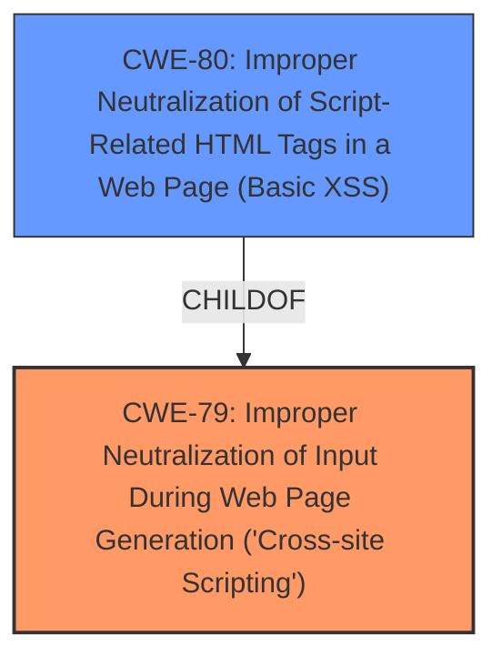

# Analysis Report for CVE-2024-8471

# Vulnerability Analysis Report: CVE-2024-8471

## Description

Cross-Site Scripting (XSS) vulnerability, whereby user-controlled input is not sufficiently encrypted. Exploitation of this vulnerability could allow an attacker to retrieve the session details of an authenticated user through JOBID and USERNAME parameters in /jobportal/process.php.

## Vulnerability Description Key Phrases

- **Weakness:** cross-site scripting
- **Impact:** retrieve session details
- **Component:** /jobportal/process.php

## Analysis (with Relationship Data)

# Summary

| CWE ID | CWE Name | Confidence | CWE Abstraction Level | CWE Vulnerability Mapping Label | CWE-Vulnerability Mapping Notes |
|---|---|---|---|---|---|
| CWE-79 | Improper Neutralization of Input During Web Page Generation ('Cross-site Scripting') | 1.0 | Base | Allowed | Primary CWE. Matches the vulnerability description of XSS due to insufficient encryption of user-controlled input. |

## Evidence and Confidence

*   **Confidence Score:** 1.0
*   **Evidence Strength:** HIGH

## Relationship Analysis
The primary relationship considered was the parent-child relationship between CWE-79 and its variants like CWE-80. While CWE-80 (Improper Neutralization of Script-Related HTML Tags in a Web Page (Basic XSS)) is a more specific variant, the description doesn't provide enough information to confirm the vulnerability is limited to script-related HTML tags. Therefore, the more general CWE-79 is selected. There were also other relationships such as peer and chain relationships but those were discarded in favor of the selected primary CWE.



## Vulnerability Chain
The vulnerability chain starts with the **improper neutralization** of user-controlled input, leading directly to the impact of potential session details retrieval.

Root Cause: **Improper Neutralization** of user-controlled input (CWE-79)
Impact: Retrieval of session details of an authenticated user

## Summary of Analysis
The analysis strongly points towards CWE-79 (Improper Neutralization of Input During Web Page Generation ('Cross-site Scripting')) as the primary weakness. The vulnerability description states that user-controlled input is not sufficiently encrypted, leading to a cross-site scripting vulnerability. The CVE Reference Links Content Summary confirms that the root cause is due to insufficient sanitization of user-controlled input, which can lead to an attacker retrieving session details.

The selection of CWE-79 is based on the direct match with the vulnerability description and the confirmation from the CVE reference. The retriever results also list CWE-79 as the top candidate. While other CWEs like CWE-80 (Improper Neutralization of Script-Related HTML Tags in a Web Page (Basic XSS)) were considered, there wasn't sufficient evidence to narrow down the XSS to script-related HTML tags specifically. Therefore, CWE-79 provides the most accurate and general representation of the **weakness**.


## CWE Relationship Analysis

Current CWEs represent these abstraction levels: .


### Vulnerability Chain Analysis

**Chain starting from CWE-79:**
- 79 (Improper Neutralization of Input During Web Page Generation ('Cross-site Scripting')) - ROOT


**Chain starting from CWE-80:**
- 80 (Improper Neutralization of Script-Related HTML Tags in a Web Page (Basic XSS)) - ROOT


### CWE Relationship Diagram

```mermaid
graph TD
    classDef primary fill:#f96,stroke:#333,stroke-width:2px
    classDef secondary fill:#69f,stroke:#333
    classDef tertiary fill:#9e9,stroke:#333
```


*Report generated on 2025-07-14 03:49:02*
