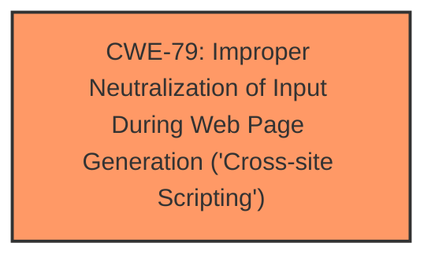

# Analysis Report for CVE-2024-8472

# Vulnerability Analysis Report: CVE-2024-8472

## Description

**Cross-Site Scripting** (XSS) vulnerability, whereby user-controlled input is not sufficiently encrypted. Exploitation of this vulnerability could allow an attacker to retrieve the session details of an authenticated user through multiple parameters in /jobportal/index.php.

## Vulnerability Description Key Phrases

- **Weakness:** Cross-Site Scripting
- **Impact:** retrieve session details
- **Component:** /jobportal/index.php

## Analysis (with Relationship Data)

# Summary
| CWE ID | CWE Name | Confidence | CWE Abstraction Level | CWE Vulnerability Mapping Label | CWE-Vulnerability Mapping Notes |
|---|---|---|---|---|---|
| CWE-79 | Improper Neutralization of Input During Web Page Generation ('Cross-site Scripting') | 1.0 | Base | Primary CWE | Allowed |

## Evidence and Confidence

*   **Confidence Score:** 1.0
*   **Evidence Strength:** HIGH

## Relationship Analysis
The primary relationship that influenced the decision was the direct match of the vulnerability description to the definition of CWE-79. The vulnerability is a **Cross-Site Scripting** (XSS) vulnerability, where user-controlled input is not sufficiently encrypted, aligning directly with the description of CWE-79 as **improper neutralization of input during web page generation**.



## Vulnerability Chain
The vulnerability chain starts with the **improper neutralization of user-controlled input**, leading to the **Cross-Site Scripting** vulnerability, and finally resulting in the **potential retrieval of session details**.

## Summary of Analysis
The analysis is primarily based on the direct evidence from the vulnerability description, which clearly states the presence of a **Cross-Site Scripting** (XSS) vulnerability due to **insufficient encryption of user-controlled input**.

The vulnerability description states: "**Cross-Site Scripting** (XSS) vulnerability, whereby user-controlled input is not sufficiently encrypted. Exploitation of this vulnerability could allow an attacker to retrieve the session details of an authenticated user through multiple parameters in /jobportal/index.php."

The retriever results also strongly support CWE-79 as the primary candidate, with a high similarity score.

CWE-79 is selected because it accurately reflects the **root cause** of the vulnerability. The vulnerability lies in the **improper neutralization** of user input before it is used in the generation of a web page. This allows an attacker to inject malicious scripts that can be executed by other users.

The selection of CWE-79 is at the optimal level of specificity because it is a Base level CWE that directly describes the **improper neutralization** issue leading to the XSS vulnerability.


## CWE Relationship Analysis

Current CWEs represent these abstraction levels: .


### Vulnerability Chain Analysis

**Chain starting from CWE-79:**
- 79 (Improper Neutralization of Input During Web Page Generation ('Cross-site Scripting')) - ROOT


### CWE Relationship Diagram

```mermaid
graph TD
    classDef primary fill:#f96,stroke:#333,stroke-width:2px
    classDef secondary fill:#69f,stroke:#333
    classDef tertiary fill:#9e9,stroke:#333
```


*Report generated on 2025-07-14 03:49:14*
