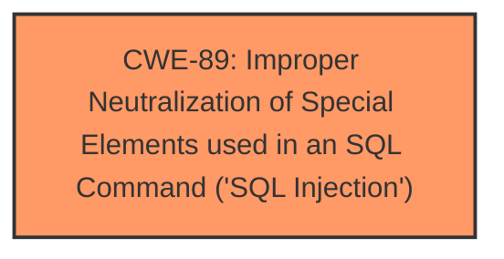

# Raw Analyzer Response for CVE-2024-8529

# Summary
| CWE ID | CWE Name | Confidence | CWE Abstraction Level | CWE Vulnerability Mapping Label | CWE-Vulnerability Mapping Notes |
|---|---|---|---|---|---|
| CWE-89 | Improper Neutralization of Special Elements used in an SQL Command ('SQL Injection') | 1.0 | Base | Primary | Allowed |

## Evidence and Confidence

*   **Confidence Score:** 1.0
*   **Evidence Strength:** HIGH

## Relationship Analysis
The primary relationship identified is that CWE-89 is a base-level CWE, providing a specific description of the SQL Injection vulnerability. No other child or parent relationships strongly influence this decision, as the description clearly points to the root cause being improper neutralization in SQL commands. The abstraction level is appropriate as it is a base-level CWE.

## Vulnerability Chain
The vulnerability chain starts with **insufficient escaping on the user-supplied parameter** `c_fields` and **lack of sufficient preparation on the existing SQL query**, leading directly to **SQL Injection**. This allows unauthenticated attackers to **extract sensitive information from the database**. The root cause is clearly the **improper neutralization**, which directly results in the impact of information disclosure.

## Summary of Analysis
The analysis is based heavily on the provided evidence, particularly the vulnerability description which highlights the **insufficient escaping** and **lack of sufficient preparation** leading to **SQL Injection**. The "CWE for similar CVE Descriptions" section further solidifies this choice with CWE-89 being the primary and top CWE match. The graph relationships confirm that CWE-89 is a base-level CWE which is optimal for describing the root cause.

Relevant CWE Information:

# Enhanced Context (25 CWEs)
The following CWEs were identified as potentially relevant to this vulnerability:

## CWE-352: Cross-Site Request Forgery (CSRF)
**Abstraction Level**: Compound
**Similarity Score**: 0.72
**Source**: dense
- Not Used: CSRF is not mentioned in the vulnerability description or reference links content summary. This vulnerability is about improper SQL query construction, not request forgery.

## CWE-472: External Control of Assumed-Immutable Web Parameter
**Abstraction Level**: Base
**Similarity Score**: 0.72
**Source**: dense
- Not Used: While the `c_fields` parameter is externally controlled, the core issue is not that it's assumed immutable, but that it's improperly handled in the SQL query.

## CWE-434: Unrestricted Upload of File with Dangerous Type
**Abstraction Level**: Base
**Similarity Score**: 0.71
**Source**: dense
- Not Used: This CWE is not relevant as the vulnerability does not involve file uploads.

## CWE-425: Direct Request ('Forced Browsing')
**Abstraction Level**: Base
**Similarity Score**: 0.70
**Source**: dense
- Not Used: The issue is not about unauthorized access to URLs but about the construction of SQL queries with user-supplied data.

## CWE-639: Authorization Bypass Through User-Controlled Key
**Abstraction Level**: Base
**Similarity Score**: 0.70
**Source**: dense
- Not Used: The vulnerability is not related to bypassing authorization through a user-controlled key but rather about SQL injection.

## CWE-116: Improper Encoding or Escaping of Output
**Abstraction Level**: Class
**Similarity Score**: 0.69
**Source**: dense
- Not Used: While escaping is mentioned, the core issue is not the output encoding but the lack of input sanitization/neutralization when constructing the SQL query.

## CWE-502: Deserialization of Untrusted Data
**Abstraction Level**: Base
**Similarity Score**: 0.69
**Source**: dense
- Not Used: The vulnerability does not involve deserialization of untrusted data.

## CWE-96: Improper Neutralization of Directives in Statically Saved Code ('Static Code Injection')
**Abstraction Level**: Base
**Similarity Score**: 0.68
**Source**: dense
- Not Used: The injection is happening in SQL queries, not in static code.

## CWE-95: Improper Neutralization of Directives in Dynamically Evaluated Code ('Eval Injection')
**Abstraction Level**: Variant
**Similarity Score**: 0.68
**Source**: dense
- Not Used: The vulnerability is related to SQL queries, not dynamic code evaluation.

## CWE-90: Improper Neutralization of Special Elements used in an LDAP Query ('LDAP Injection')
**Abstraction Level**: Base
**Similarity Score**: 1176.04
**Source**: sparse
- Not Used: The vulnerability is SQL Injection, not LDAP Injection.

## CWE-138: Improper Neutralization of Special Elements
**Abstraction Level**: Class
**Similarity Score**: 1142.09
**Source**: sparse
- Not Used: This is a higher-level class. CWE-89 is more specific and appropriate.

## CWE-863: Incorrect Authorization
**Abstraction Level**: Class
**Similarity Score**: 1137.71
**Source**: sparse
- Not Used: The primary issue is not incorrect authorization, but improper handling of SQL queries leading to SQL injection.

## CWE-73: External Control of File Name or Path
**Abstraction Level**: base
**Similarity Score**: 4.33
**Source**: graph
- Not Used: The vulnerability is not related to file path manipulation.

## CWE-471: Modification of Assumed-Immutable Data (MAID)
**Abstraction Level**: base
**Similarity Score**: 2.72
**Source**: graph
- Not Used: The vulnerability is about SQL injection, not modification of assumed-immutable data.

## CWE-41: Improper Resolution of Path Equivalence
**Abstraction Level**: base
**Similarity Score**: 2.21
**Source**: graph
- Not Used: This is not related to the described vulnerability.

## CWE-183: Permissive List of Allowed Inputs
**Abstraction Level**: base
**Similarity Score**: 2.21
**Source**: graph
- Not Used: This CWE does not apply as the vulnerability is not about a permissive list of allowed inputs.

## CWE-59: Improper Link Resolution Before File Access ('Link Following')
**Abstraction Level**: base
**Similarity Score**: 2.21
**Source**: graph
- Not Used: This CWE does not apply as the vulnerability is not about link following.