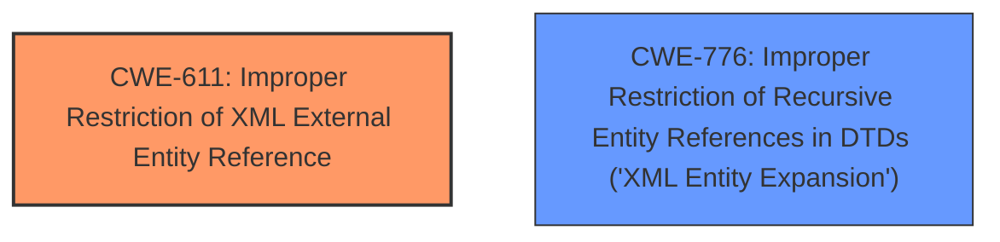

# Analysis for CVE-2024-8602

# Summary

| CWE ID  | CWE Name                                                                                                   | Confidence | CWE Abstraction Level | CWE Vulnerability Mapping Label | CWE-Vulnerability Mapping Notes |
| :-------- | :--------------------------------------------------------------------------------------------------------- | :--------- | :---------------------- | :------------------------------ | :------------------------------ |
| CWE-611 | Improper Restriction of XML External Entity Reference                                                    | 1          | Base                    | Primary                         | Allowed                       |
| CWE-776 | Improper Restriction of Recursive Entity References in DTDs ('XML Entity Expansion') | 0.7        | Base                    | Secondary                         | Allowed                       |

## Evidence and Confidence

*   **Confidence Score:** 0.9
*   **Evidence Strength:** HIGH

## Relationship Analysis

The primary relationship is that CWE-611 [CWE-611: Improper Restriction of XML External Entity Reference] and CWE-776 [CWE-776: Improper Restriction of Recursive Entity References in DTDs ('XML Entity Expansion')] are both related to XML processing vulnerabilities. CWE-611 focuses on the general issue of improper restriction of XML external entities, while CWE-776 is a more specific case dealing with recursive entity references in DTDs (Document Type Definitions). Both are at the Base level of abstraction. There is no direct parent-child relationship between these CWEs, but they can be considered peer vulnerabilities within the realm of XML security.

## Vulnerability Chain

The vulnerability chain starts with the **default settings of the DocumentBuilder allowing for an XXE**, which leads to the potential for:

1.  Reading files from the operating system
2.  Crashing the thread handling the parsing or causing it to enter an infinite loop
3.  Executing HTTP requests
4.  Loading additional DTDs or XML files
5.  Under certain conditions, executing OS commands

The root cause is the **XXE** vulnerability. This is directly caused by the **improper configuration of the DocumentBuilderFactory**.

## Summary of Analysis

The primary vulnerability is CWE-611 [CWE-611: Improper Restriction of XML External Entity Reference] due to the **default settings of the DocumentBuilder allowing for an XXE**, as explicitly stated in the "Vulnerability Description Key Phrases". The "CVE Reference Links Content Summary" section also confirms this, stating that the `DocumentBuilderFactory` is not configured to disallow processing of `DOCTYPE` declarations, leading to the **XXE vulnerability**. The impact of this vulnerability includes information disclosure, denial of service, and arbitrary HTTP GET requests, which are all consequences of a successful XXE attack.

CWE-776 [CWE-776: Improper Restriction of Recursive Entity References in DTDs ('XML Entity Expansion')] is a secondary candidate because the vulnerability description mentions the possibility of causing the parsing thread to enter an infinite loop, which could be related to recursive entity expansion. However, the primary issue is the **XXE** vulnerability, not specifically the recursive entity expansion.

The evidence strongly supports CWE-611 as the primary CWE. While CWE-776 could be a contributing factor, it's not the main root cause. Therefore, I'm assigning CWE-611 with high confidence (1.0) and CWE-776 as a secondary consideration with a lower confidence (0.7).

The retriever results also support this conclusion, with CWE-611 having the highest score.

The mapping guidance for both CWE-611 and CWE-776 indicates that they are at the Base level of abstraction and are ALLOWED for mapping, which further supports their selection.

Relevant CWE Information:
* CWE-611: Improper Restriction of XML External Entity Reference
* CWE-776: Improper Restriction of Recursive Entity References in DTDs ('XML Entity Expansion')