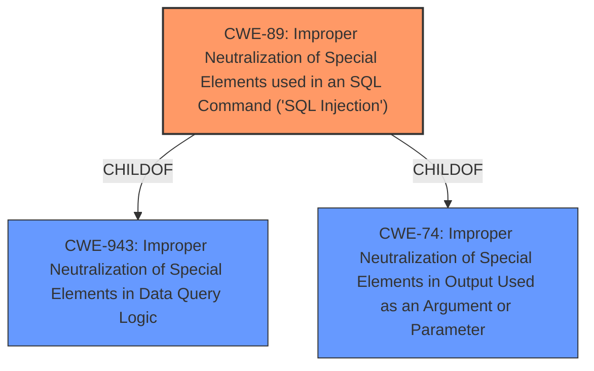

# Analysis Report for CVE-2024-8621

# Vulnerability Analysis Report: CVE-2024-8621

## Description

The Daily Prayer Time plugin for WordPress is vulnerable to SQL Injection via the max_word attribute of the quran_verse shortcode in all versions up to, and including, 2024.08.26 due to **insufficient escaping on the user supplied parameter and lack of sufficient preparation on the existing SQL query**. This makes it possible for authenticated attackers, with Contributor-level access and above, to append additional SQL queries into already existing queries that can be used to extract sensitive information from the database.

## Vulnerability Description Key Phrases

- **Rootcause:** insufficient escaping on the user supplied parameter and lack of sufficient preparation on the existing SQL query
- **Weakness:** SQL injection
- **Impact:** extract sensitive information from the database
- **Attacker:** authenticated attackers
- **Product:** Daily Prayer Time plugin for WordPress
- **Version:** all versions up to and including 2024.08.26
- **Component:** max_word attribute of the quran_verse shortcode

## Analysis (with Relationship Data)

# Summary

| CWE ID | CWE Name | Confidence | CWE Abstraction Level | CWE Vulnerability Mapping Label | CWE-Vulnerability Mapping Notes |
|---|---|---|---|---|---|
| CWE-89 | Improper Neutralization of Special Elements used in an SQL Command ('SQL Injection') | 1.0 | Base | Allowed | Primary CWE: The vulnerability is a clear case of SQL injection due to **insufficient escaping** and **lack of sufficient preparation** of the SQL query.|

## Evidence and Confidence

*   **Confidence Score:** 1.0
*   **Evidence Strength:** HIGH

## Relationship Analysis
The primary relationship that influenced the decision was the hierarchical relationship between CWE-89 and its parent CWEs, particularly CWE-943 (Improper Neutralization of Special Elements in Data Query Logic) and CWE-74 (Improper Neutralization of Special Elements in Output Used as an Argument or Parameter;). However, CWE-89 is more specific and directly applicable to the SQL injection vulnerability described. No chain relationships were crucial in this instance, as the focus is on the immediate cause.



## Vulnerability Chain
The vulnerability chain starts with **insufficient input sanitization**, leading directly to **SQL injection**, which allows for **data extraction**. The primary CWE is the **SQL injection** itself.

## Summary of Analysis
The analysis is based on the provided evidence, particularly the vulnerability description and the CVE reference summary, which clearly indicate an SQL injection vulnerability. The **root cause** is the **insufficient sanitization of user-supplied input**, leading to the ability to inject malicious SQL code. The selection of CWE-89 is at the optimal level of specificity, as it directly addresses the SQL injection vulnerability.

The vulnerability description states: "The Daily Prayer Time plugin for WordPress is vulnerable to SQL Injection via the max_word attribute of the quran_verse shortcode in all versions up to, and including, 2024.08.26 due to **insufficient escaping on the user supplied parameter and lack of sufficient preparation on the existing SQL query**."

The CVE Reference Links Content Summary states: "The vulnerability stems from **insufficient sanitization** of user-supplied input within the `getQuote` function of the `QuranDB.php` file. Specifically, the `min_word`, `max_word` and `language` attributes of the `quran_verse` shortcode were not properly sanitized before being used in a SQL query."

Relevant CWE Information:

*   **CWE-89: Improper Neutralization of Special Elements used in an SQL Command ('SQL Injection')**: This CWE perfectly matches the vulnerability, as the plugin fails to properly neutralize special elements in the user-supplied input, leading to SQL injection.
*   **CWE-116: Improper Encoding or Escaping of Output**: While encoding/escaping issues can contribute to SQL injection, the primary issue here is the **lack of sufficient preparation on the existing SQL query**, making CWE-89 a more direct fit.
*   **CWE-90: Improper Neutralization of Special Elements used in an LDAP Query ('LDAP Injection')**: This is not relevant as the vulnerability is related to SQL queries, not LDAP.
*   **CWE-352: Cross-Site Request Forgery (CSRF)**: This is not relevant as the described vulnerability is SQL Injection, not CSRF.
*   **CWE-425: Direct Request ('Forced Browsing')**: This is not relevant as the described vulnerability is SQL Injection, not related to authorization issues.
*   **CWE-472: External Control of Assumed-Immutable Web Parameter**: This is not relevant as the described vulnerability is SQL Injection, not related to immutable parameters.
*   **CWE-208: Observable Timing Discrepancy**: This is not relevant as the described vulnerability is SQL Injection, not related to timing discrepancies.
*   **CWE-79: Improper Neutralization of Input During Web Page Generation ('Cross-site Scripting')**: This is not relevant as the described vulnerability is SQL Injection, not related to Cross-Site Scripting.
*   **CWE-502: Deserialization of Untrusted Data**: This is not relevant as the described vulnerability is SQL Injection, not related to deserialization issues.
*   **CWE-639: Authorization Bypass Through User-Controlled Key**: This is not relevant as the described vulnerability is SQL Injection, not related to authorization bypass.
*   **CWE-201: Insertion of Sensitive Information Into Sent Data**: This is not relevant as the described vulnerability is SQL Injection, not related to sending sensitive information.
*   **CWE-94: Improper Control of Generation of Code ('Code Injection')**: This is not relevant as the described vulnerability is SQL Injection, not related to code injection.
*   **CWE-385: Covert Timing Channel**: This is not relevant as the described vulnerability is SQL Injection, not related to timing channels.
*   **CWE-456: Missing Initialization of a Variable**: This is not relevant as the described vulnerability is SQL Injection, not related to missing variable initialization.
*   **CWE-98: Improper Control of Filename for Include/Require Statement in PHP Program ('PHP Remote File Inclusion')**: This is not relevant as the described vulnerability is SQL Injection, not related to file inclusion.


## CWE Relationship Analysis

Current CWEs represent these abstraction levels: .


### Vulnerability Chain Analysis

**Chain starting from CWE-90:**
- 90 (Improper Neutralization of Special Elements used in an LDAP Query ('LDAP Injection')) - ROOT


**Chain starting from CWE-89:**
- 89 (Improper Neutralization of Special Elements used in an SQL Command ('SQL Injection')) - ROOT


### CWE Relationship Diagram

```mermaid
graph TD
    classDef primary fill:#f96,stroke:#333,stroke-width:2px
    classDef secondary fill:#69f,stroke:#333
    classDef tertiary fill:#9e9,stroke:#333
```


*Report generated on 2025-07-14 03:59:12*
