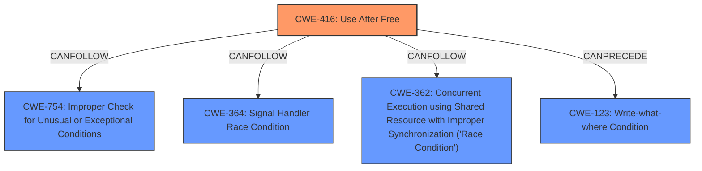

# Analysis Report for CVE-2024-8639

# Vulnerability Analysis Report: CVE-2024-8639

## Description

Use after free in Autofill in Google Chrome on Android prior to 128.0.6613.137 allowed a remote attacker to potentially exploit heap corruption via a crafted HTML page. (Chromium security severity High)

## Vulnerability Description Key Phrases

- **Rootcause:** use after free
- **Impact:** potentially exploit heap corruption
- **Vector:** crafted HTML page
- **Attacker:** remote attacker
- **Product:** Google Chrome on Android
- **Version:** prior to 128.0.6613.137
- **Component:** Autofill

## Analysis (with Relationship Data)

# Summary
| CWE ID | CWE Name | Confidence | CWE Abstraction Level | CWE Vulnerability Mapping Label | CWE-Vulnerability Mapping Notes |
|---|---|---|---|---|---|
| CWE-416 | Use After Free | 1.0 | Variant | Primary | Allowed |

## Evidence and Confidence

*   **Confidence Score:** 1.0
*   **Evidence Strength:** HIGH

## Relationship Analysis
The primary CWE is CWE-416, which is a variant. There are several related CWEs that could potentially follow a use-after-free, such as CWE-754 (Improper Check for Unusual or Exceptional Conditions), CWE-364 (Signal Handler Race Condition), and CWE-362 (Concurrent Execution using Shared Resource with Improper Synchronization ('Race Condition')). However, without additional information, these are speculative.



## Vulnerability Chain
The vulnerability chain starts with a **use-after-free** (CWE-416). The impact is potential heap corruption.

## Summary of Analysis
The vulnerability description clearly states a **use after free** condition exists in the Autofill component of Google Chrome on Android. The key phrase "rootcause: **use after free**" and the CVE Reference Links Content Summary confirming "Root Cause: Use-after-free vulnerability" provide direct evidence supporting the selection of CWE-416. The retriever results also strongly suggest CWE-416 as the primary candidate. The CWE-416 description aligns precisely with the vulnerability: "The product reuses or references memory after it has been freed." I am confident in this assessment. The selection of CWE-416 is at the optimal level of specificity (Variant).

Relevant CWE Information:

# Enhanced Context (25 CWEs)
The following CWEs were identified as potentially relevant to this vulnerability:

## CWE-416: Use After Free
**Abstraction Level**: Variant
**Similarity Score**: 0.79
**Source**: dense

**Description**:
The product reuses or references memory after it has been freed. At some point afterward, the memory may be allocated again and saved in another pointer, while the original pointer references a location somewhere within the new allocation. Any operations using the original pointer are no longer valid because the memory "belongs" to the code that operates on the new pointer.

**Mapping Guidance**:
- Usage: Allowed
- Rationale: This CWE entry is at the Variant level of abstraction, which is a preferred level of abstraction for mapping to the root causes of vulnerabilities.


## CWE Relationship Analysis

Current CWEs represent these abstraction levels: .


### Vulnerability Chain Analysis

**Chain starting from CWE-123:**
- 123 (Write-what-where Condition) - ROOT


**Chain starting from CWE-416:**
- 416 (Use After Free) - ROOT


### CWE Relationship Diagram

```mermaid
graph TD
    classDef primary fill:#f96,stroke:#333,stroke-width:2px
    classDef secondary fill:#69f,stroke:#333
    classDef tertiary fill:#9e9,stroke:#333
```


*Report generated on 2025-07-14 04:00:13*
