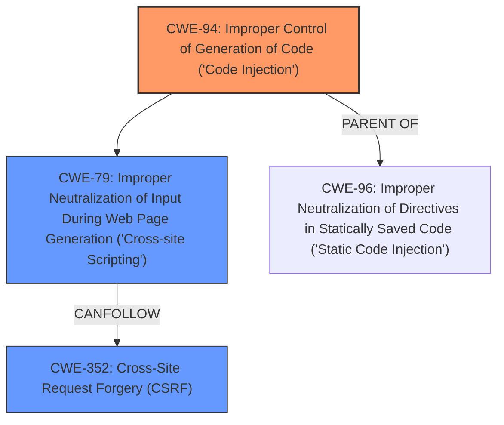

# Analysis Report for CVE-2024-8760

# Vulnerability Analysis Report: CVE-2024-8760

## Description

The Stackable - Page Builder Gutenberg Blocks plugin for WordPress is vulnerable to CSS Injection in all versions up to, and including, 3.13.6. This makes it possible for unauthenticated attackers to embed untrusted style information into comments resulting in a possibility of data exfiltration such as admin nonces with limited impact. These nonces could be used to perform CSRF attacks within a limited time window. The presence of other plugins may make additional nonces available, which may pose a risk in plugins that dont perform capability checks to protect AJAX actions or other actions reachable by lower-privileged users.

## Vulnerability Description Key Phrases

- **Weakness:** cross-site scripting
- **Impact:** data exfiltration
- **Vector:** CSS injection
- **Attacker:** unauthenticated attackers
- **Product:** Stackable - Page Builder Gutenberg Blocks plugin for WordPress
- **Version:** up to and including 3.13.6

## Analysis (with Relationship Data)

# Summary
| CWE ID | CWE Name | Confidence | CWE Abstraction Level | CWE Vulnerability Mapping Label | CWE-Vulnerability Mapping Notes |
|---|---|---|---|---|---|
| CWE-94 | Improper Control of Generation of Code ('Code Injection') | 0.9 | Base | Primary | Allowed-with-Review |
| CWE-79 | Improper Neutralization of Input During Web Page Generation ('Cross-site Scripting') | 0.7 | Base | Secondary | Allowed |
| CWE-352 | Cross-Site Request Forgery (CSRF) | 0.6 | Compound | Secondary | Allowed |

## Evidence and Confidence

*   **Confidence Score:** 0.7
*   **Evidence Strength:** MEDIUM

## Relationship Analysis
The primary weakness is **Improper Control of Generation of Code ('Code Injection')** (CWE-94), which is a base CWE. The injected code can then lead to **Cross-site Scripting** (CWE-79) if the injected code is not properly neutralized when it is used in a web page. The **Cross-Site Request Forgery (CSRF)** (CWE-352) is a potential impact if the attacker can exfiltrate nonces via the injected code.



## Vulnerability Chain
The vulnerability chain starts with the **Improper Control of Generation of Code ('Code Injection')** (CWE-94). This leads to the possibility of **Cross-site Scripting** (CWE-79). The impact of this vulnerability is potential **Cross-Site Request Forgery (CSRF)** (CWE-352) attacks via data exfiltration.

## Summary of Analysis
The vulnerability description indicates a CSS Injection vulnerability in the Stackable plugin. The plugin **fails to properly sanitize user-provided data when generating CSS, allowing unauthenticated users to inject malicious CSS code**. This description strongly suggests **Improper Control of Generation of Code ('Code Injection')** (CWE-94) as the root cause. The injected CSS can then be used for **Cross-site Scripting** (CWE-79) if the injected code is not properly neutralized when it is used in a web page. The impact of this vulnerability is potential **Cross-Site Request Forgery (CSRF)** (CWE-352) attacks via data exfiltration.

The evidence supporting this decision is:
*   "The vulnerability stems from a **lack of proper sanitization and control over CSS generation** within the Stackable – Page Builder Gutenberg Blocks plugin, allowing for CSS injection."
*   "The vulnerability is classified as **"Improper Control of Generation of Code ('Code Injection')"**, highlighting the flawed process of generating CSS code."
*   "Attackers can embed malicious CSS to potentially extract sensitive information, such as admin nonces."
*   "The extracted admin nonces could be used to perform CSRF (Cross-Site Request Forgery) attacks."

The graph relationships influenced my decision by highlighting the potential chain of vulnerabilities, starting with **Improper Control of Generation of Code ('Code Injection')** (CWE-94) leading to **Cross-site Scripting** (CWE-79), potentially resulting in **Cross-Site Request Forgery (CSRF)** (CWE-352).

My selected CWEs are at the optimal level of specificity because they directly address the **root cause (CWE-94)** and the potential consequences (**CWE-79** and **CWE-352**).

# Relevant CWE Information:

## CWE-352: Cross-Site Request Forgery (CSRF)
**Technical Explanation:** The vulnerability allows for the potential extraction of admin nonces, which could be used to perform CSRF attacks. While CSRF is a possible outcome, it's not the primary weakness, but rather a potential impact of the data exfiltration.
**Security Implications:** An attacker could potentially perform actions on behalf of an administrator without their knowledge.
**Relationship Analysis:** This is a potential impact of the vulnerability, rather than the root cause.
**Mapping Guidance Analysis:** Usage: Allowed. This is a well-known Composite of multiple weaknesses that must all occur simultaneously, although it is attack-oriented in nature.
**Mitigation Analysis:** Mitigations for CSRF would involve proper nonce generation and validation.
**Evidence:** "The extracted admin nonces could be used to perform CSRF (Cross-Site Request Forgery) attacks."
**Rationale:** The vulnerability allows for potential CSRF attacks if the attacker can exfiltrate nonces via the injected code.

## CWE-79: Improper Neutralization of Input During Web Page Generation ('Cross-site Scripting')
**Technical Explanation:** The injected CSS can be used for XSS attacks.
**Security Implications:** An attacker can inject malicious scripts into web pages viewed by other users.
**Relationship Analysis:** This is a consequence of the code injection, where the injected code is not properly neutralized when it is used in a web page.
**Mapping Guidance Analysis:** Usage: Allowed.
**Mitigation Analysis:** Mitigations for XSS would involve proper input validation and output encoding.
**Evidence:** "This makes it possible for unauthenticated attackers to embed untrusted style information into comments resulting in a possibility of data exfiltration such as admin nonces with limited impact."
**Rationale:** The injected CSS can be used for XSS attacks.

## CWE-89: Improper Neutralization of Special Elements used in an SQL Command ('SQL Injection')
**Rationale:** Although the retrieved results suggest this CWE, the vulnerability is CSS Injection, not SQL Injection. Therefore, this CWE is not applicable.

## CWE-94: Improper Control of Generation of Code ('Code Injection')
**Technical Explanation:** The plugin fails to properly sanitize user-provided data when generating CSS, allowing unauthenticated users to inject malicious CSS code.
**Security Implications:** An attacker can inject arbitrary CSS code into the application.
**Relationship Analysis:** This is the root cause of the vulnerability.
**Mapping Guidance Analysis:** Usage: Allowed-with-Review. This entry is frequently misused for vulnerabilities with a technical impact of "code execution," which does not by itself indicate a root cause weakness, since dozens of weaknesses can enable code execution.
**Mitigation Analysis:** Mitigations for code injection would involve proper input validation and sanitization.
**Evidence:** "The vulnerability stems from a lack of proper sanitization and control over CSS generation within the Stackable – Page Builder Gutenberg Blocks plugin, allowing for CSS injection."
**Rationale:** The plugin fails to properly sanitize user-provided data when generating CSS, allowing unauthenticated users to inject malicious CSS code.

## CWE-434: Unrestricted Upload of File with Dangerous Type
**Rationale:** This CWE is not applicable because the vulnerability is CSS Injection, not file upload.

## CWE-425: Direct Request ('Forced Browsing')
**Rationale:** This CWE is not applicable because the vulnerability is CSS Injection, not direct request.

## CWE-96: Improper Neutralization of Directives in Statically Saved Code ('Static Code Injection')
**Rationale:** The vulnerability is about injecting CSS, which is not statically saved code. Therefore, this CWE is less appropriate than CWE-94.

## CWE-471: Modification of Assumed-Immutable Data (MAID)
**Rationale:** The vulnerability is about injecting CSS, not modifying immutable data. Therefore, this CWE is not applicable.

## CWE-183: Permissive List of Allowed Inputs
**Rationale:** The vulnerability is about injecting CSS, not a permissive list of allowed inputs. Therefore, this CWE is not applicable.

## CWE-613: Insufficient Session Expiration
**Rationale:** The vulnerability is about injecting CSS, not session expiration. Therefore, this CWE is not applicable.

## CWE-494: Download of Code Without Integrity Check
**Rationale:** The vulnerability is about injecting CSS, not downloading code. Therefore, this CWE is not applicable.

## CWE-73: External Control of File Name or Path
**Rationale:** The vulnerability is about injecting CSS, not controlling file names or paths. Therefore, this CWE is not applicable.


## CWE Relationship Analysis

Current CWEs represent these abstraction levels: .


### Vulnerability Chain Analysis

**Chain starting from CWE-183:**
- 183 (Permissive List of Allowed Inputs) - ROOT


**Chain starting from CWE-89:**
- 89 (Improper Neutralization of Special Elements used in an SQL Command ('SQL Injection')) - ROOT


### CWE Relationship Diagram

```mermaid
graph TD
    classDef primary fill:#f96,stroke:#333,stroke-width:2px
    classDef secondary fill:#69f,stroke:#333
    classDef tertiary fill:#9e9,stroke:#333
```


*Report generated on 2025-07-14 04:05:42*
