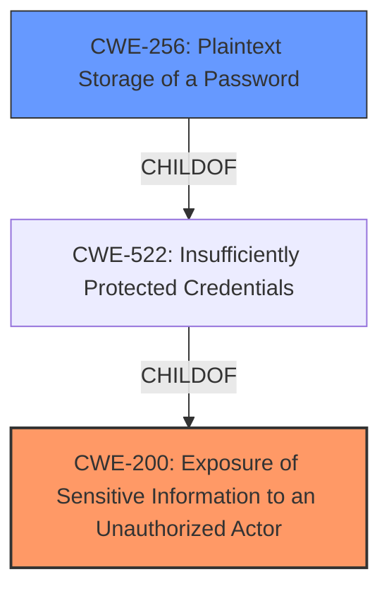

# Raw Analyzer Response for CVE-2024-8777

# Summary

| CWE ID  | CWE Name                                                        | Confidence | CWE Abstraction Level | CWE Vulnerability Mapping Label | CWE-Vulnerability Mapping Notes |
| ------- | --------------------------------------------------------------- | ---------- | --------------------- | ------------------------------- | ------------------------------- |
| CWE-200 | Exposure of Sensitive Information to an Unauthorized Actor      | 0.9        | Class                 | Allowed                         | Primary CWE                     |
| CWE-256 | Plaintext Storage of a Password                                 | 0.7        | Base                  | Allowed                         | Secondary Candidate             |

## Evidence and Confidence

*   **Confidence Score:** 0.8
*   **Evidence Strength:** MEDIUM

## Relationship Analysis

The primary relationship impacting my decision is the parent-child relationship between CWE-200 (Exposure of Sensitive Information to an Unauthorized Actor) and its potential children, such as CWE-532 (Insertion of Sensitive Information into Log File) or CWE-497 (Exposure of Sensitive System Information to an Unauthorized Control Sphere). However, the description remains at a higher level, justifying the selection of the parent CWE-200. CWE-256 (Plaintext Storage of a Password) is considered a secondary issue which can be a child of CWE-522 (Insufficiently Protected Credentials).

## Vulnerability Chain

The vulnerability chain starts with an information leakage vulnerability in OMFLOW, allowing unauthorized remote attackers to read arbitrary system configurations. If LDAP authentication is enabled, this leads to the exposure of plaintext credentials.
  - Root Cause: Information Leakage Vulnerability.
  - Weakness: Reading arbitrary system configurations.
  - Impact: Exposure of plaintext credentials.

## Summary of Analysis

The initial analysis focused on the vulnerability description, which highlights an information leakage vulnerability allowing unauthorized remote attackers to read system configurations. The description further states that if LDAP authentication is enabled, attackers can obtain plaintext credentials.

The primary CWE identified is CWE-200 (Exposure of Sensitive Information to an Unauthorized Actor). This is due to the **impact** of the vulnerability, which is to read arbitrary system configurations. This aligns directly with the description of CWE-200, which involves exposing sensitive information to unauthorized actors.

The retriever results also support this selection, with CWE-200 being the top combined result. The description mentions that if LDAP authentication is enabled, attackers can obtain plaintext credentials, suggesting **plaintext storage of a password**, hence CWE-256, Plaintext Storage of a Password, is listed as a secondary weakness.

The relationship graph indicates that CWE-200 is a parent of CWE-497, CWE-532, etc, but the information is not specific enough to justify using any of the children.

Relevant Evidence:
* "OMFLOW from The SYSCOM Group has an information leakage vulnerability, allowing unauthorized remote attackers to read arbitrary system configurations."
* "If LDAP authentication is enabled, attackers can obtain plaintext credentials."

CWEs Considered But Not Used:

*   CWE-306 (Missing Authentication for Critical Function): While the vulnerability involves unauthorized access, the description doesn't explicitly state a missing authentication mechanism, but rather an information leakage leading to exposure, thus CWE-306 is not selected.
*   CWE-862 (Missing Authorization): Similar to CWE-306, the vulnerability is not explicitly about missing authorization checks, but about information leakage, so CWE-862 is not selected.
*   CWE-522 (Insufficiently Protected Credentials): While plaintext credentials are a symptom, the root cause is the initial information leakage. So, CWE-522 and its children are not selected as primary.
* CWE-319 (Cleartext Transmission of Sensitive Information): This is related to transmission, and not storage, so it does not fit.