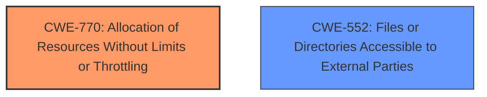

# Enhanced Analysis for CVE-2024-8811

# Summary

| CWE ID | CWE Name | Confidence | CWE Abstraction Level | CWE Vulnerability Mapping Label | CWE-Vulnerability Mapping Notes |
|---|---|---|---|---|---|
| CWE-770 | Allocation of Resources Without Limits or Throttling | 0.8 | Base | Primary | Allowed |
| CWE-552 | Files or Directories Accessible to External Parties | 0.6 | Base | Secondary | Allowed |

## Evidence and Confidence

*   **Confidence Score:** 0.7
*   **Evidence Strength:** MEDIUM

## Relationship Analysis
The primary CWE is CWE-770, which relates to resource management. The secondary CWE, CWE-552, is related to file access control. CWE-770 describes a scenario where resources are allocated without limits, and this can lead to issues like denial of service or bypass of security mechanisms. CWE-552 is about making files or directories accessible to unauthorized actors. These CWEs are not directly related in a parent-child or peer relationship but can be present in the same vulnerability when improper resource management (CWE-770) leads to files being inappropriately accessed (CWE-552).



## Vulnerability Chain
The vulnerability chain starts with WinZip's **improper handling** of the Mark-of-the-Web (MOTW). This **improper handling** allows the removal of the MOTW, which is a form of resource allocation without proper limits or throttling (CWE-770). This leads to the extracted files lacking the MOTW, making them accessible without the intended security restrictions (CWE-552). This allows an attacker to **execute arbitrary code**.

## Summary of Analysis
Initially, the analysis considered the high-scoring CWEs from the Retriever Results, such as CWE-787 (Out-of-bounds Write), CWE-59 (Improper Link Resolution Before File Access), and CWE-20 (Improper Input Validation). However, these did not directly address the core issue of WinZip removing the Mark-of-the-Web (MOTW) from archive files. The key aspect of this vulnerability is the **improper handling** of a security mechanism (MOTW), leading to a bypass.

CWE-770 (Allocation of Resources Without Limits or Throttling) fits because the MOTW is a resource intended to limit the execution of untrusted files. By removing it, WinZip is essentially allocating resources (file execution) without the intended limits. CWE-552 (Files or Directories Accessible to External Parties) is a secondary weakness because the extracted files, now lacking MOTW, are accessible without the intended security restrictions.

The graph relationships did not significantly influence the final selection, as the focus was on identifying the root cause based on the vulnerability description and CVE summary. The chosen CWEs are at the optimal level of specificity because they directly address the **improper handling** of the MOTW and the resulting accessibility of files.

Relevant CWE Information:

**CWE-770: Allocation of Resources Without Limits or Throttling**

*   **Description:** The software allocates resources without imposing adequate restrictions on the quantity or rate at which those resources are allocated, which can allow an attacker to consume a large amount of resources, possibly leading to a denial of service or the circumvention of security mechanisms that depend on resource limitations.
*   **Mapping Guidance:** Usage: Allowed
*   **Rationale:** This CWE entry is at the Base level of abstraction, which is a preferred level of abstraction for mapping to the root causes of vulnerabilities.

**CWE-552: Files or Directories Accessible to External Parties**

*   **Description:** The product makes files or directories accessible to unauthorized actors, even though they should not be.
*   **Mapping Guidance:** Usage: Allowed
*   **Rationale:** This CWE entry is at the Base level of abstraction, which is a preferred level of abstraction for mapping to the root causes of vulnerabilities.

CWEs Considered and Rejected:

*   CWE-787 (Out-of-bounds Write): While the vulnerability leads to arbitrary code execution, it's not directly caused by an out-of-bounds write.
*   CWE-59 (Improper Link Resolution Before File Access): This doesn't apply as the issue isn't about improper link resolution.
*   CWE-20 (Improper Input Validation): Too generic; the vulnerability is more specific than general input validation.
*   CWE-23 (Relative Path Traversal): Not relevant as the vulnerability doesn't involve path traversal.
*   CWE-22 (Improper Limitation of a Pathname to a Restricted Directory ('Path Traversal')): Not relevant as the vulnerability doesn't involve path traversal.
*   CWE-732 (Incorrect Permission Assignment for Critical Resource): Could be argued, but CWE-770 + CWE-552 better captures the initial resource allocation issue leading to the permission problem.
*   CWE-1007 (Insufficient Visual Distinction of Homoglyphs Presented to User): Not applicable to this vulnerability.
*   CWE-274 (Improper Handling of Insufficient Privileges): Not the primary issue.
*   CWE-409 (Improper Handling of Highly Compressed Data (Data Amplification)): Not relevant as the vulnerability doesn't involve compressed data handling.
*   CWE-73 (External Control of File Name or Path): Not the primary issue.


## CWE Relationship Analysis

Current CWEs represent these abstraction levels: .


### Vulnerability Chain Analysis

**Chain starting from CWE-274:**
- 274 (Improper Handling of Insufficient Privileges) - ROOT


**Chain starting from CWE-732:**
- 732 (Incorrect Permission Assignment for Critical Resource) - ROOT


### CWE Relationship Diagram

```mermaid
graph TD
    classDef primary fill:#f96,stroke:#333,stroke-width:2px
    classDef secondary fill:#69f,stroke:#333
    classDef tertiary fill:#9e9,stroke:#333
```