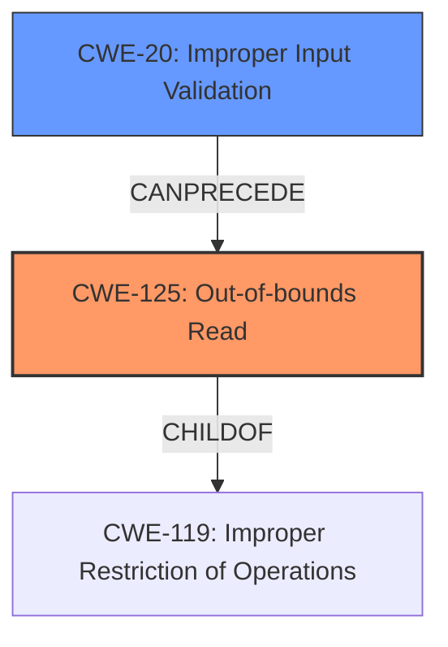

# Analysis for CVE-2024-8824

# Summary
| CWE ID  | CWE Name                                                         | Confidence | CWE Abstraction Level | CWE Vulnerability Mapping Label | CWE-Vulnerability Mapping Notes |
| :-------- | :--------------------------------------------------------------- | :--------- | :-------------------- | :------------------------------ | :------------------------------ |
| CWE-125   | Out-of-bounds Read                                               | 0.95       | Base                  | Primary                         | Allowed                       |
| CWE-20    | Improper Input Validation                                        | 0.75       | Class                 | Secondary                       | Discouraged                    |

## Evidence and Confidence

*   **Confidence Score:** 0.85
*   **Evidence Strength:** HIGH

## Relationship Analysis
The primary weakness is CWE-125 [CWE-125: Out-of-bounds Read], which directly reflects the vulnerability description's **"Out-Of-Bounds Read"**. CWE-125 [CWE-125: Out-of-bounds Read] is more specific than its parent CWE-119 [CWE-119: Improper Restriction of Operations within the Bounds of a Memory Buffer], offering a precise classification. The **"lack of proper validation of user-supplied data"** which is the root cause, can be classified as CWE-20 [CWE-20: Improper Input Validation], but it's a more general weakness. The relationship here is that **improper input validation can lead to an out-of-bounds read**.

## Vulnerability Chain
The vulnerability chain starts with **"lack of proper validation of user-supplied data"**, leading to an **"Out-Of-Bounds Read"**, and finally resulting in **"Information Disclosure"**.

CWE-20 (Improper Input Validation) -> CWE-125 (Out-of-bounds Read) -> Information Disclosure

## Summary of Analysis
The analysis focuses on the provided information and the identified key phrases. The primary classification is CWE-125 [CWE-125: Out-of-bounds Read] because the description explicitly mentions **"Out-Of-Bounds Read"**, and the vulnerability involves reading past the end of an allocated object. The root cause, **"lack of proper validation of user-supplied data"**, is classified as CWE-20 [CWE-20: Improper Input Validation], although it is a more general classification.

*   **CWE-125 [CWE-125: Out-of-bounds Read]:** This is the primary CWE because the vulnerability is explicitly described as an out-of-bounds read. The description states, "The issue results from the **lack of proper validation of user-supplied data**, which can result in a read past the end of an allocated object." This directly aligns with the definition of CWE-125 [CWE-125: Out-of-bounds Read], which involves reading data past the end or before the beginning of the intended buffer.
*   **CWE-20 [CWE-20: Improper Input Validation]:** This is a secondary CWE that represents the root cause of the vulnerability. The vulnerability description explicitly mentions **"lack of proper validation of user-supplied data"**. CWE-20 [CWE-20: Improper Input Validation] is a broader category, but it accurately reflects the **lack of input validation** that leads to the out-of-bounds read.

Other CWEs Considered but Not Used:

*   CWE-787 [CWE-787: Out-of-bounds Write]: While related to buffer overflows, this CWE is not applicable because the vulnerability involves reading, not writing, out of bounds.
*   CWE-1284 [CWE-1284: Improper Validation of Specified Quantity in Input]: This CWE is more specific to quantity validation and doesn't fully capture the general **lack of input validation**.
*   CWE-122 [CWE-122: Heap-based Buffer Overflow]: This is not applicable because the description only specifies an out-of-bounds read, and does not specify that a heap-based buffer overflow is the root cause.
*   CWE-126 [CWE-126: Buffer Over-read]: While similar to CWE-125 [CWE-125: Out-of-bounds Read], CWE-125 [CWE-125: Out-of-bounds Read] is more commonly used and directly reflects the **"Out-Of-Bounds Read"** vulnerability.