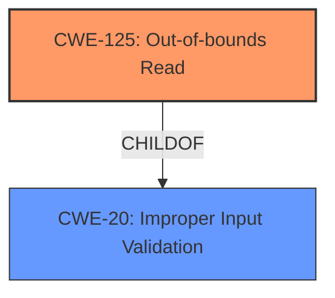

# Enhanced Analysis for CVE-2024-8835

# Summary
| CWE ID  | CWE Name                                                                   | Confidence | CWE Abstraction Level | CWE Vulnerability Mapping Label | CWE-Vulnerability Mapping Notes |
| :-------- | :------------------------------------------------------------------------- | :--------- | :---------------------- | :------------------------------ | :------------------------------ |
| CWE-125   | Out-of-bounds Read                                                         | 0.9        | Base                    | Primary CWE                     | Allowed                       |
| CWE-20    | Improper Input Validation                                                  | 0.8        | Class                   | Secondary Candidate             | Allowed                       |

## Evidence and Confidence

*   **Confidence Score:** 0.9
*   **Evidence Strength:** HIGH

## Relationship Analysis
The primary weakness is an **Out-of-bounds Read** (CWE-125), which is a type of memory safety violation. This can occur because of **Improper Input Validation** (CWE-20), where the application does not properly check the size or boundaries of the input data, leading to a read operation outside the allocated buffer. CWE-125 is a base CWE, while CWE-20 is a class CWE.mermaid



## Vulnerability Chain
The vulnerability chain starts with **Improper Input Validation** (CWE-20), where the application **fails to validate user-supplied data**. This **lack of validation** allows for an **Out-of-bounds Read** (CWE-125) when parsing JB2 files. The impact of this **Out-of-bounds Read** is **information disclosure**, and it could potentially lead to arbitrary code execution if combined with other vulnerabilities.

## Summary of Analysis
The primary CWE is CWE-125 **Out-of-bounds Read**, as the vulnerability description explicitly states "PDF-XChange Editor JB2 File Parsing **Out-Of-Bounds Read** **Information Disclosure Vulnerability**". The **root cause** is **the lack of proper validation of user-supplied data**, which maps to CWE-20 **Improper Input Validation**.

The evidence from the vulnerability description is: "The issue results from the **lack of proper validation of user-supplied data**, which can result in a read past the end of an allocated object".

CWE-125 is more specific and directly reflects the technical weakness, while CWE-20 represents the underlying cause. The hierarchical relationship (CWE-125 ChildOf CWE-20) supports this classification.

Other CWEs considered but not used:

*   CWE-787 **Out-of-bounds Write**: This CWE was not selected because the vulnerability is specifically an **Out-of-bounds Read**, not a write.
*   CWE-1284 **Improper Validation of Specified Quantity in Input**: While input validation is a factor, CWE-20 is more general and appropriate as the **Improper Input Validation** doesn't specifically relate to quantities.
*   CWE-122 **Heap-based Buffer Overflow**: The description mentions an **Out-of-bounds Read**, not necessarily a buffer overflow.
*   CWE-457 **Use of Uninitialized Variable**: This is not directly related to the described vulnerability.
*   CWE-126 **Buffer Over-read**: This is very similar to CWE-125, but CWE-125 is preferred.
```


## CWE Relationship Analysis

Current CWEs represent these abstraction levels: .


### Vulnerability Chain Analysis

**Chain starting from CWE-1284:**
- 1284 (Improper Validation of Specified Quantity in Input) - ROOT


**Chain starting from CWE-457:**
- 457 (Use of Uninitialized Variable) - ROOT


### CWE Relationship Diagram

```mermaid
graph TD
    classDef primary fill:#f96,stroke:#333,stroke-width:2px
    classDef secondary fill:#69f,stroke:#333
    classDef tertiary fill:#9e9,stroke:#333
```