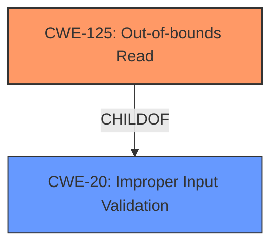

# Analysis for CVE-2024-8837

# Summary
| CWE ID  | CWE Name                                                                        | Confidence | CWE Abstraction Level | CWE Vulnerability Mapping Label | CWE-Vulnerability Mapping Notes |
| :-------- | :------------------------------------------------------------------------------ | :---------- | :---------------------- | :------------------------------ | :------------------------------ |
| CWE-125   | Out-of-bounds Read                                                            | 1          | Base                    | Primary CWE                    | Allowed                        |
| CWE-20    | Improper Input Validation                                                      | 0.7         | Class                   | Secondary Candidate            | Discouraged                    |

## Evidence and Confidence

*   **Confidence Score:** 0.9
*   **Evidence Strength:** HIGH

## Relationship Analysis
The primary weakness is an **Out-of-bounds Read** (CWE-125), which occurs due to a **lack of proper validation of user-supplied data**. CWE-125 is a base-level CWE, providing a specific description of the vulnerability. CWE-20 is a class-level CWE representing **Improper Input Validation**, which is a broader category. The vulnerability description explicitly states the **lack of proper validation of user-supplied data**, leading to the out-of-bounds read. Thus, CWE-20 can be considered a contributing factor, but CWE-125 is a more precise description of the actual vulnerability.

## Vulnerability Chain
The vulnerability chain starts with the **lack of proper validation of user-supplied data**. This **root cause** leads to an **Out-of-bounds Read** (CWE-125) when parsing XPS files. The final impact is the ability for a remote attacker to execute arbitrary code.

## Summary of Analysis
The primary CWE is CWE-125, **Out-of-bounds Read**, because the vulnerability description explicitly mentions a read operation beyond the bounds of an allocated buffer. The description states: "The issue results from the **lack of proper validation of user-supplied data**, which can result in a read past the end of an allocated buffer." This aligns directly with the definition of CWE-125.

CWE-20, **Improper Input Validation**, is considered as a secondary factor. The description mentions "**lack of proper validation of user-supplied data**" as the root cause, but CWE-125 accurately describes the resulting vulnerability. According to the CWE-20 documentation, its usage is discouraged when lower-level CWEs are available, and CWE-125 is a more specific (Base) CWE.

The selection of CWE-125 is based on direct evidence from the vulnerability description and the CWE specifications. It represents the most accurate and specific classification of the vulnerability.

Relevant CWE Information:

# Enhanced Context (25 CWEs)
The following CWEs were identified as potentially relevant to this vulnerability:

## CWE-611: Improper Restriction of XML External Entity Reference
**Abstraction Level**: Base
**Similarity Score**: 0.74
**Source**: dense

**Description**:
The product processes an XML document that can contain XML entities with URIs that resolve to documents outside of the intended sphere of control, causing the product to embed incorrect documents into its output.

**Mapping Guidance**:
- Usage: Allowed
- Rationale: This CWE entry is at the Base level of abstraction, which is a preferred level of abstraction for mapping to the root causes of vulnerabilities.

*Reason for not selecting*: The vulnerability is related to XPS file parsing and **out-of-bounds read**, not XML external entity reference.

## CWE-80: Improper Neutralization of Script-Related HTML Tags in a Web Page (Basic XSS)
**Abstraction Level**: Variant
**Similarity Score**: 0.71
**Source**: dense

**Description**:
The product receives input from an upstream component, but it does not neutralize or incorrectly neutralizes special characters such as "<", ">", and "&" that could be interpreted as web-scripting elements when they are sent to a downstream component that processes web pages.

**Mapping Guidance**:
- Usage: Allowed
- Rationale: This CWE entry is at the Variant level of abstraction, which is a preferred level of abstraction for mapping to the root causes of vulnerabilities.

*Reason for not selecting*: The vulnerability is related to XPS file parsing and **out-of-bounds read**, not Cross-Site Scripting (XSS).

## CWE-434: Unrestricted Upload of File with Dangerous Type
**Abstraction Level**: Base
**Similarity Score**: 0.70
**Source**: dense

**Description**:
The product allows the upload or transfer of dangerous file types that are automatically processed within its environment.

**Mapping Guidance**:
- Usage: Allowed
- Rationale: This CWE entry is at the Base level of abstraction, which is a preferred level of abstraction for mapping to the root causes of vulnerabilities.

*Reason for not selecting*: The vulnerability is related to XPS file parsing and **out-of-bounds read**, not unrestricted file upload.

## CWE-116: Improper Encoding or Escaping of Output
**Abstraction Level**: Class
**Similarity Score**: 0.70
**Source**: dense

**Description**:
The product prepares a structured message for communication with another component, but encoding or escaping of the data is either missing or done incorrectly. As a result, the intended structure of the message is not preserved.

**Mapping Guidance**:
- Usage: Allowed-with-Review
- Rationale: This CWE entry is a Class and might have Base-level children that would be more appropriate

*Reason for not selecting*: The vulnerability is related to XPS file parsing and **out-of-bounds read**, not improper encoding or escaping of output.

## CWE-125: Out-of-bounds Read
**Abstraction Level**: Base
**Similarity Score**: 0.69
**Source**: dense

**Description**:
The product reads data past the end, or before the beginning, of the intended buffer.

**Mapping Guidance**:
- Usage: Allowed
- Rationale: This CWE entry is at the Base level of abstraction, which is a preferred level of abstraction for mapping to the root causes of vulnerabilities.

*Reason for selecting*: The vulnerability description explicitly mentions **out-of-bounds read**.

## CWE-788: Access of Memory Location After End of Buffer
**Abstraction Level**: Base
**Similarity Score**: 0.68
**Source**: dense

**Description**:
The product reads or writes to a buffer using an index or pointer that references a memory location after the end of the buffer.

**Mapping Guidance**:
- Usage: Discouraged
- Rationale: The CWE entry might be misused when lower-level CWE entries might be available. It also overlaps existing CWE entries and might be deprecated in the future.

*Reason for not selecting*: CWE-125 is more general and also covers reads before the buffer.

## CWE-184: Incomplete List of Disallowed Inputs
**Abstraction Level**: Base
**Similarity Score**: 0.68
**Source**: dense

**Description**:
The product implements a protection mechanism that relies on a list of inputs (or properties of inputs) that are not allowed by policy or otherwise require other action to neutralize before additional processing takes place, but the list is incomplete.

**Mapping Guidance**:
- Usage: Allowed
- Rationale: This CWE entry is at the Base level of abstraction, which is a preferred level of abstraction for mapping to the root causes of vulnerabilities.

*Reason for not selecting*: The vulnerability is related to XPS file parsing and **out-of-bounds read**, not an incomplete list of disallowed inputs.

## CWE-134: Use of Externally-Controlled Format String
**Abstraction Level**: Base
**Similarity Score**: 0.68
**Source**: dense

**Description**:
The product uses a function that accepts a format string as an argument, but the format string originates from an external source.

**Mapping Guidance**:
- Usage: Allowed
- Rationale: This CWE entry is at the Base level of abstraction, which is a preferred level of abstraction for mapping to the root causes of vulnerabilities.

*Reason for not selecting*: The vulnerability is related to XPS file parsing and **out-of-bounds read**, not format string injection.

## CWE-131: Incorrect Calculation of Buffer Size
**Abstraction Level**: Base
**Similarity Score**: 0.68
**Source**: dense

**Description**:
The product does not correctly calculate the size to be used when allocating a buffer, which could lead to a buffer overflow.

**Mapping Guidance**:
- Usage: Allowed
- Rationale: This CWE entry is at the Base level of abstraction, which is a preferred level of abstraction for mapping to the root causes of vulnerabilities.

*Reason for not selecting*: The vulnerability is related to XPS file parsing and **out-of-bounds read**, not an incorrect calculation of buffer size.

## CWE-138: Improper Neutralization of Special Elements
**Abstraction Level**: Class
**Similarity Score**: